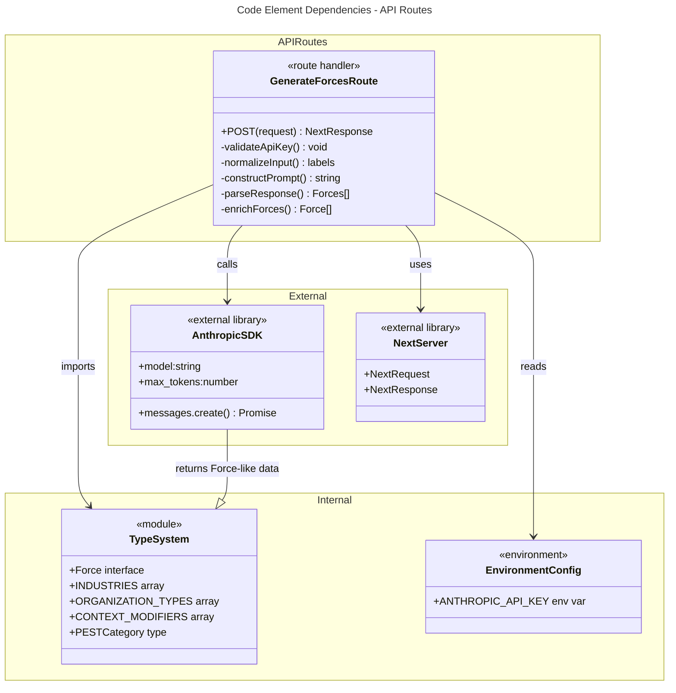

# C4 Code Level: API Routes

## Overview

- **Name**: API Routes - Force Generation Service
- **Description**: Backend API routes that handle AI-powered PEST force generation for scenario planning. Currently includes one active endpoint for generating driving forces based on user context.
- **Location**: `/app/api/`
- **Language**: TypeScript with Next.js 14 App Router
- **Purpose**: Provides RESTful endpoints for the Strategic Futures Lab simulation to request AI-generated strategic forces and analytical content

## Code Elements

### API Routes

#### `POST /api/generate-forces` Handler
**File**: `/app/api/generate-forces/route.ts`

**Function Signature**:
```typescript
async function POST(request: NextRequest): Promise<NextResponse>
```

**Request Type**:
```typescript
{
  industry: string              // Industry ID from INDUSTRIES
  organizationType: string      // Organization type ID from ORGANIZATION_TYPES
  challenge: string            // Strategic challenge description
  modifiers?: string[]         // Array of context modifier IDs from CONTEXT_MODIFIERS
  strategicQuestion?: string   // The focal issue/strategic question
}
```

**Response Type** (Success - 200):
```typescript
{
  forces: Force[]
}

// Where Force is:
{
  id: string                   // Generated as "force-{timestamp}-{index}"
  name: string                 // 3-5 word force name (e.g., "AI Talent Shortage")
  description: string          // One clear sentence explaining the force
  category: PESTCategory       // One of: 'P' | 'E' | 'S' | 'T' | 'En' | 'L'
  suggestedImpact: number      // 1-5 scale (AI suggestion)
  suggestedUncertainty: number // 1-5 scale (AI suggestion)
  impact: number               // 0 (Not Rated) - user must actively rate
  uncertainty: number          // 0 (Not Rated) - user must actively rate
  isCustom: boolean            // false for AI-generated forces
}
```

**Response Type** (Error - 500):
```typescript
{
  error: string  // Descriptive error message
}
```

**Description**:
Main API endpoint that orchestrates AI-powered generation of 16 PEST (Political, Economic, Social, Technological, Environmental, Legal/Regulatory) driving forces. The endpoint:
1. Validates Anthropic API key availability
2. Extracts and normalizes user input (industry, organization type, context modifiers)
3. Constructs a detailed prompt for Claude AI with full context
4. Calls Claude Sonnet 4 model to generate forces
5. Parses JSON response with error handling
6. Enriches forces with unique IDs and initializes rating fields to 0 (requiring user input)

**Location**: `/app/api/generate-forces/route.ts:9-121`

**Key Processing Steps**:
- Line 17: Destructure request body with default empty modifiers array
- Line 21-28: Resolve human-readable labels for enums (industry, org type, modifiers)
- Line 30-67: Construct detailed prompt with explicit format requirements
- Line 69-73: Call Claude API with structured message format
- Line 76-77: Extract text content from API response
- Line 84-96: Parse JSON with fallback for wrapped responses
- Line 99-109: Map AI response to Force interface with ID generation and rating initialization
- Line 112: Return forces array

**Error Handling**:
- Checks for missing API key (500: "API key not configured")
- Handles missing response content (500: "No content in response")
- Gracefully handles JSON parse errors with console logging and error response
- Catches all exceptions with message extraction for untyped errors

**Dependencies**:
- `NextRequest`, `NextResponse` from Next.js
- Anthropic SDK for Claude API calls
- Type system from `lib/types`

---

### Unused Routes

#### `app/api/generate-question/` Directory
**Status**: Empty directory, no route handler implemented
**Purpose**: Placeholder for future question generation endpoint
**Location**: `/app/api/generate-question/`

---

## Dependencies

### Internal Dependencies

#### Type Definitions
- **File**: `lib/types.ts`
- **Imports**:
  - `INDUSTRIES: Industry[]` - Array of 12 industry definitions (BFSI, IT Services, Manufacturing, etc.)
  - `ORGANIZATION_TYPES: OrganizationType[]` - Array of 6 organization type definitions
  - `CONTEXT_MODIFIERS: ContextModifier[]` - Array of 19 context modifiers across 4 categories (market, financial, operational, regulatory)
  - `PESTCategory` type - Union type for PEST/EL categories
- **Usage**:
  - Resolves industry/organization/modifier IDs to human-readable labels (lines 21-28)
  - Contextualizes the strategic prompt with business domain specifics
  - Ensures consistent terminology across the application

#### Force Interface
- **From**: `lib/types.ts:316-326`
- **Structure**:
  - `id`: Unique identifier (generated runtime)
  - `name`, `description`: Force content
  - `category`: PEST classification
  - `impact`, `uncertainty`: Numerical ratings (0-5)
  - `isCustom`: Boolean flag for AI vs user-generated forces
  - `aiSuggestedImpact`, `aiSuggestedUncertainty`: AI recommendations (optional)

### External Dependencies

#### Anthropic SDK
- **Package**: `@anthropic-ai/sdk`
- **Version**: ^0.32.1
- **Used For**: Claude AI API integration
- **Specific Usage**:
  - `Anthropic` class initialization with API key
  - `messages.create()` method for prompt execution
  - Model: `claude-sonnet-4-20250514`
  - Max tokens: 4000 (sufficient for 16 force JSON objects)

#### Next.js Server Utilities
- **Package**: `next/server`
- **Types Used**:
  - `NextRequest`: HTTP request handler parameter
  - `NextResponse`: HTTP response builder for JSON returns

#### Environment Configuration
- **Variable**: `process.env.ANTHROPIC_API_KEY`
- **Requirement**: Must be set in `.env.local` for production use
- **Validation**: Checked on every request (line 12-14)

---

## Relationships

### Data Flow

```mermaid
---
title: API Request/Response Flow - Force Generation
---
flowchart LR
    subgraph Client["Client (React Frontend)"]
        A["forces page component"]
        B["zustand store"]
    end

    subgraph Request["Request Processing"]
        C["Extract request body"]
        D["Resolve enum labels"]
        E["Construct prompt"]
    end

    subgraph AI["Claude AI Processing"]
        F["Anthropic SDK"]
        G["claude-sonnet-4-20250514"]
        H["Generate 16 forces JSON"]
    end

    subgraph Response["Response Processing"]
        I["Parse JSON response"]
        J["Add unique IDs"]
        K["Initialize ratings to 0"]
        L["Map to Force interface"]
    end

    subgraph Output["Client Output"]
        M["Store forces in zustand"]
        N["Display in Forces UI"]
    end

    A -->|POST /api/generate-forces| C
    C --> D
    D --> E
    E --> F
    F --> G
    G --> H
    H --> I
    I --> J
    J --> K
    K --> L
    L -->|NextResponse.json| M
    M --> N
```



### Dependency Graph



### Integration Points

**Frontend Integration**:
- Called from simulation UI components in `app/simulation/design/forces/` when user clicks "Generate with AI"
- Stores returned forces in zustand store (`lib/store.ts`)
- User can then rate, modify, or add custom forces

**AI Integration**:
- Directly calls Anthropic Claude API
- Uses structured prompt engineering with explicit requirements
- Expects JSON response wrapped in optional "forces" key
- Falls back to array parsing if "forces" key absent

**Error Flow**:
- API key missing → 500 error
- Claude API failure → 500 error with message
- JSON parse failure → 500 error with response content logged
- Response validation failure → 500 error

---

## Technical Patterns & Design Decisions

### Prompt Engineering Strategy
**Approach**: Highly explicit, format-prescriptive prompt
- Provides detailed context (industry, organization, challenge)
- Specifies exact PEST categories and field names
- Includes format example to guide output structure
- Requests ONLY JSON (no markdown/explanation)
- Sets expectations for content (3-5 word names, one-sentence descriptions)

**Rationale**: Ensures consistent, parseable responses from Claude

### Error Handling Strategy
**Pattern**: Graceful degradation with user-facing errors
- API key validation before processing (fail fast)
- Try-catch around JSON parsing with detailed logging
- Return generic but helpful error messages to client
- Console logging of full errors for debugging

**Rationale**: Prevents processing failures from reaching users without visibility to developers

### ID Generation Strategy
**Pattern**: Timestamp + index combination
```typescript
id: `force-${Date.now()}-${index}`
```

**Rationale**:
- Guarantees uniqueness across multiple requests
- Preserves order of generation
- Human-debuggable format

### Rating Initialization
**Pattern**: Initialize all ratings to 0 (Not Rated) instead of using AI suggestions
```typescript
impact: 0              // Override aiSuggestedImpact
uncertainty: 0        // Override aiSuggestedUncertainty
```

**Rationale**: Forces user to actively evaluate forces in their own context rather than over-relying on AI suggestions. AI suggestions available as optional fields for reference.

### Response Format Resilience
**Pattern**: Handle both wrapped ("forces" key) and unwrapped (direct array) responses
```typescript
let forces = Array.isArray(parsed) ? parsed : (parsed.forces || [])
```

**Rationale**: Provides flexibility if Claude's response format varies slightly, improves robustness

---

## Performance Characteristics

| Aspect | Value | Notes |
|--------|-------|-------|
| **Max Tokens** | 4000 | Sufficient for 16 force objects (~250 tokens per force) |
| **Model** | claude-sonnet-4-20250514 | Fast, capable of structured output |
| **Typical Latency** | 2-5 seconds | Depends on Anthropic API load |
| **Request Size** | < 5 KB | Typical request payload |
| **Response Size** | < 2 KB | Parsed JSON forces array |
| **Timeout** | Not explicitly set | Inherits Next.js default (30 seconds) |

---

## Security Considerations

### API Key Management
- **Requirement**: Stored in `.env.local` (never committed)
- **Validation**: Checked on every request
- **Exposure Risk**: Minimized by server-side execution
- **Credential Never Leaked**: API key stays on server, never sent to client

### Input Validation
- **Current Approach**: Minimal validation - relies on Claude API to handle invalid categories
- **Risk**: Malformed category strings could reach Claude
- **Recommendation**: Add enum validation before prompt construction

### Output Validation
- **Current Approach**: JSON parsing with try-catch
- **Risk**: Invalid force objects could be stored if parse succeeds
- **Recommendation**: Add Zod/TypeScript validation before returning to client

---

## Notes

1. **Unused Route**: The `app/api/generate-question/` directory exists but is empty. Consider removing if not planned for immediate development.

2. **Model Selection**: Uses Claude Sonnet 4 (more capable) instead of Opus or Haiku. This is appropriate for structured force generation but could be optimized for cost.

3. **Force Count Fixed**: Always generates exactly 16 forces (4 per PEST category). Not configurable via request parameters.

4. **Strategic Question Field**: The `strategicQuestion` parameter is passed to the prompt but results don't differ based on it in the current implementation. Used for context only.

5. **Error Logging**: Uses console.error for debugging. In production, should integrate with error tracking service (e.g., Sentry).

6. **No Rate Limiting**: Currently no rate limiting on this endpoint. Should be added to prevent API quota exhaustion.

7. **Timeout Handling**: No explicit timeout set. If Anthropic API hangs, request will timeout at Next.js level (typically 30 seconds).

8. **PEST Expansion**: Uses 6 categories (PEST + Environmental + Legal) instead of traditional 4. Aligns with Indian regulatory context (GST, RBI, SEBI, etc.).

