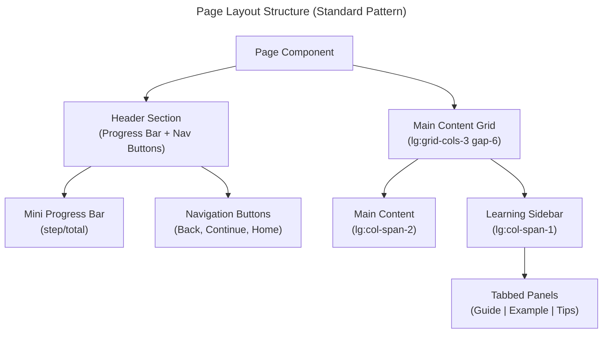

# C4 Code Level: Simulation Pages (App Router)

## Overview

- **Name**: Simulation Pages - 4-Phase Journey
- **Description**: Collection of page components that implement the complete scenario planning simulation following Shell's methodology. Guides users through a structured 4-phase journey (Discover → Design → Develop → Decide) with 13 sub-steps, managing complex state for strategic futures analysis.
- **Location**: `/app/simulation/`
- **Language**: TypeScript/React (Next.js 13+ App Router with Client Components)
- **Purpose**: Deliver an interactive scenario planning simulation with real-time state management, learning sidebars, progress tracking, and AI-assisted content generation. Each phase page manages specific aspects of the scenario planning lifecycle.

## Architecture Overview

The simulation is organized around **4 main phases** with **sub-step pages** organized hierarchically:

```
/simulation/
├── layout.tsx                    # Root layout wrapping all phases
├── discover/
│   ├── pre-read/page.tsx        # Phase intro (full-screen)
│   ├── context/page.tsx         # Industry, org type, stakeholder, focal issue
│   ├── focal-issue/page.tsx     # (merged into context)
│   └── forces/page.tsx          # PEST forces rating
├── design/
│   ├── uncertainties/page.tsx   # Critical uncertainties selection
│   ├── axes/page.tsx            # Axis labeling & orthogonality
│   ├── matrix/page.tsx          # 2×2 matrix naming
│   └── forces/page.tsx          # (legacy, forces list)
├── develop/
│   ├── narratives/page.tsx      # Scenario narrative writing
│   ├── impact/page.tsx          # Impact assessment matrix
│   └── risk/page.tsx            # Risk & opportunity mapping
├── decide/
│   ├── responses/page.tsx       # Drag-and-drop response assignment
│   ├── actions/page.tsx         # Action planning per response type
│   └── report/page.tsx          # Final strategic playbook
└── phase-{1-10}/page.tsx        # Legacy phase structure
```

## Code Elements

### Layout Component

#### `SimulationLayout`
- **File**: `layout.tsx` (lines 1–138)
- **Type**: Client-side Root Layout
- **Purpose**: Wraps all simulation phase pages with consistent header, progress tracking, and dark theme styling
- **Key Responsibilities**:
  - Extracts current phase from pathname using regex matching
  - Maps route patterns to custom titles (`CUSTOM_PAGE_TITLES`)
  - Displays step explainers from `STEP_EXPLAINERS` mapping
  - Renders `ProgressIndicator` component for navigation
  - Handles pre-read full-screen special case
  - Applies dark background gradients per phase

**Function Signature**:
```typescript
export default function SimulationLayout({
  children,
}: {
  children: React.ReactNode
}): JSX.Element | React.ReactNode
```

**Key Internal Functions**:
- `getNewRouteTitle(pathname: string): string | null` - Matches `/simulation/{phase}/{step}` routes
- `getStepExplainer(pathname: string): string | null` - Returns explainer text for current step
- `getCurrentMainPhase(pathname: string | null): MainPhase` - Extracts phase from pathname

**Dependencies**:
- `usePathname()` (Next.js navigation)
- `PHASE_NAMES`, `SUB_STEP_CONFIG`, `MAIN_PHASE_CONFIG` (type definitions)
- `ProgressIndicator` component

---

### Discover Phase Pages

#### `PreReadPage`
- **File**: `discover/pre-read/page.tsx` (lines 1–96)
- **Type**: Client Component
- **Purpose**: Introduce the Discover phase with evocative storytelling and phase overview
- **Responsibilities**:
  - Display phase badge with icon
  - Show introductory narrative (game-guide voice)
  - List "In this phase, you'll:" activities with icons
  - Display golden quote for emphasis
  - Trigger session start and navigation on CTA click

**Function Signature**:
```typescript
export default function PreReadPage(): JSX.Element
```

**State & Handlers**:
- Uses `useRouter()` for navigation
- Calls `setCurrentStep('context')` and `startSession()` on continue

**Dependencies**:
- `useRouter`, `useSimulationStore`
- Framer Motion (`motion.div` for animations)
- Lucide icons (`Search`, `MapPin`, `Compass`, `ArrowRight`)

**UI Pattern**: Full-screen intro with centered content, motion animations, CTA button

---

#### `ContextPage`
- **File**: `discover/context/page.tsx` (lines 566–1268)
- **Type**: Client Component (Complex, 700+ lines)
- **Purpose**: Multi-step wizard for capturing strategic context before force analysis
- **Responsibilities**:
  - Navigate through 6 sequential steps (industry → organization → stakeholder → focal-issue → modifiers → summary)
  - Generate contextual focal issue suggestions via AI
  - Manage custom industry/modifier inputs
  - Display dynamic learning sidebar with journey recap at end
  - Track progress with mini progress bar

**Main Exported Component**:
```typescript
export default function ContextPage(): JSX.Element
```

**Internal State Management**:
- Local state: `step`, `generatedIssues`, `selectedIssueId`, `revealedIssues`, `customIssue`, `isEditingIssue`, `customIndustry`, `customModifiers`
- Store integration: `useSimulationStore()` for industry, orgType, stakeholder, focalIssue, modifiers, and refinement fields

**Step-Specific Handlers**:
1. **Industry Step**: `handleIndustrySelect()`, `handleCustomIndustrySubmit()`
2. **Organization Step**: `handleOrganizationSelect()`
3. **Stakeholder Step**: `handleStakeholderSelect()` - Auto-derives time horizon from role
4. **Focal Issue Step**: `generateFocalIssues()`, `toggleRevealIssue()`, `handleIssueSelect()`, `handleRefineIssue()`
5. **Modifiers Step**: `toggleModifier()`, `addCustomModifier()`, `removeCustomModifier()`
6. **Summary Step**: Journey recap display with `LearningSidebar` using timeline visualization

**Key Features**:
- **Focal Issue Generation**: Simulates AI with example options (good/bad labeling)
- **Learning Content**: `LEARNING_CONTENT` object provides tabbed guide/example/tips for each step
- **Custom Inputs**: Support for custom industries, focal issues, and modifiers
- **Motion Animations**: `AnimatePresence` with `containerVariants` for step transitions

**LearningSidebar Integration**:
- At summary step, renders special `journeyRecap` format showing vertical timeline of selections
- Other steps show standard guide/example/tips tabs

**Dependencies**:
- `useSimulationStore`, `useRouter`
- Framer Motion (`motion.div`, `AnimatePresence`)
- Type definitions: `INDUSTRIES`, `ORGANIZATION_TYPES`, `CONTEXT_MODIFIERS`, `STAKEHOLDER_LABELS`
- Lucide icons (extensive list for industry icons)

---

#### `ForcesPage` (Discover Phase)
- **File**: Inferred from CLAUDE.md and architecture (forces step is in design, but mentioned in discover)
- **Purpose**: PEST forces rating and selection for critical uncertainty identification
- **Expected Responsibilities**:
  - Display AI-generated PEST forces (16 total)
  - Allow users to rate forces on Impact (1–5) and Uncertainty (1–5)
  - Filter and highlight critical forces (both impact & uncertainty >= 3)
  - Store selected forces for axis selection

---

### Design Phase Pages

#### `UncertaintiesPage` (Design Step 2)
- **File**: `design/uncertainties/page.tsx` (lines 47–534)
- **Type**: Client Component
- **Purpose**: Select two critical uncertainties from rated forces to form scenario matrix axes
- **Responsibilities**:
  - Filter forces to show only "critical uncertainties" (impact >= 3 AND uncertainty >= 3)
  - Allow force selection and assignment to X or Y axis
  - Calculate orthogonality score (0–100%) for axis pair
  - Display quality indicators (emerald/amber/red for good/moderate/poor)
  - Prevent continuation until both axes selected

**Function Signature**:
```typescript
export default function UncertaintiesPage(): JSX.Element
```

**State**:
- Local: `showHomeConfirm`, `selectedForceId`
- Store: `forces`, `xAxis`, `yAxis`, `selectedForces` with setters

**Key Functions**:
- `handleForceClick(force: Force): void` - Toggle force selection
- `handleSetAxis(axis: 'x' | 'y', force: Force): void` - Assign force to axis
- `handleContinue(): void` - Navigate to axes page
- `handleGoHome(): void` - Show confirmation modal
- Orthogonality calculation: Checks category difference (60 pts), impact/uncertainty differences (5 pts each)

**Memoized Calculations**:
- `criticalForces`: Filtered and sorted by combined impact + uncertainty
- `orthogonality`: Computed score (0–100) with quality thresholds

**UI Pattern**:
- Header explanation box
- Axis selection panel (2-column grid showing X/Y dropzones)
- Orthogonality check badge (emerald/amber/red)
- Available critical uncertainties grid (1–2 columns)
- Learning sidebar with tabbed guide/example/tips

**Dependencies**:
- `useSimulationStore`, `useRouter`
- `LearningSidebar` component
- Type definitions: `Force`, `PEST_LABELS`, `PESTCategory`

**Modal Component**: `HomeConfirmModal()` inline component for navigation confirmation

---

#### `AxesPage` (Design Step 3)
- **File**: `design/axes/page.tsx` (inferred)
- **Purpose**: Define low/high labels for each axis to create meaningful scenario quadrants
- **Expected Responsibilities**:
  - Display current X and Y axes with editable label fields
  - Validate label uniqueness and non-emptiness
  - Preview how labels will appear in matrix
  - Enable progress toward matrix naming

---

#### `MatrixPage` (Design Step 4)
- **File**: `design/matrix/page.tsx` (lines 20–342)
- **Type**: Client Component
- **Purpose**: Name four scenario quadrants and create the 2×2 scenario matrix structure
- **Responsibilities**:
  - Display 2×2 grid with axis labels and quadrant positions
  - Accept scenario names in each quadrant
  - Show "✓ Named" completion indicator
  - Generate scenario objects with boilerplate values
  - Transition to Develop phase on completion

**Function Signature**:
```typescript
export default function MatrixPage(): JSX.Element
```

**State & Store**:
- Local: `expandedLearning`, `scenarioNames` (Record<quadrant, name>)
- Store: `xAxis`, `yAxis`, `xAxisLabels`, `yAxisLabels`, `setScenarios`, `completeMainPhase`

**Key Functions**:
- `handleScenarioNameChange(quadrantId: string, name: string): void`
- `handleContinue(): void` - Creates scenario objects and transitions
- `openChatGpt(prompt: string): void` - Opens ChatGPT in new window for naming suggestions

**Scenario Object Creation**:
```typescript
const scenarios = QUADRANT_POSITIONS.map((pos) => ({
  id: generateId(),
  name: scenarioNames[pos.id],
  quadrant: pos.id,
  narrative: '',
  timeHorizon: 5,
  tone: 0,
  complexity: 2,
  earlySignals: [],
  keyCapabilities: [],
}))
```

**UI Pattern**:
- Header explanation
- 2×2 matrix visualization with rotated axis labels
- Input fields for scenario names (centered in each quadrant)
- Completion checkmark (emerald color)
- AI naming suggestions card (separate from learning sidebar)
- Tabbed learning sidebar (guide/example/tips)

**Dependencies**:
- `useSimulationStore`, `useRouter`
- Framer Motion (`motion.div`)
- `LearningSidebar` component

---

### Develop Phase Pages

#### `NarrativesPage` (Develop Step 1)
- **File**: `develop/narratives/page.tsx` (lines 11–150+)
- **Type**: Client Component
- **Purpose**: Write vivid narratives for each of the four scenarios
- **Responsibilities**:
  - Display scenario cards in 2-column grid
  - Manage narrative text input for each scenario
  - Generate ChatGPT prompts with context (industry, focal issue, axis labels)
  - Require minimum 50-character narratives before progression
  - Track completion status

**Function Signature**:
```typescript
export default function NarrativesPage(): JSX.Element
```

**State**:
- Local: `expandedScenario` (for expanded view detail)
- Store: `scenarios`, `xAxis`, `yAxis`, `xAxisLabels`, `yAxisLabels`, `focalIssue`, `industry`, `updateScenario`

**Key Functions**:
- `openChatGptForScenario(scenarioName: string, quadrant: string): void` - Contextual prompt generation
- `handleNarrativeChange(scenarioId: string, narrative: string): void` - Update scenario narrative
- `allNarrativesFilled`: Computed boolean checking all narratives > 50 chars

**UI Pattern**:
- Header explanation
- Grid of scenario cards (2-column on medium+)
- Textarea input for narrative (flexible height)
- AI suggestion button per scenario
- Learning sidebar with tabbed content

---

#### `ImpactPage` (Develop Step 2)
- **File**: `develop/impact/page.tsx` (inferred)
- **Purpose**: Assess how each scenario would impact the organization across key dimensions
- **Expected Responsibilities**:
  - Display impact assessment matrix (scenarios vs. dimensions)
  - Allow rating/scoring of impact per dimension
  - Visual heatmap of organizational vulnerability
  - Summary metrics per scenario

---

#### `RiskPage` (Develop Step 3)
- **File**: `develop/risk/page.tsx` (inferred)
- **Purpose**: Map risks and opportunities across all four scenarios
- **Expected Responsibilities**:
  - Identify robust strategies (work across multiple scenarios)
  - Surface weak strategies (fail in some scenarios)
  - Visualize risk landscape across scenarios
  - Guide decision-making in the next phase

---

### Decide Phase Pages

#### `ResponsesPage` (Decide Step 1)
- **File**: `decide/responses/page.tsx` (lines 22–250+)
- **Type**: Client Component
- **Purpose**: Classify each scenario into strategic response categories (Bet Big, Hedge, Monitor)
- **Responsibilities**:
  - Display unassigned scenarios as draggable cards
  - Show response type buckets (Bet Big, Hedge, Monitor, Watch)
  - Implement native HTML5 drag-and-drop
  - Track assignments in store
  - Enable progression only when all scenarios assigned

**Function Signature**:
```typescript
export default function ResponsesPage(): JSX.Element
```

**State**:
- Local: `draggedScenario`, `hoveredBucket`
- Store: `scenarios`, `responseAssignments`, `setResponseAssignment`

**Drag-and-Drop Handlers**:
- `handleDragStart(e: React.DragEvent, scenarioId: string): void`
- `handleDragEnd(): void`
- `handleDragOver(e: React.DragEvent, responseType: ResponseType): void`
- `handleDragLeave(): void`
- `handleDrop(e: React.DragEvent, responseType: ResponseType): void`
- `handleResetAll(): void` - Clear all assignments

**Response Types** (from `RESPONSE_TYPES`):
- `'bet-big'` (Target icon) - Commit resources
- `'hedge'` (Clock icon) - Balance bets
- `'monitor'` (Shield icon) - Watch and wait
- `'watch'` (Eye icon) - Deep observation

**UI Pattern**:
- Unassigned scenarios zone (draggable cards)
- Four response type buckets with drop zones
- Assigned scenarios displayed in buckets
- Reset button for reassignment
- Learning sidebar explaining response types
- Progress bar (1/3 for Decide phase)

**Dependencies**:
- `useSimulationStore`, `useRouter`
- `LearningSidebar` component
- Type definitions: `RESPONSE_TYPES`, `ResponseType`

---

#### `ActionsPage` (Decide Step 2)
- **File**: `decide/actions/page.tsx` (inferred)
- **Purpose**: Define concrete actions for each response type with owners, timelines, and triggers
- **Expected Responsibilities**:
  - Organize actions by response type
  - Define action details (owner, timeline, trigger condition)
  - Link actions back to response assignments
  - Build executable playbook from scenarios

---

#### `ReportPage` (Decide Step 3)
- **File**: `decide/report/page.tsx` (inferred)
- **Purpose**: Compile complete strategic playbook combining scenarios, impacts, and action plans
- **Expected Responsibilities**:
  - Display all four scenarios with narratives
  - Show impact assessments
  - List action plans by response type
  - Provide export/download capability
  - Summary metrics and key decisions

---

## Dependencies

### Internal Dependencies (App-Level)

#### State Management
- `lib/store.ts` - Zustand store with slices:
  - `progress` (mainPhase, subStep, completedPhases)
  - Context data (industry, organizationType, stakeholderPerspective, focalIssue, modifiers, timeHorizon)
  - Forces (forces array with impact/uncertainty ratings)
  - Axes (xAxis, yAxis, xAxisLabels, yAxisLabels)
  - Scenarios (scenarios array with narrative, impact, risk fields)
  - Responses (responseAssignments, actions)

#### Type Definitions
- `lib/types.ts`:
  - `MainPhase` enum ('discover' | 'design' | 'develop' | 'decide')
  - `SubStep` type (step names like 'context', 'uncertainties', 'narratives')
  - `Force` interface (id, name, category, impact, uncertainty)
  - `Scenario` interface (id, name, quadrant, narrative, impacts, risks)
  - `SimulationPhase` (legacy: 1–10)
  - `INDUSTRIES`, `ORGANIZATION_TYPES`, `CONTEXT_MODIFIERS` arrays
  - `STAKEHOLDER_LABELS` mapping
  - `PEST_LABELS` and `PESTCategory` type
  - `RESPONSE_TYPES` and `ResponseType` definitions

#### Components
- `components/simulation/ProgressIndicator` - Navigation header with phase overview
- `components/simulation/LearningSidebar` - Tabbed learning content (guide/example/tips)
  - Supports mini-articles, micro-cases, comparison tiles, quick tips
  - Special `journeyRecap` mode for timeline visualization
- `components/simulation/HomeNav` - Top navigation bar
- `components/ui/button` - Reusable button component

#### Utilities
- `lib/utils.ts`:
  - `cn()` - Class name merger (clsx-style)
  - `generateId()` - UUID generation for scenarios/forces
- Navigation hooks: `useRouter()`, `usePathname()`

### External Dependencies

#### Framework & Routing
- **next/navigation** - `useRouter`, `usePathname` for app router
- **next/image** - Image optimization (if used)

#### State Management
- **zustand** - Lightweight state management with localStorage persistence

#### UI & Animation
- **framer-motion** - Motion animations
  - `motion.div`, `AnimatePresence` for entrance/exit
  - Layout animations, spring transitions
- **lucide-react** - Icon library (30+ icons used: Search, MapPin, Compass, Target, Shield, Eye, etc.)
- **tailwindcss** - Utility-first styling with custom gold/slate palette

#### Form & Input
- HTML5 native input elements
- Native drag-and-drop API
- TextArea for narrative input

#### API Integration
- ChatGPT link generation via URL encoding (`https://chat.openai.com/?q=...`)
- No backend API calls from pages (AI force generation handled by separate route)

---

## Navigation Flow & Relationships

### Phase Progression Model

```mermaid
---
title: Simulation Navigation Flow (4-Phase Journey)
---
flowchart TD
    START([Pre-Read]) -->|"Let's start scouting"| CONTEXT["Context Wizard<br/>6 steps: Industry → Org → Stakeholder<br/>→ Focal Issue → Modifiers → Summary"]

    CONTEXT -->|"Continue"| FORCES["Design: Forces<br/>(AI-generated PEST)"]

    FORCES -->|"Continue"| UNCERTAINTIES["Design: Uncertainties<br/>Select 2 critical forces"]

    UNCERTAINTIES -->|"Both axes selected"| AXES["Design: Axes<br/>Label low/high extremes"]

    AXES -->|"Continue"| MATRIX["Design: Matrix<br/>Name 4 scenarios"]

    MATRIX -->|"All scenarios named"| NARRATIVES["Develop: Narratives<br/>Write vivid descriptions"]

    NARRATIVES -->|"All narratives > 50 chars"| IMPACT["Develop: Impact<br/>Assess org impact"]

    IMPACT -->|"Continue"| RISK["Develop: Risk<br/>Map risks & opportunities"]

    RISK -->|"Continue"| RESPONSES["Decide: Responses<br/>Drag scenarios to buckets"]

    RESPONSES -->|"All assigned"| ACTIONS["Decide: Actions<br/>Define action plans"]

    ACTIONS -->|"Continue"| REPORT["Decide: Report<br/>Strategic Playbook"]

    REPORT -->|"Download/Share"| END([Complete])

    style START fill:#gold
    style CONTEXT fill:#2d3748
    style FORCES fill:#2d3748
    style UNCERTAINTIES fill:#2d3748
    style AXES fill:#2d3748
    style MATRIX fill:#2d3748
    style NARRATIVES fill:#2d3748
    style IMPACT fill:#2d3748
    style RISK fill:#2d3748
    style RESPONSES fill:#2d3748
    style ACTIONS fill:#2d3748
    style REPORT fill:#2d3748
    style END fill:#gold
```



### Page-to-Store Data Flow

```mermaid
---
title: Data Flow: Pages → Zustand Store → Pages
---
flowchart LR
    CP["ContextPage<br/>(industry, org, stakeholder<br/>focalIssue, modifiers)"]
    FP["ForcesPage<br/>(forces ratings)"]
    UP["UncertaintiesPage<br/>(xAxis, yAxis,<br/>orthogonality check)"]
    AP["AxesPage<br/>(xAxisLabels,<br/>yAxisLabels)"]
    MP["MatrixPage<br/>(scenarios array<br/>w/ names)"]
    NP["NarrativesPage<br/>(scenario narratives)"]
    IP["ImpactPage<br/>(impact assessments)"]
    RP["RiskPage<br/>(risk mappings)"]
    RSP["ResponsesPage<br/>(response assignments)"]
    ACP["ActionsPage<br/>(action plans)"]
    REP["ReportPage<br/>(final playbook)"]

    STORE["Zustand Store<br/>(useSimulationStore)<br/><br/>Persists to localStorage"]

    CP -->|dispatch| STORE
    FP -->|dispatch| STORE
    UP -->|dispatch| STORE
    AP -->|dispatch| STORE
    MP -->|dispatch| STORE
    NP -->|dispatch| STORE
    IP -->|dispatch| STORE
    RP -->|dispatch| STORE
    RSP -->|dispatch| STORE
    ACP -->|dispatch| STORE
    REP -->|dispatch| STORE

    STORE -->|subscribe| CP
    STORE -->|subscribe| FP
    STORE -->|subscribe| UP
    STORE -->|subscribe| AP
    STORE -->|subscribe| MP
    STORE -->|subscribe| NP
    STORE -->|subscribe| IP
    STORE -->|subscribe| RP
    STORE -->|subscribe| RSP
    STORE -->|subscribe| ACP
    STORE -->|subscribe| REP
```

### Component Composition Pattern



---

## Key Design Patterns

### 1. Tabbed Learning Sidebar

All Develop and Decide phase pages use `LearningSidebar` with consistent structure:

```typescript
<LearningSidebar
  defaultTab="guide"
  tabs={[
    { id: 'guide', label: 'Guide', icon: BookOpen, content: <GuideContent /> },
    { id: 'example', label: 'Example', icon: Building, content: <ExampleContent /> },
    { id: 'tips', label: 'Tips', icon: Lightbulb, content: <TipsContent /> },
  ] as LearningTab[]}
/>
```

### 2. Progress Indicator Pattern

Mini progress bar in header shows step completion within phase:

```typescript
<div className="flex gap-0.5">
  {[1, 2, 3, 4].map((i) => (
    <div
      key={i}
      className={cn(
        'h-1 w-6 rounded-full transition-colors',
        i < current ? 'bg-gold-500' : i === current ? 'bg-gold-400' : 'bg-slate-600'
      )}
    />
  ))}
</div>
<span className="text-[10px] text-slate-500">current/total</span>
```

### 3. Navigation Button Set

Consistent pattern across all pages:
- **Back Button** - Conditional, gold outline style
- **Continue/Next Button** - Primary action, disabled until completion criteria met
- **Home Button** - Returns to landing, shows confirmation modal

### 4. Motion Animations

Used for user feedback:
- `AnimatePresence` + `motion.div` for step transitions in wizards
- `whileHover`/`whileTap` for interactive cards
- Spring transitions for tab indicators
- Layout animations for grid reflows

### 5. Drag-and-Drop Pattern (ResponsesPage)

Native HTML5 DnD API:

```typescript
draggable
onDragStart={(e) => handleDragStart(e, scenarioId)}
onDragEnd={handleDragEnd}

// Drop zone:
onDragOver={(e) => handleDragOver(e, responseType)}
onDragLeave={() => handleDragLeave()}
onDrop={(e) => handleDrop(e, responseType)}
```

### 6. Validation & Completion Criteria

Each step has clear criteria preventing progression:

- **ContextPage**: All fields in current step required before "Continue" enables
- **UncertaintiesPage**: Both X and Y axes must be selected
- **MatrixPage**: All 4 scenario names must be non-empty
- **NarrativesPage**: All narratives must be > 50 characters
- **ResponsesPage**: All 4 scenarios must be assigned to response types

### 7. ChatGPT Integration

Opens ChatGPT in new window with pre-populated prompt:

```typescript
const handleOpenChatGpt = (prompt: string) => {
  window.open(`https://chat.openai.com/?q=${encodeURIComponent(prompt)}`, '_blank')
}
```

Used for:
- Focal issue generation suggestions
- Scenario naming inspiration
- Narrative writing assistance
- Learning deepdives (external links)

---

## State Management Details

### Store Actions Used in Pages

**ContextPage**:
- `setIndustry()`, `setOrganizationType()`, `setStakeholderPerspective()`
- `setFocalIssue()`, `setFocalIssueRefinement()`
- `toggleModifier()`, `setTimeHorizon()`
- `setCurrentStep()`, `completeMainPhase()`, `startSession()`

**UncertaintiesPage**:
- `setXAxis()`, `setYAxis()`
- `selectForce()`, `deselectForce()`
- `setCurrentStep()`

**MatrixPage**:
- `setScenarios()` (bulk creation)
- `completeMainPhase()`, `setCurrentStep()`

**NarrativesPage**:
- `updateScenario()` (update narrative field)
- `setCurrentStep()`

**ResponsesPage**:
- `setResponseAssignment()`
- `setCurrentStep()`

### Store Selectors

```typescript
// ContextPage
{ industry, organizationType, stakeholderPerspective, focalIssue,
  focalIssueRefinement, timeHorizon, modifiers,
  isGeneratingFocalIssues, setIsGeneratingFocalIssues }

// UncertaintiesPage
{ forces, xAxis, yAxis, selectedForces }

// MatrixPage
{ xAxis, yAxis, xAxisLabels, yAxisLabels }

// NarrativesPage
{ scenarios, xAxis, yAxis, xAxisLabels, yAxisLabels,
  focalIssue, industry }

// ResponsesPage
{ scenarios, responseAssignments }
```

---

## Styling & Theming

### Color Palette

- **Dark backgrounds**: `bg-slate-900`, `bg-slate-800`, `bg-slate-700`
- **Gold accents**: `bg-gold-500/10`, `text-gold-400`, `border-gold-500/30`
- **Interactive states**: Gold on hover/focus
- **Completion**: Emerald (`bg-emerald-500/20`, `text-emerald-400`) for "✓ Named" badges
- **Warning**: Amber for "moderate" states
- **Error**: Red for urgency or destructive actions

### Typography

- **Headings**: `font-serif text-3xl` for page titles (layout.tsx)
- **Subheadings**: `font-semibold text-white`
- **Body**: `text-slate-400`, `text-slate-300`
- **Muted**: `text-slate-500`
- **Gold callouts**: `text-gold-400 font-semibold border-l-2 border-gold-500`

### Responsive Layout

Standard breakpoint usage:
- Mobile-first base styles
- `md:` for medium screens (768px+)
- `lg:` for large screens (1024px+)
  - Main content becomes 2-column layout with 3-column grid
  - Sidebar appears (col-span-2 for content, col-span-1 for sidebar)
- `hidden lg:flex` for sidebar (hidden on mobile)

---

## Performance Considerations

### Memoization

**UncertaintiesPage**:
```typescript
const criticalForces = useMemo(
  () => forces.filter((f) => f.impact > 0 && f.uncertainty > 0 && f.impact >= 3 && f.uncertainty >= 3),
  [forces]
)
const orthogonality = useMemo(() => { ... }, [xAxis, yAxis])
```

**ContextPage**:
```typescript
const groupedModifiers = useMemo(() => {
  const groups = {}
  CONTEXT_MODIFIERS.forEach((mod) => { ... })
  return groups
}, [])
```

### Lazy Loading

- Learning sidebar content only renders active tab (via Framer Motion `AnimatePresence`)
- Modal content (mini-articles) only renders when `showArticle` is true
- Confirmation modals render conditionally based on state

---

## Error Handling

### Graceful Degradation

- Missing or invalid icons fall back to default `Building` icon
- Missing store data shows placeholder text ("Not selected", "Not defined")
- Failed force/issue generation shows retry button
- Orthogonality score caps at 100%

### User Confirmations

- Leaving simulation: `window.confirm()` modal before navigation
- Starting over: Confirmation before reset
- Form validation: Prevents progression with disabled buttons, not blocking alerts

---

## Accessibility Features

- Semantic HTML (headings, buttons, inputs, labels)
- Color contrast: Gold (AA standard) on dark backgrounds
- Focus states: `:focus-visible:ring-2 ring-gold-400`
- Icon labeling: Descriptive text alongside icons
- ARIA considerations: Unclear from code review (likely using standard semantic markup)
- Keyboard navigation: Tab order follows visual flow

---

## Notes & Observations

1. **File Organization**: Pages follow Next.js App Router pattern with nested directories matching URL structure. This makes routing automatic and discoverable.

2. **Learning Content Distribution**: Educational content is distributed across:
   - `LearningSidebar` component (reusable pattern)
   - Inline `LEARNING_CONTENT` objects (ContextPage-specific)
   - Mini-article modals (critical learning moments)
   - External ChatGPT links (exploration deepdives)

3. **State Persistence**: Zustand store is configured with localStorage middleware (implied by CLAUDE.md), enabling session recovery.

4. **AI Integration**: Currently uses ChatGPT links for assistance rather than server-side API calls. Force generation likely handled by separate API route (`/api/generate-forces`).

5. **Design Consistency**: Dark theme with gold accents is strictly maintained across all pages. No light UI patterns used, maintaining "premium executive feel."

6. **Phase Naming vs. Step Routing**: Layout supports both legacy phase-1..10 structure and new {discover|design|develop|decide}/{step} structure, with new structure taking precedence.

7. **Learning Sidebar Pattern**: All Develop/Decide pages should use `LearningSidebar` component with tabbed structure. Earlier phases (Discovery, Design) use inline learning content or separate cards.

8. **Progress Tracking**: Uses combination of:
   - Phase progression in store (`completeMainPhase`)
   - Step navigation in store (`setCurrentStep`)
   - URL-based detection in layout (`usePathname`)
   - Mini progress bars in page headers

9. **Validation Strategy**: Completion criteria are computed properties checked before enabling "Continue" buttons, not form submission validations. This provides immediate user feedback.

10. **Motion & Animation**: Consistent use of Framer Motion for:
    - Step transitions (`containerVariants`)
    - Tab switching (spring animations for indicators)
    - Card entrance/exit (staggered delays)
    - Overflow animations (reveal effects)

