# C4 Code Level: Components/UI

## Overview

- **Name**: UI Component Library
- **Description**: A reusable, composable library of React UI components for the Strategic Futures Lab application. Includes foundational design system components (Button, Card, Progress) and advanced animation/motion components for interactive user experiences.
- **Location**: `/components/ui`
- **Language**: TypeScript/React (TSX)
- **Purpose**: Provides a consistent, themeable component library that implements the application's design system (dark theme with gold accents). Serves as the foundation for building the scenario planning simulation interface with premium animations and interactions.

## Code Elements

### Presentational Components

#### Button Component
- **File**: `button.tsx`
- **Type**: Styled React button component with multiple visual variants
- **Export**: `Button`, `buttonVariants`

**Function Signature:**
```typescript
Button = React.forwardRef<HTMLButtonElement, ButtonProps>(
  ({ className, variant, size, asChild = false, ...props }, ref) => ...
)
```

**Interface: ButtonProps**
```typescript
interface ButtonProps
  extends React.ButtonHTMLAttributes<HTMLButtonElement>,
          VariantProps<typeof buttonVariants> {
  asChild?: boolean
}
```

**Properties:**
- `className?: string` - Additional CSS classes merged with variant styles
- `variant?: 'default' | 'secondary' | 'outline' | 'ghost' | 'gold' | 'destructive'` - Visual style variant (default: 'default')
- `size?: 'default' | 'sm' | 'lg' | 'icon'` - Button size variant (default: 'default')
- `asChild?: boolean` - If true, renders as Slot component for composition flexibility (default: false)
- Inherits all standard HTML button attributes (`onClick`, `disabled`, `type`, etc.)

**Description:** Flexible, styled button component supporting multiple visual variants and sizes. Uses CVA (Class Variance Authority) for variant management and supports polymorphic rendering via Slot for composition patterns.

**Dependencies:**
- `@radix-ui/react-slot` - Polymorphic component rendering
- `class-variance-authority (cva)` - CSS class variant management
- `@/lib/utils` - `cn()` utility for class merging
- React 18.3.1

**Design System:**
- **Variants:**
  - `default`: Gold background with dark text, shadow (primary action)
  - `secondary`: Dark slate background with light text (secondary action)
  - `outline`: Transparent with border, hover fills (tertiary action)
  - `ghost`: No background, text-only hover (minimal action)
  - `gold`: Alias for default (emphasizes gold theme)
  - `destructive`: Red background (danger action)
- **Sizes:**
  - `default`: h-11 (44px), px-6
  - `sm`: h-9 (36px), px-4, smaller text
  - `lg`: h-14 (56px), px-8, larger text
  - `icon`: h-10 w-10 (40x40px, square for icon-only buttons)
- **Transition:** All states use smooth 200ms transition-all
- **Focus:** Ring-style focus indicator with navy-500 color
- **Disabled:** Pointer-events disabled, 50% opacity

**Location:** `/components/ui/button.tsx` (lines 1-55)

---

#### Card Component
- **File**: `card.tsx`
- **Type**: Composable card layout component system
- **Exports**: `Card`, `CardHeader`, `CardTitle`, `CardDescription`, `CardContent`, `CardFooter`

**Function Signatures:**

```typescript
Card = React.forwardRef<
  HTMLDivElement,
  React.HTMLAttributes<HTMLDivElement> & { selected?: boolean }
>(({ className, selected, ...props }, ref) => ...)

CardHeader = React.forwardRef<
  HTMLDivElement,
  React.HTMLAttributes<HTMLDivElement>
>(({ className, ...props }, ref) => ...)

CardTitle = React.forwardRef<
  HTMLParagraphElement,
  React.HTMLAttributes<HTMLHeadingElement>
>(({ className, ...props }, ref) => ...)

CardDescription = React.forwardRef<
  HTMLParagraphElement,
  React.HTMLAttributes<HTMLParagraphElement>
>(({ className, ...props }, ref) => ...)

CardContent = React.forwardRef<
  HTMLDivElement,
  React.HTMLAttributes<HTMLDivElement>
>(({ className, ...props }, ref) => ...)

CardFooter = React.forwardRef<
  HTMLDivElement,
  React.HTMLAttributes<HTMLDivElement>
>(({ className, ...props }, ref) => ...)
```

**Interfaces:**

**Card Props:**
```typescript
React.HTMLAttributes<HTMLDivElement> & { selected?: boolean }
```
- `selected?: boolean` - Visual indicator for selected card state
- All standard HTML div attributes

**Other Components Props:**
- All accept standard HTML element attributes (`className`, `id`, `style`, `data-*`, event handlers, etc.)

**Descriptions:**

- **Card**: Root container for card content. Supports selected state for interactive selection patterns. Responsive border colors and shadow based on hover and selection state.
- **CardHeader**: Header section with flexbox vertical layout and spacing. Contains title and description.
- **CardTitle**: H3 semantic heading with serif font, large size, and tight line-height for visual hierarchy.
- **CardDescription**: Muted text (slate-500) for secondary information in header.
- **CardContent**: Main content area with padding, used for body content. Default padding-top is removed (pt-0) since CardHeader already has bottom spacing.
- **CardFooter**: Footer section with flexbox row layout for action buttons and secondary controls.

**Design System:**
- **Colors:**
  - Background: `bg-white` (light)
  - Text: `text-navy-900` (dark, primary)
  - Border default: `border-navy-200`
  - Border hover: `border-navy-300`
  - Border selected: `border-navy-900`
  - Ring selected: `ring-navy-900/20`
- **Styling:**
  - `rounded-xl` - Extra-large border radius
  - `shadow-sm` (default), `shadow-md` (hover/selected)
  - `transition-all duration-200` - Smooth state changes
  - Selected state: enhanced border, ring glow, elevated shadow
- **Spacing:**
  - Header/Content/Footer: `p-6` (24px padding)
  - Content: `pt-0` (removes top padding for visual continuity)
  - Header: `space-y-1.5` between title and description

**Location:** `/components/ui/card.tsx` (lines 1-81)

---

#### Progress Component
- **File**: `progress.tsx`
- **Type**: Progress bar component wrapping Radix UI primitives
- **Export**: `Progress`

**Function Signature:**
```typescript
Progress = React.forwardRef<
  React.ElementRef<typeof ProgressPrimitive.Root>,
  React.ComponentPropsWithoutRef<typeof ProgressPrimitive.Root>
>(({ className, value, ...props }, ref) => ...)
```

**Props:**
```typescript
React.ComponentPropsWithoutRef<typeof ProgressPrimitive.Root> & { value?: number }
```
- `value?: number` - Current progress value (0-100 by default)
- `className?: string` - Additional CSS classes
- All Radix UI ProgressPrimitive props

**Description:** Horizontal progress bar component showing numeric progress. The indicator animates with smooth easing. Uses Radix UI progress primitives for accessibility and WAI-ARIA compliance.

**Design System:**
- **Track:** `bg-slate-700`, h-1 (4px), full width, overflow hidden
- **Indicator:** `bg-gold-500`, full height, smooth width animation
- **Animation:** `transition-all duration-500 ease-out` - Smooth 500ms progress animation
- **Styling:** `rounded-full` on both track and indicator

**Location:** `/components/ui/progress.tsx` (lines 1-28)

---

### Animation Components

#### StreamingText Component
- **File**: `animations.tsx`
- **Type**: Text animation component (character-by-character reveal)

**Function Signature:**
```typescript
function StreamingText(props: StreamingTextProps): JSX.Element
```

**Interface: StreamingTextProps**
```typescript
interface StreamingTextProps {
  text: string
  className?: string
  speed?: number        // ms per character (default: 30)
  delay?: number        // initial delay in ms (default: 0)
  onComplete?: () => void
}
```

**Description:** Animates text by revealing one character at a time, creating a typewriter-like streaming effect. Displays a pulsing cursor while text is being revealed. Triggers callback when animation completes.

**State Management:**
- `displayedText: string` - Currently revealed text
- `isComplete: boolean` - Animation completion flag

**Location:** `/components/ui/animations.tsx` (lines 6-48)

---

#### FadeInView Component
- **File**: `animations.tsx`
- **Type**: Viewport-triggered animation component

**Function Signature:**
```typescript
function FadeInView(props: FadeInViewProps): JSX.Element
```

**Interface: FadeInViewProps**
```typescript
interface FadeInViewProps {
  children: ReactNode
  className?: string
  delay?: number              // Animation delay in seconds (default: 0)
  duration?: number           // Animation duration in seconds (default: 0.6)
  direction?: 'up' | 'down' | 'left' | 'right' | 'none' // Direction (default: 'up')
}
```

**Description:** Fades in and slides element when it enters viewport. Uses Framer Motion `useInView` hook to trigger animation once per element. Supports directional slide (up, down, left, right) combined with fade.

**Behavior:**
- Initial state: `opacity: 0` with offset position based on direction
- Animated state (in view): `opacity: 1` with position reset
- Only triggers once per element (`once: true`)
- Viewport margin: `-50px` (triggers 50px before element enters)

**Location:** `/components/ui/animations.tsx` (lines 50-92)

---

#### StaggerContainer & StaggerItem Components
- **File**: `animations.tsx`
- **Type**: Container + child animation orchestration

**Function Signatures:**
```typescript
function StaggerContainer(props: StaggerContainerProps): JSX.Element
function StaggerItem(props: { children: ReactNode; className?: string }): JSX.Element
```

**Interface: StaggerContainerProps**
```typescript
interface StaggerContainerProps {
  children: ReactNode
  className?: string
  staggerDelay?: number    // Delay between each child animation (default: 0.1)
  initialDelay?: number    // Delay before first child starts (default: 0)
}
```

**Description:** Orchestrates staggered animations of child elements. Container manages timing, each StaggerItem handles individual element animation. Children fade in and slide up sequentially.

**Animation Details:**
- **Container variants:**
  - `hidden`: opacity 0
  - `visible`: opacity 1 with stagger timing
- **Item variants:**
  - `hidden`: opacity 0, y: 20px
  - `visible`: opacity 1, y: 0 (500ms duration)
- **Timing:** Each item starts `staggerDelay` seconds after previous

**Location:** `/components/ui/animations.tsx` (lines 94-146)

---

#### GlowPulse Component
- **File**: `animations.tsx`
- **Type**: Interactive hover animation with pulsing glow backdrop

**Function Signature:**
```typescript
function GlowPulse(props: GlowPulseProps): JSX.Element
```

**Interface: GlowPulseProps**
```typescript
interface GlowPulseProps {
  children: ReactNode
  className?: string
  color?: string  // Color name: 'gold' or 'emerald' (default: 'gold')
}
```

**Description:** Wraps children with an animated glow effect. On hover, scales up smoothly. Background glow pulses continuously with breathing animation.

**Animation Details:**
- **Hover effect:** Scale 1.02 with spring physics (stiffness: 400, damping: 17)
- **Glow background:**
  - Colors: `bg-{color}-500/20` with blur
  - Opacity pulse: 0.3 → 0.6 → 0.3
  - Scale pulse: 1 → 1.05 → 1
  - Duration: 3 seconds, infinite loop
- **Positioning:** Absolute glow behind content, relative content layer on top

**Location:** `/components/ui/animations.tsx` (lines 148-177)

---

#### FloatingParticles Component
- **File**: `animations.tsx`
- **Type**: Background particle effect component

**Function Signature:**
```typescript
function FloatingParticles(props: FloatingParticlesProps): JSX.Element
```

**Interface: FloatingParticlesProps**
```typescript
interface FloatingParticlesProps {
  count?: number    // Number of particles (default: 20)
  className?: string
}
```

**Description:** Generates floating particle effects for hero/background sections. Each particle floats independently with randomized timing and position. Non-interactive (pointer-events-none).

**Particle Details:**
- **Count:** Configurable, default 20 particles
- **Styling:** `w-1 h-1 bg-gold-400/30 rounded-full`
- **Positioning:** Randomly distributed across container
- **Animation per particle:**
  - Y position: vertical drift ±30px
  - Opacity: 0.2 → 0.5 → 0.2
  - Scale: 1 → 1.2 → 1
  - Duration: 3-5 seconds (randomized)
  - Delay: 0-2 seconds (randomized per particle)

**Location:** `/components/ui/animations.tsx` (lines 179-211)

---

#### SectionReveal Component
- **File**: `animations.tsx`
- **Type**: Section-level fade animation

**Function Signature:**
```typescript
function SectionReveal(props: SectionRevealProps): JSX.Element
```

**Interface: SectionRevealProps**
```typescript
interface SectionRevealProps {
  children: ReactNode
  className?: string
}
```

**Description:** Fades in entire section element when it enters viewport. Simpler than FadeInView, no directional movement. Useful for major content sections.

**Animation Details:**
- Initial: `opacity: 0`
- Animated: `opacity: 1`
- Duration: 0.8 seconds with easeOut
- Viewport detection: `-100px` margin (triggers 100px before entry)
- One-time trigger: `once: true`

**Location:** `/components/ui/animations.tsx` (lines 213-234)

---

#### BreathingCard Component
- **File**: `animations.tsx`
- **Type**: Card animation with breathing glow background

**Function Signature:**
```typescript
function BreathingCard(props: BreathingCardProps): JSX.Element
```

**Interface: BreathingCardProps**
```typescript
interface BreathingCardProps {
  children: ReactNode
  className?: string
}
```

**Description:** Card component with breathing glow animation in background. Card fades in on mount, background glow pulses infinitely. Creates premium, living card effect.

**Animation Details:**
- **Card entrance:**
  - Initial: `opacity: 0, y: 20px`
  - Animated: `opacity: 1, y: 0`
  - Duration: 0.5 seconds
- **Background glow:**
  - Gradient: `from-gold-500/5 to-transparent`
  - Opacity pulse: 0.5 → 0.8 → 0.5
  - Duration: 4 seconds, infinite
  - Positioned absolutely behind content

**Location:** `/components/ui/animations.tsx` (lines 236-264)

---

#### Typewriter Component
- **File**: `animations.tsx`
- **Type**: Text animation with cycling words

**Function Signature:**
```typescript
function Typewriter(props: TypewriterProps): JSX.Element
```

**Interface: TypewriterProps**
```typescript
interface TypewriterProps {
  words: string[]
  className?: string
  typingSpeed?: number      // ms per character when typing (default: 100)
  deletingSpeed?: number    // ms per character when deleting (default: 50)
  pauseDuration?: number    // ms to pause before deleting (default: 2000)
}
```

**Description:** Cycles through array of words with typewriter typing/deleting animation. Continuously loops, pausing between words. Displays pulsing cursor.

**State Management:**
- `currentWordIndex: number` - Which word in array
- `currentText: string` - Currently displayed text
- `isDeleting: boolean` - Animation phase (typing vs. deleting)

**Behavior:**
- Types one character at a time
- Pauses at complete word for `pauseDuration`
- Deletes one character at a time (faster)
- Cycles to next word
- Loops infinitely

**Location:** `/components/ui/animations.tsx` (lines 266-318)

---

#### Counter Component
- **File**: `animations.tsx`
- **Type**: Animated number counter

**Function Signature:**
```typescript
function Counter(props: CounterProps): JSX.Element
```

**Interface: CounterProps**
```typescript
interface CounterProps {
  end: number              // Target number
  duration?: number        // Animation duration in seconds (default: 2)
  className?: string
  prefix?: string          // Text before number (default: '')
  suffix?: string          // Text after number (default: '')
}
```

**Description:** Animates numeric value from 0 to target value when element enters viewport. Useful for statistics, metrics, progress counters. Triggers once per page load.

**Animation Details:**
- **Trigger:** Viewport entry detection (`useInView`)
- **Animation:** RequestAnimationFrame for smooth 60fps counting
- **Duration:** Configurable seconds (default: 2)
- **Format:** `prefix + count + suffix` (e.g., "$2500+" with prefix="$", suffix="+")
- **One-time:** Animation only runs once per page load

**Location:** `/components/ui/animations.tsx` (lines 320-362)

---

## Dependencies

### Internal Dependencies

**From `/lib` directory:**
- `@/lib/utils` - `cn()` utility function
  - Used in: Button, Card, Progress
  - Purpose: Merge and deduplicate Tailwind CSS classes

**From React ecosystem:**
- React core hooks: `useState`, `useEffect`, `useRef`
  - Used in: StreamingText, Typewriter, Counter, FadeInView, SectionReveal
  - Purpose: State management, side effects, DOM references

### External Dependencies

**UI Framework & Components:**
- `react@^18.3.1` - React library
- `@radix-ui/react-slot@^1.1.1` - Polymorphic component pattern (Button)
- `@radix-ui/react-progress@^1.1.1` - Progress primitive component
- `framer-motion@^11.15.0` - Animation library (all animation components)
  - Exports: `motion`, `useInView`, `Variants`

**Styling & Design:**
- `class-variance-authority@^0.7.1` - CSS variant management (Button)
- Tailwind CSS (via config) - Utility-first CSS framework
  - Color tokens: gold, slate, navy, emerald, amber, red
  - Responsive utilities
  - Spacing, sizing, positioning utilities

**Project Structure:**
- Next.js (indirect) - App server configuration
- TypeScript - Type safety

---

## Relationships

### Component Hierarchy

All components are independent and composable. No direct parent-child relationships enforced at the code level.

**Typical usage patterns:**

```
Page/View
├── Card (presentational)
│   ├── CardHeader
│   ├── CardTitle
│   ├── CardDescription
│   ├── CardContent
│   └── CardFooter
├── Button (with Card)
├── Progress (with status updates)
├── Animation containers (surrounding page content)
│   ├── FadeInView (individual elements)
│   ├── StaggerContainer (grouped elements)
│   │   └── StaggerItem (per child)
│   ├── BreathingCard (special cards)
│   └── SectionReveal (section blocks)
├── Text animations
│   ├── StreamingText (narrative content)
│   └── Typewriter (interactive headers)
├── Background effects
│   ├── FloatingParticles (hero section)
│   └── GlowPulse (interactive elements)
└── Counters
    └── Counter (statistics)
```

### Component Dependency Graph

```mermaid
---
title: Code Diagram - UI Component Library
---
classDiagram
    namespace Presentational {
        class Button {
            <<component>>
            +ButtonProps
            +variants: CVA
        }
        class Card {
            <<component>>
            +CardProps
        }
        class CardHeader {
            <<component>>
            +children: ReactNode
        }
        class CardTitle {
            <<component>>
            +children: ReactNode
        }
        class CardDescription {
            <<component>>
            +children: ReactNode
        }
        class CardContent {
            <<component>>
            +children: ReactNode
        }
        class CardFooter {
            <<component>>
            +children: ReactNode
        }
        class Progress {
            <<component>>
            +ProgressProps
            +value: number
        }
    }

    namespace TextAnimations {
        class StreamingText {
            <<component>>
            +StreamingTextProps
            +displayedText: string
            +isComplete: boolean
        }
        class Typewriter {
            <<component>>
            +TypewriterProps
            +currentWordIndex: number
            +currentText: string
            +isDeleting: boolean
        }
    }

    namespace ViewportAnimations {
        class FadeInView {
            <<component>>
            +FadeInViewProps
            +useInView: Hook
        }
        class SectionReveal {
            <<component>>
            +SectionRevealProps
            +useInView: Hook
        }
    }

    namespace StaggerAnimations {
        class StaggerContainer {
            <<component>>
            +StaggerContainerProps
            +containerVariants: Variants
        }
        class StaggerItem {
            <<component>>
            +itemVariants: Variants
        }
    }

    namespace InteractiveAnimations {
        class GlowPulse {
            <<component>>
            +GlowPulseProps
            +whileHover: Scale
        }
        class BreathingCard {
            <<component>>
            +BreathingCardProps
            +breathingAnimation: Variants
        }
    }

    namespace SpecialEffects {
        class FloatingParticles {
            <<component>>
            +FloatingParticlesProps
            +count: number
        }
        class Counter {
            <<component>>
            +CounterProps
            +useInView: Hook
            +useAnimationFrame: Pattern
        }
    }

    namespace ExternalLibraries {
        class FramerMotion {
            <<library>>
            +motion
            +useInView
            +Variants
        }
        class RadixUI {
            <<library>>
            +react-slot
            +react-progress
        }
        class CVA {
            <<library>>
            +cva
            +VariantProps
        }
        class TailwindCSS {
            <<library>>
            +utility-classes
            +design-tokens
        }
    }

    namespace Utilities {
        class LibUtils {
            <<module>>
            +cn()
        }
    }

    Card --> CardHeader
    Card --> CardContent
    Card --> CardFooter
    CardHeader --> CardTitle
    CardHeader --> CardDescription

    Button --> CVA
    Button --> RadixUI
    Card --> LibUtils
    Progress --> RadixUI

    FadeInView --> FramerMotion
    SectionReveal --> FramerMotion
    StaggerContainer --> FramerMotion
    StaggerItem --> FramerMotion
    GlowPulse --> FramerMotion
    BreathingCard --> FramerMotion
    FloatingParticles --> FramerMotion
    Counter --> FramerMotion

    StreamingText --> LibUtils
    Typewriter --> LibUtils

    FramerMotion --> TailwindCSS
    all --> TailwindCSS
```



### Data Flow

**Text Animation Components:**
```
User viewport → useInView hook → AnimateTrigger → Framer Motion interpolation → DOM update
```

**Interactive Components:**
```
User interaction (hover, enter) → Framer Motion state → CSS transform/opacity animation
```

**Progress Updates:**
```
External state change → value prop update → CSS transform (width animation) → DOM
```

### Technology Stack

| Category | Technology | Version | Usage |
|----------|-----------|---------|-------|
| **Framework** | React | 18.3.1 | Component rendering, hooks |
| **Animation** | Framer Motion | 11.15.0 | All motion effects, viewport detection |
| **UI Primitives** | Radix UI | 1.1.x+ | Progress, Slot for polymorphism |
| **Styling** | Tailwind CSS | 3.4.17 | Utility-first CSS |
| **Class Utilities** | CVA | 0.7.1 | Button variant management |
| **Class Merging** | clsx + tailwind-merge | Latest | CSS class deduplication |
| **Type Safety** | TypeScript | 5.7.2 | Type definitions, interfaces |

### Design System Integration

**Color Tokens Used:**
- **Primary:** `gold-400`, `gold-500` (interactive, accents)
- **Secondary:** `slate-700`, `slate-800` (backgrounds)
- **Text:** `slate-100`, `slate-300`, `slate-400`, `slate-500` (hierarchy)
- **Status:** `navy-500`, `navy-900`, `emerald-400`, `amber-400`, `red-500`

**Responsive Behavior:**
- All components accept standard HTML attributes
- Can be wrapped with responsive className utilities
- Animation parameters (speed, delay, duration) configurable

### Export Pattern

**Button Module:**
```typescript
export { Button, buttonVariants }
```

**Card Module:**
```typescript
export { Card, CardHeader, CardFooter, CardTitle, CardDescription, CardContent }
```

**Progress Module:**
```typescript
export { Progress }
```

**Animations Module:**
```typescript
export {
  StreamingText,
  FadeInView,
  StaggerContainer,
  StaggerItem,
  GlowPulse,
  FloatingParticles,
  SectionReveal,
  BreathingCard,
  Typewriter,
  Counter
}
```

---

## Notes

### Design Principles

1. **Dark Theme Compliance**: All components designed for dark backgrounds (slate-900, slate-800). Card component uses white background as intentional contrast accent.

2. **Gold Accent System**: Interactive elements, focus states, and primary actions consistently use gold color scheme per design system.

3. **Composability**: Card system follows compound component pattern, allowing flexible composition. Button supports polymorphic rendering via `asChild` prop for seamless integration with routing/navigation.

4. **Animation Performance**: Framer Motion animations use GPU-accelerated transforms (scale, opacity, y-position). Only heavy effects like blur applied to pseudo-elements.

5. **Accessibility**:
   - Button: Built-in focus ring styling, inherits ARIA attributes from HTML
   - Progress: Uses Radix UI accessible primitives with ARIA roles
   - All interactive animations can be disabled for reduced-motion preferences (would require `prefers-reduced-motion` media query implementation)

### Configuration Notes

- **TypeScript Mode**: All components use `React.forwardRef` for ref forwarding, enabling use with controlled components and third-party integrations
- **Display Names**: All components set `displayName` property for debugging in React DevTools
- **No External CSS**: All styling through Tailwind utilities embedded in component code
- **Client-Side Rendering**: All components marked with `'use client'` directive for Next.js App Router

### Future Enhancement Opportunities

- Implement `prefers-reduced-motion` respects for accessibility compliance
- Add responsive animation duration adjustments for mobile devices
- Extract animation variants to centralized constants file for reusability
- Create story variants for each animation component (Storybook integration)
- Add loading skeleton variants for Card component
- Implement BreathingCard opacity pulse as configurable parameter

