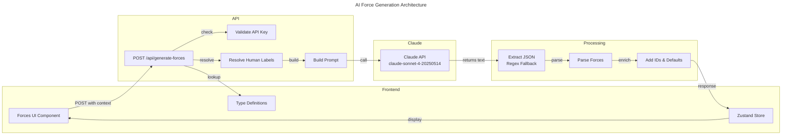

# C4 Code Level: AI Integration

## Overview

- **Name**: AI Integration Module
- **Description**: AI-powered force generation system that leverages Claude API to generate context-aware PEST-based driving forces for scenario planning
- **Location**: `/Users/shivakakkar/Scenario planning/strategic-futures-lab/lib/ai` (currently empty - AI logic resides in app/api/generate-forces)
- **Language**: TypeScript (Next.js App Router API Route)
- **Purpose**: Integrate Claude AI to intelligently generate 16 strategic driving forces based on industry context, organization type, and user-defined challenge. This enables users to quickly bootstrap their PEST analysis rather than manually brainstorming forces.

## Architecture Overview

The AI integration follows a **client-initiated API call pattern** where the frontend requests force generation and the backend calls Claude API asynchronously.

### Current Implementation Status

- **Active Code Location**: `/app/api/generate-forces/route.ts` (the AI integration currently lives here)
- **Planned Location**: `lib/ai/` directory (empty, available for refactoring)
- **Integration Type**: Next.js 13+ API Route (async POST handler)
- **AI Provider**: Anthropic Claude API (claude-sonnet-4-20250514)
- **Authentication**: Environment variable `ANTHROPIC_API_KEY`

## Code Elements

### API Route: POST /api/generate-forces

**Location**: `/Users/shivakakkar/Scenario planning/strategic-futures-lab/app/api/generate-forces/route.ts`

#### Function: `POST(request: NextRequest): Promise<NextResponse>`

Handles HTTP POST requests to generate 16 PEST-based driving forces using Claude API.

**Signature**:
```typescript
export async function POST(request: NextRequest): Promise<NextResponse>
```

**Request Payload**:
```typescript
interface GenerateForcesRequest {
  industry: string              // Industry ID (e.g., 'bfsi', 'it-services')
  organizationType: string      // Organization type ID (e.g., 'family-business', 'listed-enterprise')
  challenge: string             // User's strategic challenge/question
  modifiers?: string[]          // Optional context modifiers (e.g., ['cash-rich', 'high-regulation'])
  strategicQuestion?: string    // Explicit strategic question for additional context
}
```

**Response Payload (Success)**:
```typescript
interface GenerateForcesResponse {
  forces: Force[]
}

interface Force {
  id: string                    // Generated as 'force-{timestamp}-{index}'
  name: string                  // 3-5 word force name (e.g., "AI Talent Shortage")
  description: string           // One sentence explaining the force
  category: PESTCategory        // 'P' | 'E' | 'S' | 'T' | 'En' | 'L'
  suggestedImpact?: number      // 1-5 (AI model's suggestion, user can override)
  suggestedUncertainty?: number // 1-5 (AI model's suggestion, user can override)
  impact: number                // Always 0 (unrated - user must actively rate)
  uncertainty: number           // Always 0 (unrated - user must actively rate)
  isCustom: false               // Always false for AI-generated forces
}
```

**Response Payload (Error)**:
```typescript
interface ErrorResponse {
  error: string  // Error description
}
```

**Responsibilities**:
1. Validate ANTHROPIC_API_KEY is configured
2. Extract and parse request parameters
3. Resolve human-readable labels for industry, organization type, and context modifiers using type definitions from `/lib/types.ts`
4. Construct a structured prompt for Claude that defines the PEST analysis context and force generation requirements
5. Call Claude API with model `claude-sonnet-4-20250514` and max_tokens of 4000
6. Parse JSON response from Claude (with regex fallback for cases where text wraps the JSON)
7. Transform raw API response into domain-specific Force objects with IDs and rating defaults
8. Return structured JSON response or error
9. Log generation success/failure for debugging

**Error Handling**:
- Returns 500 status if `ANTHROPIC_API_KEY` is not configured
- Returns 500 status if Claude API call fails
- Returns 500 status if response parsing fails (no valid JSON found)
- Logs detailed error information for backend monitoring
- Gracefully handles malformed Claude responses with regex extraction

**Dependencies**:
- `@anthropic-ai/sdk` - Claude API client
- `next/server` - Next.js request/response types
- `/lib/types.ts` - INDUSTRIES, ORGANIZATION_TYPES, CONTEXT_MODIFIERS definitions

### Helper Functions

#### Function: `parseForces(content: string): Force[]`

**Inline Logic** (not extracted to separate function):
- Attempts to extract JSON from Claude response using regex: `/\{[\s\S]*\}/`
- Handles both direct JSON response and text-wrapped JSON
- Parses as either array directly or object with `.forces` property
- Maps parsed forces to add system-generated fields (id, impact=0, uncertainty=0, isCustom=false)

## Dependencies

### Internal Dependencies

The AI integration depends on type definitions and store utilities:

- **`lib/types.ts`**
  - `INDUSTRIES: Industry[]` - Industry catalog for label resolution
  - `ORGANIZATION_TYPES: OrganizationType[]` - Organization type catalog
  - `CONTEXT_MODIFIERS: ContextModifier[]` - Available context modifiers
  - `PESTCategory` type - Force categories (P, E, S, T, En, L)
  - `Force` interface - Force data structure

- **`lib/store.ts`** (frontend usage)
  - `useSimulationStore` - Zustand store hook (where generated forces are persisted)
  - `setIsGeneratingForces(boolean)` - Loading state management for UI feedback
  - `setForces(Force[])` - Store action to persist generated forces

### External Dependencies

- **`@anthropic-ai/sdk`** (v0.21.0+)
  - `Anthropic` class - API client initialization
  - `messages.create()` method - Call Claude API
  - `NextRequest`, `NextResponse` types from `next/server`

- **Claude API** (Anthropic)
  - Model: `claude-sonnet-4-20250514`
  - Endpoint: Claude API service (via SDK)
  - Authentication: ANTHROPIC_API_KEY environment variable
  - Rate limits: Anthropic API default rate limits apply

## Prompt Engineering

### Prompt Structure

The Claude prompt follows a **few-shot, structured format** to ensure consistent JSON output:

```
You are a strategic foresight expert conducting a PEST analysis for scenario planning.

Context:
- Industry: [Industry Name]
- Organization Type: [Org Type Name]
- Strategic Challenge: [User's Challenge]
- Strategic Question: [User's Question]
- Context Modifiers: [Comma-separated modifiers]

Generate 16 driving forces (4 per PEST category) that could significantly impact this organization...

[Requirements, focus areas, and format specification]

Example format:
{
  "forces": [...]
}

Return ONLY a valid JSON object...
```

### Key Prompt Elements

- **Structured Context Section**: Clearly presents the problem domain with labeled fields
- **Exact Deliverable**: "16 driving forces (4 per PEST category)"
- **Force Specification**:
  - Name: 3-5 words, memorable
  - Description: One clear sentence
  - Category: Single letter (P/E/S/T)
  - suggestedImpact: 1-5 scale
  - suggestedUncertainty: 1-5 scale
- **Quality Guardrails**:
  - Must be genuinely uncertain (not predetermined trends)
  - Industry and context relevant
  - Capable of creating materially different futures
  - Mix of near-term (3-5 years) and longer-term (5-10 years)
- **Output Format**: "Return ONLY a valid JSON object... No markdown, no explanation, just the JSON."

### Prompt Customization

The prompt adapts dynamically based on user input:

1. **Industry-specific context**: Uses INDUSTRIES lookup to provide industry name and context
2. **Organization type**: Influences interpretation of what "impact" means (e.g., listed enterprises care about quarterly pressures)
3. **Context modifiers**: Provides additional nuance (e.g., "cash-rich balance sheet" tells Claude the org can absorb financial risks)
4. **User's challenge/question**: Directly included to ensure generated forces are relevant to stated problem

## Data Flow

### Request Flow (Generation)

```
1. Frontend UI (e.g., Forces step)
   ↓ [user clicks "Generate Forces"]
2. POST /api/generate-forces
   {industry, organizationType, challenge, modifiers, strategicQuestion}
   ↓
3. API Route Handler
   ├─ Validate ANTHROPIC_API_KEY
   ├─ Resolve human-readable labels from types
   ├─ Build structured prompt
   ↓
4. Anthropic Claude API (claude-sonnet-4-20250514)
   [sends prompt]
   ├─ Returns text response with JSON
   ↓
5. API Handler
   ├─ Extract JSON from response (with regex fallback)
   ├─ Parse as Force objects
   ├─ Add IDs and defaults (impact=0, uncertainty=0, isCustom=false)
   ↓
6. Response to Frontend
   {forces: Force[]}
   ↓
7. Frontend (Zustand Store)
   └─ setForces(forces) → Persist in store and localStorage
```

### Potential Refactoring to lib/ai/

If refactored to create a dedicated `lib/ai/` module, the structure would be:

```typescript
lib/ai/
├── index.ts                    # Main exports
├── anthropic.ts               # Anthropic client singleton
├── prompts/
│   ├── force-generation.ts    # Force generation prompt builder
│   └── types.ts               # Prompt-related types
├── parsers/
│   ├── force-parser.ts        # JSON parsing and transformation
│   └── error-parser.ts        # Error response parsing
└── services/
    └── force-generator.ts     # High-level service for force generation
```

## Configuration & Environment

### Environment Variables

- **`ANTHROPIC_API_KEY`**: Required
  - Type: String (API key)
  - Source: `.env.local`
  - Usage: Initialize Anthropic client
  - Error handling: Returns 500 status if missing
  - Security: Never logged, only checked for existence

### Model Configuration

- **Model ID**: `claude-sonnet-4-20250514`
- **Max Tokens**: 4000 (enough for 16 forces with descriptions)
- **Temperature**: Not explicitly set (uses Claude API default of 1.0)
- **Top P**: Not set (uses default)

## Integration Points

### Frontend Integration

**React Component** (Forces step in simulation):
- Calls `POST /api/generate-forces` after user provides context
- Manages loading state with `setIsGeneratingForces(boolean)`
- Displays generated forces in selection UI
- Allows user to rate forces on impact/uncertainty (1-5 scale)
- Can edit force names/descriptions
- Can add custom forces alongside AI-generated ones

**State Management** (Zustand store, `lib/store.ts`):
- `setIsGeneratingForces(boolean)` - Loading state for UI feedback
- `setForces(Force[])` - Persist generated forces
- `updateForceRating(forceId, field, value)` - User ratings override AI suggestions
- `addCustomForce(force)` - User can add manual forces
- Forces are persisted to localStorage with zustand `persist` middleware

### Related Features

- **Research Notes** (`lib/store.ts`): Users can link research notes to forces
- **Scenario Generation**: Selected forces become axes for 2x2 scenario matrix
- **Impact Assessment**: Forces drive outcome narratives in scenarios

## Quality & Reliability

### Strengths

- **Contextual Intelligence**: Prompt includes industry, org type, and user challenge for relevant output
- **Deterministic Format**: Explicit JSON structure ensures parseable responses
- **Error Recovery**: Regex extraction handles minor formatting issues
- **Graceful Degradation**: Users can always manually add forces if generation fails
- **Rating Flexibility**: AI suggestions (suggestedImpact/Uncertainty) don't override user judgment (impact/uncertainty)

### Known Limitations

- **Static Prompt**: Prompt is hardcoded in route handler (not modular)
- **No Streaming**: Full response waits for completion (4000 token max)
- **Basic Error Recovery**: Regex extraction is simple (might fail on malformed JSON)
- **No Caching**: Every request calls Claude API (no deduplication for identical inputs)
- **Limited Customization**: No parameters to adjust force count, PEST distribution, or tone
- **Fixed Model Version**: Requires code change to upgrade Claude model

## Security Considerations

- **API Key Protection**: ANTHROPIC_API_KEY never exposed to frontend
- **Input Validation**: Basic (accepts any string inputs)
- **Output Validation**: JSON parsing validates structure, but doesn't validate force properties deeply
- **Rate Limiting**: Relies on Anthropic API's built-in rate limits (no app-level throttling)
- **Prompt Injection Risk**: User inputs (challenge, question) directly in prompt (low risk, non-executable context)

## Testing Recommendations

### Unit Tests

```typescript
// Test force generation with various contexts
describe('POST /api/generate-forces', () => {
  it('should generate 16 forces with correct structure', async () => {})
  it('should handle missing ANTHROPIC_API_KEY', async () => {})
  it('should parse JSON from malformed responses', async () => {})
  it('should add IDs and defaults to forces', async () => {})
})
```

### Integration Tests

```typescript
// Test with real Claude API (requires API key)
describe('Claude API integration', () => {
  it('should generate industry-relevant forces', async () => {})
  it('should respect PEST distribution (4 per category)', async () => {})
  it('should handle edge cases (very long context, special chars)', async () => {})
})
```

### E2E Tests

```typescript
// Test full flow: UI → API → Claude → Store
describe('Force generation E2E', () => {
  it('should generate and persist forces to store', async () => {})
  it('should allow user to rate and override suggestions', async () => {})
})
```

## Mermaid Diagram: Data Flow



## Notes

### Future Enhancements

1. **Extract to `lib/ai/` module**: Refactor route handler into modular services for reusability
2. **Support other AI providers**: Parameterize to allow OpenAI, Mistral, etc.
3. **Prompt versioning**: Store prompt templates in database for A/B testing
4. **Response caching**: Cache forces for identical input contexts
5. **Streaming support**: Stream force generation in real-time to user
6. **Model configuration**: Expose temperature/top_p parameters via environment variables
7. **Batch generation**: Support generating forces for multiple scenarios in one call
8. **Custom PEST categories**: Allow Indian vs. global PEST frameworks

### Current Implementation Gaps

- `lib/ai/` directory exists but is empty
- No dedicated AI utilities or service layer yet
- AI logic tightly coupled to Next.js route handler
- No abstraction for different AI providers
- No prompt templates or builders (prompts are inline strings)

### Related Documentation

- **User Guide**: See CLAUDE.md for phase descriptions and learning content
- **Type System**: See `lib/types.ts` for Force, Scenario, and domain models
- **State Management**: See `lib/store.ts` for Zustand store implementation
- **Frontend Integration**: See `app/simulation/forces/` page for Forces step UI
