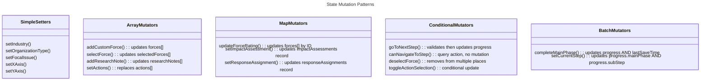

# C4 Code Level: Core Library (lib/)

## Overview

- **Name**: Strategic Futures Lab - Core Library
- **Description**: Foundation library providing state management, type definitions, and utility functions for the scenario planning simulation application
- **Location**: `/lib/` (excluding `/lib/ai`)
- **Language**: TypeScript
- **Purpose**: Manages the 4-phase simulation journey state, defines domain models for scenario planning, and provides utility functions for the entire application

---

## Code Elements

### Types and Interfaces (lib/types.ts)

#### PESTEL Categories

**`PESTCategory`** - Union Type
- **Type**: `'P' | 'E' | 'S' | 'T' | 'En' | 'L'`
- **Purpose**: Represents the 6 PESTEL force categories
- **Values**:
  - `'P'` - Political
  - `'E'` - Economic
  - `'S'` - Social
  - `'T'` - Technological
  - `'En'` - Environmental
  - `'L'` - Legal/Regulatory
- **Location**: lib/types.ts:2

**`PEST_LABELS`** - Record Mapping
- **Type**: `Record<PESTCategory, string>`
- **Purpose**: User-friendly labels for each PESTEL category
- **Location**: lib/types.ts:4-11

**`PEST_DESCRIPTIONS`** - Record Mapping
- **Type**: `Record<PESTCategory, string>`
- **Purpose**: Detailed descriptions of each PESTEL category with Indian context
- **Location**: lib/types.ts:13-20

#### Industry Configuration

**`Industry`** - Interface
- **Properties**:
  - `id: string` - Unique identifier (e.g., 'bfsi', 'it-services')
  - `name: string` - Display name (e.g., 'BFSI')
  - `icon: string` - Lucide icon name (e.g., 'landmark')
  - `description: string` - Brief description of industry
  - `indianContext?: string` - Context specific to Indian business environment
- **Purpose**: Represents an industry sector in the Indian business context
- **Location**: lib/types.ts:23-29
- **Examples**: BFSI, IT Services & SaaS, Manufacturing, Pharma & Healthcare, Consumer & Retail, Infrastructure & Real Estate, Energy & Utilities, Telecom & Media, Education & Skilling, Agri & Food Processing, Diversified Conglomerate, PSU / Government Enterprise

**`INDUSTRIES`** - Constant Array
- **Type**: `Industry[]`
- **Content**: 12 pre-defined Indian industry sectors with full metadata
- **Location**: lib/types.ts:31-116

#### Organization Type Configuration

**`OrganizationType`** - Interface
- **Properties**:
  - `id: string` - Unique identifier (e.g., 'family-business', 'startup-scaleup')
  - `name: string` - Display name (e.g., 'Promoter-led / Family Business')
  - `description: string` - Description of organization structure
  - `decisionStyle?: string` - Characteristic decision-making approach
- **Purpose**: Represents an organizational structure or ownership model
- **Location**: lib/types.ts:119-124

**`ORGANIZATION_TYPES`** - Constant Array
- **Type**: `OrganizationType[]`
- **Content**: 6 pre-defined organization types with decision characteristics
- **Location**: lib/types.ts:126-163

#### Focal Issue Templates

**`FocalIssueTemplate`** - Interface
- **Properties**:
  - `id: string` - Unique identifier (e.g., 'channel-choice')
  - `category: string` - Category name (e.g., 'Growth & Market Entry')
  - `template: string` - Template structure for focal issue phrasing
  - `example: string` - Concrete example of a focal issue
  - `goodBecause: string` - Explanation of why this makes a good focal issue
- **Purpose**: Provides templates and examples for framing strategic focal issues
- **Location**: lib/types.ts:166-172

**`FOCAL_ISSUE_TEMPLATES`** - Constant Array
- **Type**: `FocalIssueTemplate[]`
- **Content**: 6 templates covering Growth & Market Entry, Capability & Investment, Business Model, Partnerships & Ecosystem, and Organisation & Talent
- **Location**: lib/types.ts:174-217

#### Context Modifiers

**`ContextModifier`** - Interface
- **Properties**:
  - `id: string` - Unique identifier (e.g., 'pan-india')
  - `label: string` - Human-readable label (e.g., 'Pan-India presence')
  - `category: 'market' | 'financial' | 'operational' | 'regulatory'` - Modifier category
- **Purpose**: Represents contextual factors that influence strategic analysis
- **Location**: lib/types.ts:220-224

**`CONTEXT_MODIFIERS`** - Constant Array
- **Type**: `ContextModifier[]`
- **Content**: 20+ pre-defined context modifiers across market, financial, operational, and regulatory categories
- **Location**: lib/types.ts:226-253

#### Research Integration

**`ResearchNote`** - Interface
- **Properties**:
  - `id: string` - Unique identifier
  - `phase: 'focal-issue' | 'forces' | 'scenarios'` - Which simulation phase
  - `prompt: string` - Original ChatGPT prompt
  - `content: string` - AI-generated or user-edited content
  - `timestamp: number` - Millisecond timestamp of creation
  - `linkedForceIds?: string[]` - Optional links to Force objects
  - `linkedScenarioIds?: string[]` - Optional links to Scenario objects
- **Purpose**: Stores research notes from AI research missions, linked to forces and scenarios
- **Location**: lib/types.ts:256-264

**`ResearchMission`** - Interface
- **Properties**:
  - `id: string` - Unique mission identifier
  - `phase: 'focal-issue' | 'forces' | 'scenarios'` - Applicable simulation phase
  - `title: string` - Mission name
  - `description: string` - What this research mission explores
  - `suggestedPrompts: string[]` - Array of ChatGPT-ready prompts
  - `outputGuidance: string` - Instructions for what to paste from ChatGPT
- **Purpose**: Defines guided research missions for AI-assisted exploration
- **Location**: lib/types.ts:267-274

**`RESEARCH_MISSIONS`** - Constant Array
- **Type**: `ResearchMission[]`
- **Content**: 3 research missions (Industry Blind Spots, Force Deep Dive, Real-World Analogies)
- **Location**: lib/types.ts:276-313

#### Core Scenario Planning Models

**`Force`** - Interface
- **Properties**:
  - `id: string` - Unique identifier
  - `name: string` - Force name (e.g., "Government Policy Shifts")
  - `description: string` - Extended description of the force
  - `category: PESTCategory` - PESTEL classification
  - `impact: number` - Impact rating (1-5 scale)
  - `uncertainty: number` - Uncertainty rating (1-5 scale)
  - `isCustom: boolean` - Whether user-created vs AI-generated
  - `aiSuggestedImpact?: number` - Optional AI-suggested impact value
  - `aiSuggestedUncertainty?: number` - Optional AI-suggested uncertainty value
- **Purpose**: Represents a driving force in the environment that affects the organization
- **Location**: lib/types.ts:316-326

**`Scenario`** - Interface
- **Properties**:
  - `id: string` - Unique identifier
  - `name: string` - Scenario name (e.g., "Steady Growth")
  - `narrative: string` - Detailed story of how this future could unfold
  - `quadrant: 'TL' | 'TR' | 'BL' | 'BR'` - Position on 2x2 matrix
  - `timeHorizon: number` - Years into the future
  - `tone: number` - Sentiment scale from -1 (challenging) to 1 (optimistic)
  - `complexity: number` - Complexity rating (1-3)
  - `earlySignals: string[]` - Observable leading indicators
  - `keyCapabilities: string[]` - Required organizational capabilities
- **Purpose**: Represents a plausible future state based on scenario axes
- **Location**: lib/types.ts:329-339

**`ImpactScores`** - Interface
- **Properties**:
  - `probability: number` - Probability of scenario (1-5 scale)
  - `repercussion: number` - Severity of impact (1-5 scale)
  - `urgency: number` - Time criticality (1-5 scale)
  - `strategicDisruption: number` - Organizational disruption level (1-5 scale)
- **Purpose**: Assessment scores for a scenario's impact on the organization
- **Location**: lib/types.ts:342-347

**`RiskProfile`** - Interface
- **Properties**:
  - `appetite: number` - Risk appetite rating (1-5)
  - `capacity: number` - Risk capacity rating (1-5)
- **Purpose**: Represents organizational risk tolerance
- **Location**: lib/types.ts:350-353

**`ResponseType`** - Union Type
- **Type**: `'priority-action' | 'timely-action' | 'safeguard' | 'monitor' | 'ignore'`
- **Purpose**: Categories for how organization should respond to each scenario
- **Location**: lib/types.ts:356-361

**`RESPONSE_LABELS`** - Record Mapping
- **Type**: `Record<ResponseType, { label: string; description: string; color: string }>`
- **Purpose**: Human-readable labels and descriptions for response types
- **Location**: lib/types.ts:363-369

**`RESPONSE_TYPES`** - Constant Array
- **Type**: `Array<{ id: ResponseType; name: string; description: string; icon: string }>`
- **Content**: 5 response types with Lucide icon names and descriptions
- **Location**: lib/types.ts:373-379

**`ActionItem`** - Interface
- **Properties**:
  - `id: string` - Unique identifier
  - `scenarioId: string` - Associated scenario
  - `description: string` - Action description
  - `timeline: 'Q1' | 'Q2' | 'Q3' | 'Q4'` - Quarterly execution timeline
  - `budgetRange: 'low' | 'medium' | 'high'` - Budget estimate
  - `owner: 'c-suite' | 'director' | 'manager' | 'external'` - Responsibility owner
  - `selected: boolean` - Whether action is selected for prioritization
- **Purpose**: Represents an action to take in response to a scenario
- **Location**: lib/types.ts:382-390

#### Legacy Phases (Backward Compatibility)

**`SimulationPhase`** - Union Type
- **Type**: `1 | 2 | 3 | 4 | 5 | 6 | 7 | 8 | 9 | 10`
- **Purpose**: Legacy phase numbering system (kept for backward compatibility)
- **Location**: lib/types.ts:393

**`PHASE_NAMES`** - Record Mapping
- **Type**: `Record<SimulationPhase, string>`
- **Content**: Maps phase numbers 1-10 to names (Mission Briefing through Debrief & Export)
- **Location**: lib/types.ts:395-406

#### New 4-Phase Journey Structure

**`MainPhase`** - Union Type
- **Type**: `'discover' | 'design' | 'develop' | 'decide'`
- **Purpose**: Represents the 4 main phases of the journey
- **Location**: lib/types.ts:409

**`SubStep`** - Union Type
- **Type**: Union of 13 step identifiers
- **Values**:
  - Discover phase: `'pre-read' | 'context' | 'focal-issue' | 'forces'`
  - Design phase: `'uncertainties' | 'axes' | 'matrix'`
  - Develop phase: `'narratives' | 'impact' | 'risk'`
  - Decide phase: `'responses' | 'actions' | 'report'`
- **Purpose**: Individual steps within phases for granular progress tracking
- **Location**: lib/types.ts:411-428

**`PhaseProgress`** - Interface
- **Properties**:
  - `mainPhase: MainPhase` - Currently active main phase
  - `subStep: SubStep` - Currently active substep
  - `completedPhases: MainPhase[]` - Array of completed main phases
- **Purpose**: Tracks user progress through the 4-phase journey
- **Location**: lib/types.ts:430-434

**`MAIN_PHASE_CONFIG`** - Record Mapping
- **Type**: `Record<MainPhase, { label: string; description: string; subSteps: SubStep[]; icon: string }>`
- **Content**: Configuration for each of 4 main phases with descriptions and Lucide icon names
- **Location**: lib/types.ts:436-466

**`SUB_STEP_CONFIG`** - Record Mapping
- **Type**: `Record<SubStep, { label: string; mainPhase: MainPhase }>`
- **Content**: Maps each of 13 substeps to display label and parent main phase
- **Location**: lib/types.ts:468-485

#### Navigation Helpers (Functions)

**`PHASE_ORDER`** - Constant Array
- **Type**: `MainPhase[]`
- **Value**: `['discover', 'design', 'develop', 'decide']`
- **Purpose**: Canonical ordering of phases
- **Location**: lib/types.ts:488

**`getNextStep(current: SubStep): SubStep | null`**
- **Location**: lib/types.ts:498-502
- **Purpose**: Returns the next substep in the journey, or null if at the end
- **Logic**: Uses ROUTE_STEPS constant (internal array of route-level substeps)
- **Returns**: Next SubStep or null if no next step exists

**`getPrevStep(current: SubStep): SubStep | null`**
- **Location**: lib/types.ts:504-508
- **Purpose**: Returns the previous substep in the journey, or null if at the beginning
- **Logic**: Uses ROUTE_STEPS constant
- **Returns**: Previous SubStep or null if no previous step exists

**`isLastStepOfPhase(step: SubStep): boolean`**
- **Location**: lib/types.ts:510-514
- **Purpose**: Checks if a substep is the final step of its parent main phase
- **Logic**: Compares step against MAIN_PHASE_CONFIG substeps array
- **Returns**: Boolean indicating if step is last in its phase

**`isFirstStepOfPhase(step: SubStep): boolean`**
- **Location**: lib/types.ts:516-520
- **Purpose**: Checks if a substep is the first step of its parent main phase
- **Logic**: Compares step against MAIN_PHASE_CONFIG substeps array
- **Returns**: Boolean indicating if step is first in its phase

---

### State Management (lib/store.ts)

#### Stakeholder Perspective Type

**`StakeholderPerspective`** - Union Type
- **Type**: `'board-promoter' | 'ceo-md' | 'bu-head' | 'strategy-team'`
- **Purpose**: Represents different organizational levels for tailoring simulation content
- **Location**: lib/store.ts:20-24

**`STAKEHOLDER_LABELS`** - Record Mapping
- **Type**: `Record<StakeholderPerspective, { label: string; description: string }>`
- **Content**: Detailed descriptions of each stakeholder level (Board/Promoter, CEO/MD, BU Head, Strategy Team)
- **Location**: lib/store.ts:26-43

#### Zustand Store

**`useSimulationStore`** - Zustand Store Hook
- **Type**: `create<SimulationState>()`
- **Middleware**: Uses `persist` middleware with localStorage and `partialize` for selective persistence
- **Storage Key**: `'strategic-futures-lab'`
- **Location**: lib/store.ts:224-495
- **Purpose**: Central state management for entire simulation journey

#### Store State Interface

**`SimulationState`** - Interface (lib/store.ts:45-167)

**Session Metadata**
- `sessionStartTime: number | null` - When user started simulation
- `lastSaveTime: number | null` - Last state persistence timestamp

**Legacy Phase Tracking** (backward compatibility)
- `currentPhase: SimulationPhase` - Current phase (1-10)
- `completedPhases: SimulationPhase[]` - Completed legacy phases

**New Journey Progress**
- `progress: PhaseProgress` - Object tracking mainPhase, subStep, completedPhases

**Phase 1: Discover - Context Framing**
- `industry: string | null` - Selected industry sector
- `organizationType: string | null` - Organizational structure
- `stakeholderPerspective: StakeholderPerspective | null` - Decision-maker level
- `focalIssue: string | null` - Strategic question to explore
- `focalIssueRefinement: string | null` - User's additional context
- `timeHorizon: number` - Years to analyze (3-15, default 5)
- `researchNotes: ResearchNote[]` - AI research and user notes

**Legacy Phase 1 Fields** (backward compatibility)
- `challenge: string | null` - Old challenge field
- `customChallenge: string | null` - User-custom challenge
- `modifiers: string[]` - Context modifiers
- `strategicQuestion: string | null` - Legacy strategic question

**Phase 2-3: Design - Forces & Uncertainties**
- `forces: Force[]` - All forces (AI-generated + custom)
- `selectedForces: Force[]` - Forces chosen for scenario matrix
- `xAxis: Force | null` - X-axis driving force
- `yAxis: Force | null` - Y-axis driving force
- `xAxisLabels: { low: string; high: string }` - X-axis polarity labels
- `yAxisLabels: { low: string; high: string }` - Y-axis polarity labels

**Phase 3: Develop - Scenarios**
- `scenarios: Scenario[]` - 4 quadrant scenarios (TL, TR, BL, BR)

**Phase 4: Decide - Impact & Response**
- `impactAssessments: Record<string, ImpactScores>` - Impact scores by scenario ID
- `riskProfile: RiskProfile` - Organization's risk appetite & capacity
- `responseAssignments: Record<string, ResponseType>` - Response strategy per scenario
- `actions: ActionItem[]` - Action items derived from responses

**Loading States**
- `isGeneratingForces: boolean` - Forces AI generation in progress
- `isGeneratingScenarios: boolean` - Scenarios AI generation in progress
- `isGeneratingFocalIssues: boolean` - Focal issues AI generation in progress

#### Store Actions (State Setters)

**Legacy Phase Navigation**
- `setPhase(phase: SimulationPhase): void` - Set current legacy phase
- `completePhase(phase: SimulationPhase): void` - Mark legacy phase as completed

**New Journey Navigation**
- `setCurrentStep(step: SubStep): void` - Set both subStep and mainPhase
- `goToNextStep(): void` - Navigate to next substep with validation
- `goToPrevStep(): void` - Navigate to previous substep
- `completeMainPhase(phase: MainPhase): void` - Mark main phase complete, update lastSaveTime
- `canNavigateToStep(step: SubStep): boolean` - Check if navigation allowed (query action)

**Session Management**
- `startSession(): void` - Set sessionStartTime to current timestamp
- `saveProgress(): void` - Update lastSaveTime to current timestamp

**Phase 1: Context Framing Actions**
- `setIndustry(industry: string): void` - Set selected industry
- `setOrganizationType(type: string): void` - Set organization type
- `setStakeholderPerspective(perspective: StakeholderPerspective): void` - Set stakeholder level
- `setFocalIssue(issue: string): void` - Set main focal issue question
- `setFocalIssueRefinement(refinement: string): void` - Set user refinement/context
- `setTimeHorizon(years: number): void` - Set time horizon in years

**Legacy Phase 1 Actions** (backward compatibility)
- `setChallenge(challenge: string): void` - Set old challenge field
- `setCustomChallenge(challenge: string): void` - Set user-custom challenge
- `toggleModifier(modifier: string): void` - Toggle context modifier selection
- `setStrategicQuestion(question: string): void` - Set legacy strategic question

**Research Notes Actions**
- `addResearchNote(note: Omit<ResearchNote, 'id' | 'timestamp'>): void` - Add note with auto-generated ID and timestamp
- `updateResearchNote(noteId: string, content: string): void` - Update note content and timestamp
- `deleteResearchNote(noteId: string): void` - Remove note by ID
- `linkNoteToForce(noteId: string, forceId: string): void` - Add force link to note
- `linkNoteToScenario(noteId: string, scenarioId: string): void` - Add scenario link to note

**Phase 2-3: Forces & Uncertainties Actions**
- `setForces(forces: Force[]): void` - Replace entire forces array
- `updateForceRating(forceId: string, field: 'impact' | 'uncertainty', value: number): void` - Update impact/uncertainty score
- `addCustomForce(force: Omit<Force, 'id' | 'isCustom'>): void` - Add user-created force
- `selectForce(force: Force): void` - Add force to selectedForces
- `deselectForce(forceId: string): void` - Remove force from selectedForces and axes if set
- `setXAxis(force: Force | null): void` - Set x-axis force
- `setYAxis(force: Force | null): void` - Set y-axis force
- `setAxisLabels(axis: 'x' | 'y', labels: { low: string; high: string }): void` - Set polarity labels

**Phase 4: Scenarios Actions**
- `setScenarios(scenarios: Scenario[]): void` - Replace entire scenarios array
- `updateScenario(scenarioId: string, updates: Partial<Scenario>): void` - Partial update to scenario

**Phase 5: Impact & Assessment Actions**
- `setImpactAssessment(scenarioId: string, scores: ImpactScores): void` - Set all impact scores for scenario
- `updateImpactScore(scenarioId: string, field: keyof ImpactScores, value: number): void` - Update single score field
- `setRiskProfile(profile: RiskProfile): void` - Set risk appetite and capacity

**Phase 6: Response Planning Actions**
- `setResponseAssignment(scenarioId: string, response: ResponseType): void` - Assign response strategy to scenario
- `setActions(actions: ActionItem[]): void` - Replace entire actions array
- `toggleActionSelection(actionId: string): void` - Toggle action's selected flag

**Loading State Actions**
- `setIsGeneratingForces(isGenerating: boolean): void` - Set forces generation loading state
- `setIsGeneratingScenarios(isGenerating: boolean): void` - Set scenarios generation loading state
- `setIsGeneratingFocalIssues(isGenerating: boolean): void` - Set focal issues generation loading state

**Session Management**
- `resetSimulation(): void` - Reset entire state to initialState

#### Computed Selectors (Store Export Functions)

**`useHighImpactUncertaintyForces(): Force[]`**
- **Location**: lib/store.ts:498-501
- **Purpose**: Selector that returns forces with both impact >= 3 AND uncertainty >= 3
- **Use case**: Identifying critical uncertainties for scenario axes
- **Returns**: Filtered array of Force objects

**`useTotalImpact(scenarioId: string): number`**
- **Location**: lib/store.ts:503-513
- **Purpose**: Calculates total impact score for a scenario
- **Logic**: Sums probability + repercussion + urgency + strategicDisruption
- **Returns**: Number (0 if assessment doesn't exist)

**`useTotalRiskTolerance(): number`**
- **Location**: lib/store.ts:515-516
- **Purpose**: Calculates organization's total risk tolerance
- **Logic**: Sums risk appetite + risk capacity
- **Returns**: Number between 2 (minimum) and 10 (maximum)

---

### Utility Functions (lib/utils.ts)

**`cn(...inputs: ClassValue[]): string`**
- **Location**: lib/utils.ts:4-6
- **Parameters**: Variable arguments of Tailwind ClassValue types
- **Dependencies**: Uses `clsx` and `tailwind-merge`
- **Purpose**: Merges Tailwind CSS classes intelligently, resolving conflicts
- **Returns**: Merged CSS class string
- **Use case**: Conditional class application in React components with Tailwind override handling

**`generateId(): string`**
- **Location**: lib/utils.ts:8-10
- **Purpose**: Generates a pseudo-random unique ID for new entities
- **Logic**: Converts Math.random() to base-36 string and extracts substring
- **Returns**: 13-character alphanumeric string (e.g., "a1b2c3d4e5f6g")
- **Use case**: Creating IDs for Forces, Scenarios, ActionItems, ResearchNotes

---

## Dependencies

### Internal Dependencies

**Cross-module imports within lib/**
- `store.ts` imports from `types.ts`: Force, Scenario, ImpactScores, RiskProfile, ResponseType, ActionItem, SimulationPhase, ResearchNote, MainPhase, SubStep, PhaseProgress
- `store.ts` imports from `types.ts` (constants): MAIN_PHASE_CONFIG, SUB_STEP_CONFIG, getNextStep, getPrevStep, isLastStepOfPhase
- `store.ts` imports from `utils.ts`: generateId

### External Dependencies

| Package | Module | Use | Version Context |
|---------|--------|-----|-----------------|
| **zustand** | `create` | State management hook creation | Latest (v4+) |
| **zustand/middleware** | `persist` | LocalStorage persistence of state | Built-in middleware |
| **clsx** | `clsx` | Class name utility for conditional CSS | For cn() utility |
| **tailwind-merge** | `twMerge` | Tailwind CSS class merge/deduplication | For cn() utility |

### Architecture Dependencies

- **React** - Components use Zustand hooks which require React context
- **Tailwind CSS** - `cn()` utility specifically handles Tailwind class merging
- **Browser localStorage** - `persist` middleware relies on localStorage API

---

## Code Organization Patterns

### State Shape Hierarchy

The store organizes state into logical sections following the journey phases:

```
SimulationState
├── Session Metadata (sessionStartTime, lastSaveTime)
├── Legacy Phase Tracking (currentPhase, completedPhases)
├── New Journey Progress (progress.mainPhase, progress.subStep)
├── Phase 1: Context (industry, organizationType, stakeholderPerspective, focalIssue, timeHorizon)
├── Phase 2-3: Forces (forces[], selectedForces[], xAxis, yAxis, labels)
├── Phase 4: Scenarios (scenarios[])
├── Phase 5-6: Assessment (impactAssessments, riskProfile, responseAssignments, actions)
├── Research Notes (researchNotes[])
└── Loading States (isGeneratingForces, isGeneratingScenarios, isGeneratingFocalIssues)
```

### Type Safety Strategy

**Three layers of type definitions**:

1. **Domain Models** (Force, Scenario, ImpactScores) - Business logic entities
2. **Configuration Maps** (INDUSTRIES, ORGANIZATION_TYPES, RESPONSE_LABELS) - UI/content mapping
3. **State Interface** (SimulationState) - Store shape, not directly typed on store

**Union types for constrained values**:
- `PESTCategory`, `MainPhase`, `SubStep`, `ResponseType` - Prevent invalid state values
- Enables autocomplete and IDE validation

### Persistence Strategy

**Selective persistence via `partialize` function**:
- **Persisted**: All user-entered data (forces, scenarios, assessments, actions)
- **NOT persisted**: Loading states (prevents stale loading indicators after reload)
- **Enables**: Clean UX on page refresh while maintaining data integrity

### Navigation Validation

**Three-tier navigation logic**:

1. **canNavigateToStep()** - Query action that validates navigation rules
   - Can always go back to completed phases
   - Can navigate within current phase
   - Can advance to next phase only if current is complete

2. **goToNextStep() / goToPrevStep()** - Safe navigation actions
   - Check validity before updating state
   - Update both mainPhase and subStep together
   - Prevent orphaned state

3. **Helper functions** - Pure logic for step relationships
   - getNextStep(), getPrevStep() - Linear progression
   - isFirstStepOfPhase(), isLastStepOfPhase() - Phase boundaries

---

## Relationships

### Store State Flow Diagram

The simulation follows a linear 4-phase journey with backward navigation allowed after completion.

```mermaid
---
title: Simulation State Management Flow
---
classDiagram
    namespace Discover {
        class ContextFraming {
            <<phase>>
            industry: string
            organizationType: string
            stakeholderPerspective: string
            focalIssue: string
            timeHorizon: number
            researchNotes: ResearchNote[]
        }
    }

    namespace Design {
        class ForcesAndUncertainties {
            <<phase>>
            forces: Force[]
            selectedForces: Force[]
            xAxis: Force
            yAxis: Force
            xAxisLabels: Labels
            yAxisLabels: Labels
        }

        class ScenarioMatrix {
            <<phase>>
            scenarios: Scenario[]
        }
    }

    namespace Develop {
        class AssessImpact {
            <<phase>>
            impactAssessments: Map~string, ImpactScores~
            riskProfile: RiskProfile
        }
    }

    namespace Decide {
        class ResponsePlanning {
            <<phase>>
            responseAssignments: Map~string, ResponseType~
            actions: ActionItem[]
        }
    }

    namespace Navigation {
        class PhaseProgress {
            mainPhase: MainPhase
            subStep: SubStep
            completedPhases: MainPhase[]
        }
    }

    ContextFraming -->|Phase 1 → 2| ForcesAndUncertainties
    ForcesAndUncertainties -->|Phase 2 → 3| ScenarioMatrix
    ScenarioMatrix -->|Phase 3 → 4| AssessImpact
    AssessImpact -->|Phase 4 → 5| ResponsePlanning

    PhaseProgress -->|tracks| ContextFraming
    PhaseProgress -->|tracks| ForcesAndUncertainties
    PhaseProgress -->|tracks| ScenarioMatrix
    PhaseProgress -->|tracks| AssessImpact
    PhaseProgress -->|tracks| ResponsePlanning
```

### Domain Model Relationships

Forces, Scenarios, and Assessments form the core planning artifacts:

```mermaid
---
title: Scenario Planning Domain Model
---
classDiagram
    class Force {
        id: string
        name: string
        description: string
        category: PESTCategory
        impact: number
        uncertainty: number
        isCustom: boolean
    }

    class Scenario {
        id: string
        name: string
        narrative: string
        quadrant: string
        earlySignals: string[]
        keyCapabilities: string[]
    }

    class ImpactScores {
        probability: number
        repercussion: number
        urgency: number
        strategicDisruption: number
    }

    class RiskProfile {
        appetite: number
        capacity: number
    }

    class ActionItem {
        id: string
        scenarioId: string
        description: string
        timeline: string
        budgetRange: string
        owner: string
        selected: boolean
    }

    class ResearchNote {
        id: string
        content: string
        linkedForceIds: string[]
        linkedScenarioIds: string[]
    }

    Force -->|"x & y axes"| Scenario
    Force -->|"impact/uncertainty"| Scenario
    Scenario -->|"1:1"| ImpactScores
    ResearchNote -->|"linked to"| Force
    ResearchNote -->|"linked to"| Scenario
    Scenario -->|"1:many"| ActionItem
    RiskProfile -->|"evaluates"| Scenario
```

### Configuration Hierarchy

Industry, organization type, and stakeholder perspective guide personalization:

```mermaid
---
title: Simulation Configuration Hierarchy
---
classDiagram
    class INDUSTRIES {
        BFSI, IT Services, Manufacturing, Pharma
        Consumer & Retail, Infrastructure, Energy
        Telecom, Education, Agri-Food, Conglomerate, PSU
    }

    class ORGANIZATION_TYPES {
        Family Business
        PE/VC-backed
        MNC Subsidiary
        Listed Enterprise
        Startup/Scale-up
        PSU/Government
    }

    class STAKEHOLDER_LEVELS {
        Board/Promoter
        CEO/MD
        BU Head
        Strategy Team
    }

    class CONTEXT_MODIFIERS {
        Market: Pan-India, Regional, Tier-2/3
        Financial: Cash-rich, Leveraged, PE-pressure, IPO
        Operational: Legacy tech, Digital native, Asset models
        Regulatory: High regulation, Government-dependent, PLI
    }

    INDUSTRIES -->|"selected by"| ContextFraming
    ORGANIZATION_TYPES -->|"selected by"| ContextFraming
    STAKEHOLDER_LEVELS -->|"selected by"| ContextFraming
    CONTEXT_MODIFIERS -->|"applied to"| ContextFraming
```

### Action Creator Pattern

All Zustand actions follow a consistent pattern for state mutations:



---

## Summary

### Key Responsibilities

| File | Responsibility |
|------|-----------------|
| **types.ts** | Define all domain models, configuration constants, and type system for scenario planning workflow |
| **store.ts** | Manage centralized state, persist to localStorage, provide navigation logic, expose computed selectors |
| **utils.ts** | Provide foundation utilities (CSS class merging, ID generation) used throughout application |

### State Management Flow

1. User navigates phases → PhaseProgress updates (mainPhase, subStep, completedPhases)
2. User defines focal issue → ContextFraming updates (industry, stakeholder, focalIssue)
3. AI generates forces → Forces array populated, loading state managed
4. User selects axes → xAxis/yAxis set, selectedForces updated
5. Scenarios generated → 4 quadrants populated from axes
6. Impact assessed → impactAssessments record built (scenario ID → scores)
7. Responses planned → responseAssignments and actions defined
8. All state persisted to localStorage via Zustand persist middleware

### Type Safety Guarantees

- **Constrained values**: MainPhase, SubStep, ResponseType prevent invalid states
- **Record mappings**: PEST_LABELS, RESPONSE_LABELS, MAIN_PHASE_CONFIG enable type-safe lookups
- **Domain models**: Force, Scenario, ImpactScores provide shape validation
- **Navigation helpers**: getNextStep, getPrevStep prevent broken navigation sequences

---

## Notes

- **Backward Compatibility**: Legacy phase system (1-10) maintained alongside new 4-phase journey
- **localStorage Persistence**: Selective persistence via `partialize` preserves user data across sessions
- **AI Integration**: Store coordinates with `/app/api/generate-forces` and AI modules via loading state flags
- **Indian Context**: Industry and organization types tailored for Indian business ecosystem
- **Extensibility**: ResearchMission/ResearchNote system designed to support future AI research integrations
