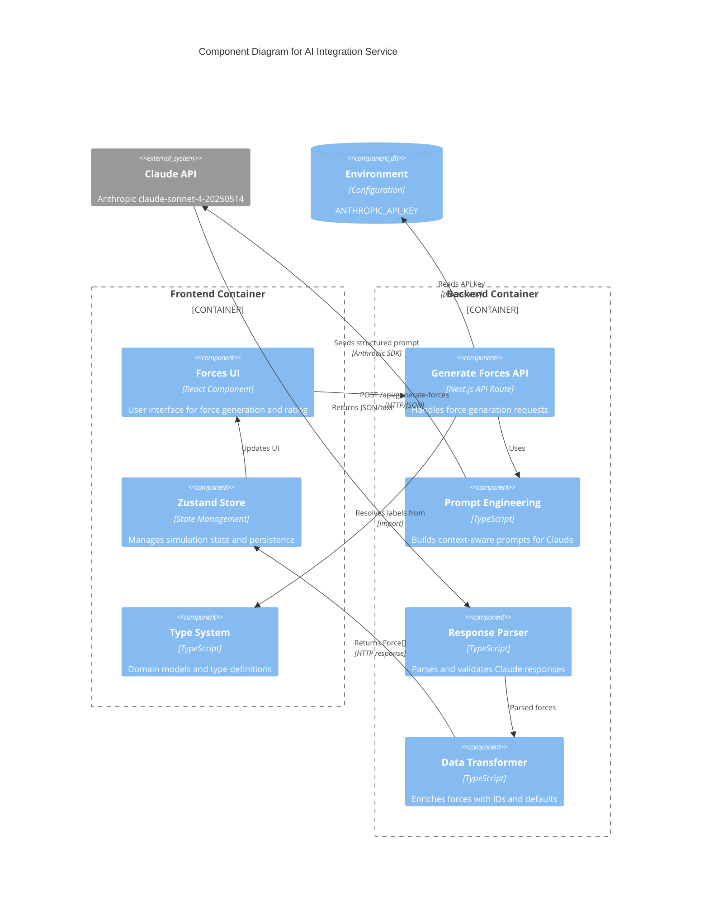
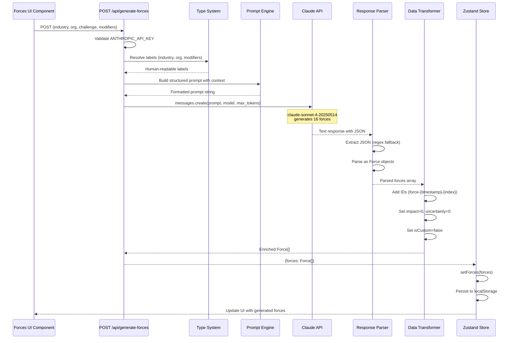

# C4 Component Level: AI Integration Service

## Overview
- **Name**: AI Integration Service
- **Description**: Claude API integration service for AI-powered context-aware PEST force generation in scenario planning workflows
- **Type**: Backend Service
- **Technology**: Anthropic SDK (claude-sonnet-4-20250514), Next.js 14 App Router API Routes, TypeScript

## Purpose

The AI Integration Service provides intelligent generation of strategic driving forces for scenario planning by leveraging Anthropic's Claude AI. This component transforms user-provided business context (industry, organization type, strategic challenge) into 16 structured PEST-based driving forces, enabling users to quickly bootstrap their scenario planning analysis rather than manually brainstorming forces from scratch.

The service acts as the bridge between the frontend simulation workflow and the Claude API, handling prompt engineering, response parsing, data transformation, and error recovery to deliver consistent, domain-specific strategic forces.

## Software Features

### Force Generation Endpoint
- **POST /api/generate-forces**: Primary endpoint for AI-powered force generation
  - Accepts industry context, organization type, strategic challenge, and optional modifiers
  - Returns 16 PEST-categorized driving forces (4 per category: Political, Economic, Social, Technological)
  - Includes AI-suggested impact and uncertainty ratings (user must actively confirm)
  - Generates unique IDs and initializes rating fields to 0 (requiring user input)

### Prompt Engineering
- **Context-aware prompt construction**: Dynamically builds prompts based on user context
  - Resolves industry/organization type/modifier IDs to human-readable labels
  - Embeds strategic challenge and focal question directly into prompt
  - Provides explicit format requirements and examples to Claude
  - Specifies force quality criteria (genuinely uncertain, industry-relevant, capable of creating materially different futures)

- **Structured output format**: Requests JSON-only response with defined schema
  - Forces Claude to return parseable JSON (no markdown wrappers)
  - Includes fallback regex extraction for wrapped JSON responses
  - Validates response structure before returning to client

### Response Processing
- **JSON parsing with error recovery**: Handles multiple response formats
  - Extracts JSON from text using regex fallback (`/\{[\s\S]*\}/`)
  - Supports both direct array and object with `.forces` property
  - Logs parse errors for debugging while returning user-friendly error messages

- **Data transformation and enrichment**: Converts AI response to domain model
  - Generates unique IDs using timestamp + index pattern (`force-{timestamp}-{index}`)
  - Initializes `impact` and `uncertainty` to 0 (user must rate)
  - Preserves AI suggestions in `suggestedImpact` and `suggestedUncertainty` fields
  - Marks all forces as `isCustom: false`

### Error Handling
- **API key validation**: Checks for ANTHROPIC_API_KEY on every request
- **Graceful failure modes**: Returns 500 status with descriptive error messages
  - Missing API key error
  - Claude API call failure
  - JSON parsing failure
  - Response validation failure
- **Detailed logging**: Console logs all errors for backend monitoring and debugging

## Code Elements

This component contains the following code-level elements:

- [c4-code-lib-ai.md](./c4-code-lib-ai.md) - AI Integration Module (prompt engineering, Claude API client, response parsing logic)
- [c4-code-app-api.md](./c4-code-app-api.md) - API Routes (POST /api/generate-forces handler, request/response types)

## Interfaces

### POST /api/generate-forces
- **Protocol**: REST/HTTP (Next.js API Route)
- **Description**: Generates 16 PEST-based driving forces using Claude AI based on user context
- **Operations**:
  - `POST(request: NextRequest): Promise<NextResponse>` - Main handler that orchestrates force generation

**Request Schema**:
```typescript
{
  industry: string              // Industry ID (e.g., 'bfsi', 'it-services')
  organizationType: string      // Organization type ID (e.g., 'family-business', 'listed-enterprise')
  challenge: string             // User's strategic challenge description
  modifiers?: string[]          // Optional context modifiers (e.g., ['cash-rich', 'high-regulation'])
  strategicQuestion?: string    // Explicit strategic question for additional context
}
```

**Response Schema (Success - 200)**:
```typescript
{
  forces: Force[]
}

// Where Force is:
{
  id: string                    // Generated as 'force-{timestamp}-{index}'
  name: string                  // 3-5 word force name (e.g., "AI Talent Shortage")
  description: string           // One clear sentence explaining the force
  category: PESTCategory        // 'P' | 'E' | 'S' | 'T' | 'En' | 'L'
  suggestedImpact: number       // 1-5 scale (AI suggestion)
  suggestedUncertainty: number  // 1-5 scale (AI suggestion)
  impact: number                // 0 (Not Rated) - user must actively rate
  uncertainty: number           // 0 (Not Rated) - user must actively rate
  isCustom: boolean             // false for AI-generated forces
}
```

**Response Schema (Error - 500)**:
```typescript
{
  error: string  // Descriptive error message
}
```

## Dependencies

### Components Used

The AI Integration Service depends on the following internal components:

- **State Management Component** (lib/store.ts)
  - Uses Zustand store for persisting generated forces in frontend
  - Calls `setIsGeneratingForces(boolean)` for loading state management
  - Calls `setForces(Force[])` to persist generated forces
  - Not directly called by this component, but consumes its output

- **Type System Component** (lib/types.ts)
  - `INDUSTRIES: Industry[]` - Industry catalog for label resolution
  - `ORGANIZATION_TYPES: OrganizationType[]` - Organization type catalog for label resolution
  - `CONTEXT_MODIFIERS: ContextModifier[]` - Available context modifiers for label resolution
  - `PESTCategory` type - Force categories (P, E, S, T, En, L)
  - `Force` interface - Force data structure used in request/response

### External Systems

- **Anthropic Claude API**
  - Model: claude-sonnet-4-20250514
  - Max Tokens: 4000
  - Authentication: ANTHROPIC_API_KEY environment variable
  - Rate Limits: Anthropic API default rate limits apply
  - SDK: @anthropic-ai/sdk (v0.32.1+)
  - Used via Anthropic class and messages.create() method

- **Next.js Server Runtime**
  - NextRequest, NextResponse types from next/server
  - Next.js 14 App Router API Route pattern
  - Server-side execution environment

## Component Diagram



## Architecture Patterns

### Prompt Engineering Strategy
**Pattern**: Highly explicit, format-prescriptive prompts with few-shot examples

The service constructs prompts that:
- Provide detailed business context (industry, organization type, challenge)
- Specify exact PEST categories and field names
- Include format examples to guide output structure
- Request ONLY JSON (no markdown/explanation)
- Set expectations for content quality (3-5 word names, one-sentence descriptions)
- Define quality guardrails (genuinely uncertain, industry-relevant, capable of creating materially different futures)

**Rationale**: Ensures consistent, parseable responses from Claude while maintaining relevance to user context.

### Error Handling Strategy
**Pattern**: Graceful degradation with user-facing errors and detailed backend logging

The service:
- Validates API key before processing (fail fast)
- Uses try-catch around JSON parsing with detailed logging
- Returns generic but helpful error messages to client
- Console logs full errors for debugging
- Never exposes API key or sensitive data in error messages

**Rationale**: Prevents processing failures from reaching users without visibility to developers.

### Response Format Resilience
**Pattern**: Multi-format JSON extraction with regex fallback

The service handles:
- Direct JSON array responses
- Object responses with `.forces` property
- Text-wrapped JSON (extracts using regex `/\{[\s\S]*\}/`)

**Rationale**: Provides flexibility if Claude's response format varies slightly, improving robustness.

### Rating Initialization
**Pattern**: Initialize all ratings to 0 (Not Rated) instead of using AI suggestions directly

The service:
- Sets `impact: 0` and `uncertainty: 0` on all generated forces
- Preserves AI suggestions in `suggestedImpact` and `suggestedUncertainty` fields
- Forces user to actively evaluate forces in their own context

**Rationale**: Prevents over-reliance on AI suggestions; encourages critical thinking and contextual judgment.

## Data Flow

### Request Flow (Force Generation)



## Configuration & Environment

### Environment Variables
- **ANTHROPIC_API_KEY**: Required
  - Type: String (API key)
  - Source: .env.local
  - Usage: Initialize Anthropic client
  - Error handling: Returns 500 status if missing
  - Security: Never logged, only checked for existence; server-side only

### Model Configuration
- **Model ID**: claude-sonnet-4-20250514
- **Max Tokens**: 4000 (sufficient for 16 forces with descriptions, ~250 tokens per force)
- **Temperature**: Not explicitly set (uses Claude API default of 1.0)
- **Top P**: Not set (uses default)

## Performance Characteristics

| Aspect | Value | Notes |
|--------|-------|-------|
| **Max Tokens** | 4000 | Sufficient for 16 force objects (~250 tokens per force) |
| **Model** | claude-sonnet-4-20250514 | Fast, capable of structured output |
| **Typical Latency** | 2-5 seconds | Depends on Anthropic API load |
| **Request Size** | < 5 KB | Typical request payload |
| **Response Size** | < 2 KB | Parsed JSON forces array |
| **Timeout** | Not explicitly set | Inherits Next.js default (30 seconds) |

## Security Considerations

### API Key Protection
- Stored in .env.local (never committed to version control)
- Validated on every request
- Server-side execution prevents exposure to frontend
- Never logged or included in error messages

### Input Validation
- Current: Minimal validation (relies on Claude API to handle invalid categories)
- Risk: Malformed category strings could reach Claude
- Recommendation: Add enum validation before prompt construction

### Output Validation
- Current: JSON parsing with try-catch
- Risk: Invalid force objects could be stored if parse succeeds
- Recommendation: Add Zod/TypeScript validation before returning to client

### Prompt Injection Risk
- User inputs (challenge, question) directly in prompt
- Risk Level: Low (non-executable context, no system commands)
- Claude API has built-in safety measures

### Rate Limiting
- Current: Relies on Anthropic API's built-in rate limits
- No app-level throttling or request deduplication
- Recommendation: Add rate limiting to prevent API quota exhaustion

## Integration Points

### Frontend Integration
**React Component** (Forces step in simulation):
- Calls `POST /api/generate-forces` after user provides context in earlier steps
- Manages loading state with `setIsGeneratingForces(boolean)` from Zustand store
- Displays generated forces in selection UI with rating interface
- Allows user to rate forces on impact/uncertainty (1-5 scale)
- Enables editing of force names and descriptions
- Supports adding custom forces alongside AI-generated ones

**State Management** (Zustand store):
- `setIsGeneratingForces(boolean)` - Loading state for UI feedback during API call
- `setForces(Force[])` - Persist generated forces to store and localStorage
- `updateForceRating(forceId, field, value)` - User ratings override AI suggestions
- `addCustomForce(force)` - User can add manual forces
- Forces persisted to localStorage with zustand persist middleware

### Related Features
- **Research Notes**: Users can link research notes to forces for context
- **Scenario Generation**: Selected forces become axes for 2x2 scenario matrix
- **Impact Assessment**: Forces drive outcome narratives in scenario development

## Known Limitations

1. **Static Prompt**: Prompt is hardcoded in route handler (not modular or versioned)
2. **No Streaming**: Full response waits for completion (4000 token max); no real-time streaming to user
3. **Basic Error Recovery**: Regex extraction is simple; may fail on severely malformed JSON
4. **No Caching**: Every request calls Claude API (no deduplication for identical inputs)
5. **Limited Customization**: No parameters to adjust force count, PEST distribution, or tone
6. **Fixed Model Version**: Requires code change to upgrade Claude model
7. **No Rate Limiting**: No app-level throttling; relies entirely on Anthropic API limits
8. **lib/ai/ Directory Empty**: AI logic currently resides in API route; planned refactoring not yet implemented

## Future Enhancements

1. **Extract to lib/ai/ module**: Refactor route handler into modular services for reusability
2. **Support other AI providers**: Parameterize to allow OpenAI, Mistral, or other LLMs
3. **Prompt versioning**: Store prompt templates in database for A/B testing and iteration
4. **Response caching**: Cache forces for identical input contexts to reduce API costs
5. **Streaming support**: Stream force generation in real-time to user for better UX
6. **Model configuration**: Expose temperature/top_p parameters via environment variables
7. **Batch generation**: Support generating forces for multiple scenarios in one call
8. **Custom PEST categories**: Allow Indian vs. global PEST frameworks (e.g., GST/RBI focus)
9. **Input validation layer**: Add Zod schemas for request validation
10. **Output validation layer**: Add Zod schemas for response validation before returning

## Deployment Considerations

### Current Deployment
- Deployed as Next.js API Route within the same application container as frontend
- No separate service boundary or deployment unit
- Shares application runtime and resources with frontend

### Potential Future Architecture
If extracted to dedicated service:
- Separate Node.js microservice with API Gateway
- Independent scaling based on AI generation load
- Could be deployed as AWS Lambda or containerized service
- Would require CORS configuration and authentication layer
- Could serve multiple frontend applications

## Testing Recommendations

### Unit Tests
```typescript
describe('POST /api/generate-forces', () => {
  it('should generate 16 forces with correct structure', async () => {})
  it('should handle missing ANTHROPIC_API_KEY', async () => {})
  it('should parse JSON from malformed responses', async () => {})
  it('should add IDs and defaults to forces', async () => {})
  it('should resolve industry/org/modifier labels correctly', async () => {})
})
```

### Integration Tests
```typescript
describe('Claude API integration', () => {
  it('should generate industry-relevant forces', async () => {})
  it('should respect PEST distribution (4 per category)', async () => {})
  it('should handle edge cases (very long context, special chars)', async () => {})
  it('should handle API rate limits gracefully', async () => {})
})
```

### E2E Tests
```typescript
describe('Force generation E2E', () => {
  it('should generate and persist forces to store', async () => {})
  it('should allow user to rate and override suggestions', async () => {})
  it('should display loading state during generation', async () => {})
  it('should handle generation errors gracefully in UI', async () => {})
})
```

## Notes

### Strengths
- **Contextual Intelligence**: Prompt includes industry, org type, and user challenge for relevant output
- **Deterministic Format**: Explicit JSON structure ensures parseable responses
- **Error Recovery**: Regex extraction handles minor formatting issues
- **Graceful Degradation**: Users can always manually add forces if generation fails
- **Rating Flexibility**: AI suggestions don't override user judgment; forces user to actively evaluate

### Implementation Gaps
- lib/ai/ directory exists but is empty
- No dedicated AI utilities or service layer yet
- AI logic tightly coupled to Next.js route handler
- No abstraction for different AI providers
- No prompt templates or builders (prompts are inline strings)

### Related Documentation
- **User Guide**: See CLAUDE.md for phase descriptions and learning content
- **Type System**: See lib/types.ts for Force, Scenario, and domain models
- **State Management**: See lib/store.ts for Zustand store implementation
- **Frontend Integration**: See app/simulation/design/forces/ page for Forces step UI
- **API Documentation**: See c4-code-app-api.md for detailed API route documentation
- **AI Module Documentation**: See c4-code-lib-ai.md for AI integration details
