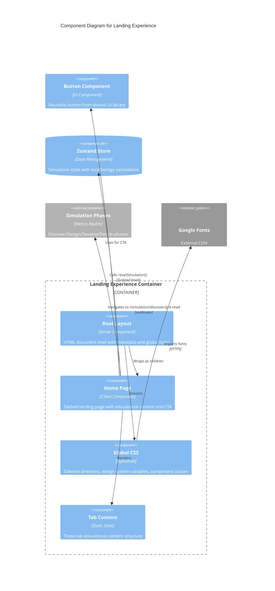

# C4 Component Level: Landing Experience

## Overview
- **Name**: Landing Experience
- **Description**: Entry point and educational introduction to scenario planning methodology that welcomes users, explains the discipline, and launches them into the simulation journey
- **Type**: Application Module
- **Technology**: Next.js 14 App Router, React 18, Framer Motion, Tailwind CSS

## Purpose

The Landing Experience component serves as the application's front door, providing users with:

1. **Educational Onboarding**: Introduces scenario planning methodology through a three-tab interface that allows self-directed learning depth
2. **Credibility Establishment**: Traces the lineage from Herman Kahn through Pierre Wack to Peter Schwartz, positioning the methodology as proven and executive-grade
3. **Journey Preview**: Outlines the four-phase simulation structure (Discover → Design → Develop → Decide) with clear learning outcomes
4. **State Initialization**: Resets the simulation state before navigation to ensure a clean user session
5. **Brand Experience**: Establishes the premium, executive feel through dark theme with gold accents, serif typography, and smooth animations

This component bridges marketing content and application functionality—it's not just a homepage, but an educational gateway that prepares users mentally before they begin the simulation.

## Software Features

### 1. Landing Page with Tabbed Pre-Read Content
- **Three-tab interface** for self-paced learning:
  - **Tab 1 ("What is Scenario Planning")**: Explains the discipline's history (RAND, Shell), methodology, and psychological impact—4 paragraphs with golden quote callout
  - **Tab 2 ("From the creators")**: Traces methodology lineage (Kahn → Wack → Schwartz) with hyperlink to "The Art of the Long View" book—3 paragraphs with credibility-building callout
  - **Tab 3 ("Your Journey Ahead")**: Previews the four-phase simulation structure with icons (Search, Compass, Layers, Target) and learning outcomes—4 labeled sections with golden quote
- **Animated tab indicator**: Spring-based layout animation that slides a gold bar under the active tab
- **Content fade transitions**: AnimatePresence with staggered fade animations when switching tabs
- **Consistent tab content height**: All tabs designed to similar length to prevent layout shift

### 2. Root Layout with Global Styling
- **HTML document shell**: Wraps all pages with metadata, language declaration, and global styles
- **Metadata configuration**: Exports Next.js Metadata object with site title ("Strategic Futures Lab") and description ("AI-powered scenario planning simulation")
- **Dark theme gradient background**: Navy-to-white gradient (`bg-gradient-to-b from-white to-navy-50`) applied at root level
- **Global CSS import**: Loads Tailwind directives, custom properties, font imports, and design system

### 3. Dark Theme with Gold Accents
- **Color palette**:
  - Backgrounds: `slate-900` (page), `slate-800` (cards), `slate-700` (borders)
  - Text: `white` (headings), `slate-100/200/300` (body), `slate-400/500` (muted)
  - Accents: `gold-400/500` (interactive elements, icons, highlights)
  - Success: `emerald-400/500` (completion indicators)
- **Typography**: Serif (Playfair Display) for headings, sans-serif (Inter) for body text
- **Component classes**: Pre-defined classes for executive cards, buttons, sliders with consistent styling
- **Custom scrollbar**: 8px width with slate background and hover effects

### 4. Brand Section
- **Focus icon** in rounded gold container (`w-12 h-12 rounded-lg bg-gold-500/10`)
- **Bicolor heading**: "The Art of" (slate) + "Thinking the Unthinkable" (gold)
- **Value proposition subtitle**: "AI-powered scenario planning simulation based on Shell's legendary methodology"

### 5. Call-to-Action with Attribution
- **Large primary button**: "Get ready to see the future" with gold styling and large size (`size="lg"`)
- **Credit line**: "Inspired by The Art of the Long View" with external hyperlink to book source
- **Navigation handler**: `handleStart()` function that resets simulation state and navigates to `/simulation/discover/pre-read`

### 6. Entry Animations
- **Page fade-in and slide-up**: 0.6-second animation on page load (`opacity: 0 → 1`, `y: 20px → 0`)
- **Tab indicator spring animation**: Stiffness 500, damping 30, with `layoutId="activeTab"`
- **Content fade transitions**: 0.2-second fade with vertical translation on tab switch

## Code Elements

This component contains the following code-level elements:

### Root Layout and Landing Page
- [c4-code-app-root.md](./c4-code-app-root.md) - Root layout component, landing page with tabbed interface, global CSS, and navigation logic

### Design System Documentation
- [c4-code-docs.md](./c4-code-docs.md) - Component patterns, design system color palette, animation patterns, and learning content guidelines referenced by the landing experience

## Interfaces

### Route Endpoints
- **Primary Route**: `/` (root route)
  - **Method**: GET
  - **Type**: Client-rendered page (Next.js App Router)
  - **Returns**: HTML with tabbed landing page interface
  - **State**: Local React state for `activeTab` selection

### Navigation Targets
- **Outbound Navigation**: `/simulation/discover/pre-read`
  - **Trigger**: User clicks "Get ready to see the future" button
  - **State Management**: Calls `resetSimulation()` from Zustand store before navigation
  - **Protocol**: Client-side navigation via Next.js `useRouter` hook

### Component API
- **RootLayout Component**:
  - **Props**: `{ children: React.ReactNode }`
  - **Returns**: `JSX.Element` with HTML shell, metadata, and styled body wrapper
  - **Type**: Server Component (default in Next.js App Router)

- **Home Component**:
  - **Props**: None
  - **Returns**: `JSX.Element` with landing page content
  - **Type**: Client Component (uses `'use client'` directive)
  - **State**: `activeTab: 'what' | 'creators' | 'journey'`
  - **Handlers**: `handleStart(): void` - Navigation trigger with state reset

### External Links
- **Book Attribution**: `https://www.amazon.com/Art-Long-View-Planning-Uncertain/dp/0385267320`
  - **Protocol**: External HTTP link with `target="_blank"` and `rel="noopener noreferrer"`
  - **Purpose**: Credibility and source attribution

## Dependencies

### Internal Components Used
- **Button**: UI component from `@/components/ui/button`
  - **Purpose**: Primary CTA button with consistent styling
  - **Props**: `size="lg"`, `onClick={handleStart}`
  - **Technology**: Radix UI primitives with Tailwind styling

### Internal State Management
- **Zustand Store**: `@/lib/store`
  - **Hook**: `useSimulationStore()`
  - **Method Used**: `resetSimulation()` - Clears all simulation state before journey start
  - **Purpose**: Ensure clean state for new simulation session

### External Libraries
| Library | Version | Purpose | Usage in Component |
|---------|---------|---------|-------------------|
| `next` | 14.2.20 | App Router framework | Metadata type, useRouter hook, RootLayout pattern |
| `react` | ^18.3.1 | UI library | JSX, useState, ReactNode typing |
| `framer-motion` | ^11.15.0 | Animation library | motion.div, AnimatePresence, layout animations |
| `lucide-react` | ^0.469.0 | Icon library | Focus, Search, Compass, Layers, Target icons |
| `tailwindcss` | ^3.4.17 | CSS framework | Utility classes for dark theme and gold accents |
| `@radix-ui/*` | Various | Headless UI primitives | Base for Button component |
| `class-variance-authority` | ^0.7.1 | Component variants | Used in Button implementation |
| `zustand` | ^5.0.2 | State management | Simulation state persistence |

### External Systems
- **Google Fonts**:
  - **Fonts**: Inter (sans-serif, weights 400-700), Playfair Display (serif, weights 400-700)
  - **Protocol**: HTTPS import in `globals.css`
  - **Purpose**: Typography design system

## Component Diagram



## Architecture & Design Patterns

### Routing Structure
```
/                                    → Home (landing page with tabs)
  ↓ User clicks CTA button
  ↓ handleStart() executes
  ↓ resetSimulation() clears state
  ↓ router.push() navigates
/simulation/discover/pre-read        → Start of 4-phase journey
```

The landing page is the application root; users must complete the onboarding flow before entering the simulation.

### Component Hierarchy
```
RootLayout (Server Component)
├── Metadata (exported)
├── Global Styles (imported)
└── {children} (pages routed by Next.js)
    └── Home (Client Component)
        ├── motion.div (wrapper for page animation)
        ├── Brand Section
        │   ├── Focus icon
        │   ├── H1 heading (bicolor)
        │   └── Subtitle
        ├── Tabbed Panel
        │   ├── Tab Headers (buttons)
        │   ├── motion.div (tab indicator)
        │   ├── Tab Content
        │   │   ├── Icons (Search, Compass, Layers, Target)
        │   │   ├── Text paragraphs
        │   │   └── Golden quote callouts
        │   └── AnimatePresence (fade animation)
        └── CTA Section
            ├── Button (UI component)
            └── Credit line (external link)
```

### State Flow
```
Home Component Mount
├── useState(activeTab) → Initialize to 'what'
├── useRouter() → Get Next.js router instance
└── useSimulationStore() → Access Zustand store

User Tab Interaction
├── Click tab header → setActiveTab(newTab)
├── Tab indicator animates → Spring animation to new position
└── Content fades → AnimatePresence exit/enter transition

User CTA Click
├── handleStart() executes
├── resetSimulation() → Clear Zustand store state
└── router.push('/simulation/discover/pre-read') → Navigate to simulation
```

### Styling Architecture

**Global CSS** (`globals.css`):
- Tailwind directives (@tailwind base, components, utilities)
- CSS custom properties for color scheme (HSL variables)
- Font imports (Inter, Playfair Display)
- Component utility classes (.btn-primary, .card-executive, etc.)
- Custom scrollbar styling

**Page Styling**:
- Tailwind utility classes directly in JSX
- Dark theme: `bg-slate-900` (page), `slate-100/300/400` (text)
- Gold accents: `text-gold-400`, `border-gold-500`
- Responsive classes available (sm:, md:, lg: prefixes)

**Component Styling**:
- Button component inherits design system theme
- Framer Motion classes for animations (opacity, y-translation)
- No inline styles; all class-based approach

## User Journey Flow

### 1. Page Load
- RootLayout renders with metadata and global styles
- Home component mounts with client-side hydration
- Initial state: `activeTab = 'what'`
- Page entry animation triggers (fade-in, slide-up over 0.6s)

### 2. Tab Exploration
- User clicks tab header ("From the creators" or "Your Journey Ahead")
- `setActiveTab(newTab)` updates local state
- Tab indicator animates to new position (spring animation, stiffness 500, damping 30)
- Old content fades out (opacity 1 → 0, y: 0 → -10px)
- New content fades in (opacity 0 → 1, y: 10px → 0)
- No page reload; state remains in component memory

### 3. External Link Click (Optional)
- User clicks "The Art of the Long View" hyperlink in Tab 2
- Opens in new browser tab (`target="_blank"`)
- Security headers prevent referrer leakage (`rel="noopener noreferrer"`)
- User remains on landing page in original tab

### 4. Simulation Start
- User clicks "Get ready to see the future" button
- `handleStart()` function executes:
  1. Calls `resetSimulation()` from Zustand store (clears all simulation state)
  2. Calls `router.push('/simulation/discover/pre-read')` for client-side navigation
- Next.js router transitions to discovery phase pre-read page
- Layout transitions seamlessly (shared RootLayout persists)

## Animation Details

### Page Entry Animation
- **Type**: Fade-in + slide-up
- **Duration**: 0.6 seconds
- **Initial State**: `opacity: 0, y: 20px`
- **Animate To**: `opacity: 1, y: 0`
- **Effect**: Entire page content slides up and fades in on load

### Tab Indicator Animation
- **Type**: Spring animation with layout animation ID
- **Spring Config**: `stiffness: 500, damping: 30`
- **Effect**: Gold bar (`bg-gold-400`, height 1px) slides horizontally under active tab
- **Layout ID**: `layoutId="activeTab"` enables smooth position transitions

### Content Fade Animation
- **Type**: AnimatePresence with `mode="wait"`
- **Initial**: `opacity: 0, y: 10px`
- **Animate**: `opacity: 1, y: 0`
- **Exit**: `opacity: 0, y: -10px`
- **Duration**: 0.2 seconds
- **Effect**: Content slides down and fades in when tab switches

## Accessibility & UX Considerations

### Semantic HTML
- Uses `<html lang="en">` for language declaration
- Proper heading hierarchy (h1 for main title, h3 within tabs)
- External links have `target="_blank"` and `rel="noopener noreferrer"` for security
- Tab headers use `<button>` elements for keyboard accessibility

### Visual Design
- High contrast: Gold on slate-900 background meets WCAG AA standards
- Large, readable text sizes (base 14px, headings larger)
- Button `size="lg"` provides accessible touch targets (44px minimum)
- Focus states inherited from Radix UI Button component (keyboard navigation support)

### Responsive Considerations
- `max-w-2xl` container constrains width on large screens (672px max)
- `px-6` horizontal padding adapts for smaller screens
- Tailwind responsive utilities available for future mobile optimization

## Performance Considerations

### Optimization Techniques

1. **Server Component for Layout**:
   - Root layout is a Server Component by default in Next.js App Router
   - Metadata is server-rendered, reducing client-side JavaScript overhead
   - HTML shell generated on server, improving initial paint time

2. **Client Component for Interactivity**:
   - Home page isolated as Client Component with `'use client'` directive
   - Only this page requires JavaScript for tab state and animations
   - Other static pages can remain server-rendered

3. **CSS Strategy**:
   - Global styles loaded once for entire application
   - Tailwind CSS produces optimized build with only used utilities (PurgeCSS)
   - Component classes reduce CSS duplication across pages

4. **Animation Performance**:
   - Framer Motion uses GPU-accelerated transforms (opacity, y-translation)
   - No layout shifts during animations (only transform and opacity changes)
   - `layoutId` prevents unnecessary re-renders during tab switches

5. **Code Splitting**:
   - Button and store imports are asynchronous via Next.js automatic code splitting
   - lucide-react icons are tree-shakeable (only imported icons bundled)
   - Framer Motion animations don't block initial paint (loaded after hydration)

### Bundle Size Impact
- **layout.tsx**: Minimal server component (~1KB)
- **page.tsx**: Client component with dependencies (~15KB estimated)
- **globals.css**: Tailwind + custom styles (~3KB after purge)
- **Icons**: 5 icons from lucide-react (~2KB total when tree-shaken)
- **Total Landing Experience**: ~21KB (reasonable for entry point)

## Testing Considerations

### Key Testable Elements

1. **Metadata Export**:
   - Assert `metadata.title === 'Strategic Futures Lab'`
   - Assert description includes "AI-powered scenario planning simulation"

2. **Tab Switching**:
   - Render Home component with React Testing Library
   - Click "From the creators" tab → Assert `activeTab === 'creators'`
   - Assert correct content renders for each tab (check for unique text)
   - Verify tab indicator animates to correct position (Framer Motion mock)

3. **Navigation**:
   - Mock `useRouter` from `next/navigation`
   - Mock `useSimulationStore` from `@/lib/store`
   - Click "Get ready to see the future" button
   - Assert `resetSimulation()` called once
   - Assert `router.push('/simulation/discover/pre-read')` called once
   - Assert `resetSimulation()` called before `router.push()`

4. **Animations**:
   - Mock Framer Motion or render with animation enabled
   - Verify motion.div and AnimatePresence components render without errors
   - Test animation variants (initial, animate, exit) are defined correctly

5. **Accessibility**:
   - Tab headers should be focusable with keyboard (Tab key)
   - Assert all buttons have accessible names (aria-label or text content)
   - External links should announce correctly to screen readers
   - Color contrast ratios should meet WCAG AA (use axe-core or Pa11y)

## Integration Points

### Inbound Connections
- **Entry Point**: All users arrive at `/` as the application root route
- **Purpose**: Provides visual introduction and education before simulation
- **No Authentication**: Landing page is publicly accessible (no login required)

### Outbound Connections
- **Primary Navigation**: Routes to `/simulation/discover/pre-read` (first phase of journey)
- **State Reset**: Calls `useSimulationStore().resetSimulation()` to clear previous session data
- **Component Dependency**: Imports Button component from shared UI library (`@/components/ui/button`)
- **External Link**: Hyperlinks to Amazon book page for "The Art of the Long View"

### Data Contracts

**Store Contract**:
- Assumes `useSimulationStore` has `resetSimulation()` method
- No parameters required for reset
- No return value expected
- State cleared: `industry`, `organizationType`, `stakeholderPerspective`, `forces`, `scenarios`, `impactAssessments`, `responseAssignments`, `actions`, `progress`

**Navigation Contract**:
- Assumes route `/simulation/discover/pre-read` exists in Next.js routing
- Client-side navigation via `useRouter().push()`
- No query parameters or state passed in URL

**Component Contract**:
- Button component accepts `size="lg"` prop
- Button component accepts `onClick` handler prop
- Button renders children (text + optional icons)

## Design Decisions

### Why Three Tabs?
The tabbed format serves multiple pedagogical purposes:
1. **Self-paced Learning**: Users choose depth of pre-reading without mandatory scrolling
2. **Cognitive Chunking**: Three distinct topics (What/Who/How) are easier to retain than one long page
3. **Engagement Hook**: Interactive tabs feel more modern and premium than static text
4. **Consistent Height**: All tabs designed to similar length prevents jarring layout shifts

### Why Client Component for Home?
- Necessary for tab state management (`useState` for `activeTab`)
- Required for Framer Motion animations (client-side JavaScript)
- Could be optimized with server-side rendering if tabs were pre-selected, but interactivity is core to UX

### Why Framer Motion?
- Chosen for smooth, spring-based animations that feel premium and executive
- GPU-accelerated transforms (better performance than CSS transitions)
- `layoutId` enables seamless tab indicator sliding without JavaScript calculations
- Industry-standard animation library with TypeScript support

### Why Golden Quote Pattern?
- Establishes credibility by attributing historical success (Shell oil shocks)
- Visually breaks up text with gold accent (design system consistency)
- Provides memorable takeaways users can recall during simulation
- Creates trust through third-party validation (not self-promotion)

### Why Reset State Before Navigation?
- Ensures clean slate for new simulation session (no residual data from previous runs)
- Prevents edge cases where user navigates back to landing and re-enters
- Aligns with mental model of "starting fresh" after reading educational content

## Known Limitations

### Current Constraints
- **Tab Content is Static**: No dynamic content or API calls (all content hardcoded in component)
- **No Error Boundary**: If store or router is unavailable, component crashes (no fallback UI)
- **No Loading State**: Implicit loading in Next.js, but no explicit spinner or skeleton
- **Animation Performance Untested**: No testing on low-end devices (may lag on old hardware)
- **No Analytics Tracking**: Tab interactions and button clicks not tracked (no visibility into user behavior)

### Edge Cases Not Handled
- **Browser Back Button**: User can navigate back to landing after starting simulation (state already reset, may confuse users)
- **External Link Failure**: If Amazon link is broken, no fallback or error message
- **Missing Store Method**: If `resetSimulation()` is removed from store, component crashes (no defensive check)

## Future Enhancements

### Planned Improvements
1. **Internationalization (i18n)**: Support for metadata and content in multiple languages (Hindi, Tamil, Telugu for Indian market)
2. **Analytics Tracking**: Track tab interactions, button clicks, and external link clicks (PostHog or Google Analytics)
3. **Mobile Optimization**: Responsive tab layout for smaller viewports (stack vertically on mobile)
4. **Accessibility Audit**: Ensure WCAG 2.1 AA compliance (screen reader testing, keyboard navigation, color contrast)
5. **Server-Side Tab Preference**: Remember user's last active tab based on profile (personalization)
6. **Loading State**: Add explicit skeleton or spinner during page hydration (perceived performance)
7. **Error Boundary**: Add React Error Boundary to catch store/router failures gracefully

### Potential Refactorings
- **Extract Tab Content to Markdown**: Move static tab content to `.md` files for easier editing by non-developers
- **Server-Side Tab Rendering**: Pre-render all tabs on server and show/hide with CSS (improve initial load)
- **Component Library Migration**: Move Button to separate package for reuse in other projects
- **Animation Performance Testing**: Add performance budgets and test on low-end devices

## Notes

This Landing Experience component represents the synthesis of two critical code-level elements:
1. The **App Root layer** (`layout.tsx`, `page.tsx`, `globals.css`) provides the technical foundation
2. The **Design System documentation** (`COMPONENTS.md`, `learning-sidebar-components.md`) ensures visual and interaction consistency

Together, they create a cohesive entry point that:
- Educates users on scenario planning methodology (Shell lineage, four-phase journey)
- Establishes premium brand experience (dark theme, gold accents, serif typography)
- Prepares users mentally before simulation begins (tabs allow self-paced learning)
- Ensures clean state initialization (reset before navigation)

This component is unique in the application architecture—it's the only page that is purely educational and non-functional. All other pages in the simulation are task-oriented (selecting industry, assessing forces, creating scenarios). The Landing Experience bridges marketing and product, serving as both credibility-builder and onboarding experience.
