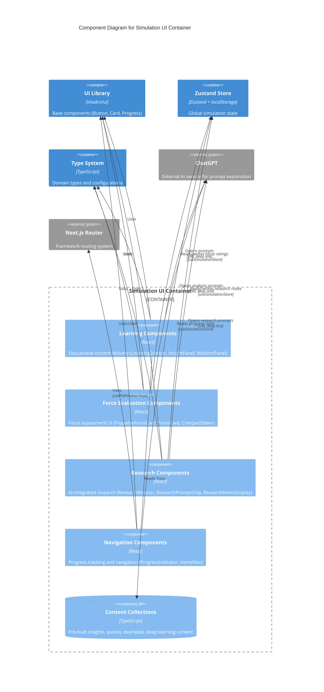

# C4 Component Level: Simulation Components

## Overview
- **Name**: Simulation Components
- **Description**: Domain-specific UI component library for scenario planning simulation interface
- **Type**: React Component Library
- **Technology**: React, TypeScript, Framer Motion, Zustand

## Purpose

The Simulation Components library provides a comprehensive set of interactive React components that guide users through a 4-phase scenario planning journey. These components solve the challenge of making complex strategic planning methodology accessible and engaging through:

**Educational Content Delivery**: Components like LearningSidebar, InsightPanel, and WisdomPanel provide contextual learning content that explains scenario planning concepts, principles, and best practices at each step of the journey.

**Force Evaluation Interface**: FlippableForceCard and ForceCard components enable users to assess driving forces along two critical dimensions (impact and uncertainty) using intuitive slider controls and visual feedback.

**Progress Tracking**: ProgressIndicator provides multi-level progress visualization, showing both overall journey progress and detailed sub-step completion within each phase.

**Research Integration**: ResearchMission components bridge the gap between the simulation and external AI tools (ChatGPT) by providing structured prompts, note-taking capabilities, and context-aware template substitution.

**Interactive Learning**: Components use animations, 3D flips, expandable content, and scrollable carousels to maintain engagement while teaching complex strategic concepts.

These components form the interactive layer between the user and the Zustand store, translating domain logic (PEST forces, uncertainty matrices, scenario narratives) into an executive-quality, dark-themed interface with gold accents.

## Software Features

### Educational & Learning Components
- **LearningSidebar**: Tabbed sidebar with Guide/Example/Tips tabs for step-by-step learning content
- **InsightPanel**: Collapsible panel displaying contextual insights (principles, warnings, tips, quotes, context)
- **WisdomPanel**: Scrollable quote carousel from strategic thinkers with exploration links
- **LearningCards**: Reveal-style cards showing good/bad examples with explanations
- **DiscoverPrompts**: Expandable list of ChatGPT/Google exploration prompts

### Force Evaluation Components
- **FlippableForceCard**: 3D-flipping card for evaluating driving forces (dark theme)
- **ForceCard**: Standard force evaluation card with sliders (light theme variant)
- **ForceChip**: Compact pill-shaped badge for displaying selected forces
- **CompactSlider**: Space-efficient slider component for impact/uncertainty ratings

### Research & AI Integration
- **ResearchMission**: Expandable mission card with AI prompts and note-taking
- **ResearchPromptChip**: Compact, inline prompt chip with copy-to-clipboard
- **ResearchNotesDisplay**: Display saved research notes with delete functionality

### Navigation & Progress
- **ProgressIndicator**: Multi-level journey progress tracker with expandable phase details
- **HomeNav**: Fixed navigation button to return home from any simulation page

### Pre-built Content Collections
- **10+ insight collections**: Phase-specific insights (FOCAL_ISSUE_INSIGHTS, INDIAN_PESTEL_INSIGHTS, etc.)
- **11+ wisdom quotes**: Curated quotes from Peter Schwartz, Steve Jobs, Andy Grove, Sun Tzu, Ratan Tata, etc.
- **Deep learning functions**: Industry-specific PEST exploration, scenario axis methodology
- **Example comparison objects**: Rating examples, orthogonality examples, modifier impact examples

## Code Elements

This component contains the following code-level elements:
- [c4-code-components-simulation.md](./c4-code-components-simulation.md) - Complete simulation component library documentation

## Interfaces

### ResearchMission Interface
```typescript
interface ResearchMissionProps {
  missionId: string                                  // Unique identifier for mission
  industry?: string | null                           // Industry context for prompts
  focalIssue?: string | null                         // Focal issue context
  forces?: Array<{ id: string; name: string }>      // Linked forces
  scenarios?: Array<{ id: string; name: string }>   // Linked scenarios
  onComplete?: () => void                            // Completion callback
  onSkip?: () => void                                // Skip callback
  className?: string                                 // CSS class override
}
```

**Protocol**: React Props API
**Description**: Manages research activities with AI prompt suggestions and note-taking
**Key Operations**:
- `processPrompt(prompt: string): string` - Replaces placeholders with actual values
- `handleCopy(prompt: string, index: number): Promise<void>` - Copies to clipboard
- `handleSaveNotes(): void` - Saves notes to Zustand store

### InsightPanel Interface
```typescript
type InsightType = 'principle' | 'warning' | 'tip' | 'quote' | 'context'

interface InsightContent {
  type: InsightType
  title: string
  content: string | string[]
  source?: string
  expandedContent?: string
  linkText?: string
  linkHref?: string
  chatGptPrompt?: string
}

interface InsightPanelProps {
  insights: InsightContent[]      // Array of insight objects
  className?: string               // CSS class override
  collapsible?: boolean           // Panel collapsibility (default: true)
  defaultExpanded?: boolean       // Initial expansion state (default: false)
}
```

**Protocol**: React Props API
**Description**: Displays contextual educational insights with multiple content types
**Key Operations**:
- `openChatGpt(prompt: string): void` - Opens ChatGPT with formatted prompt

### FlippableForceCard Interface
```typescript
interface FlippableForceCardProps {
  force: Force                               // Force object with ratings
  onImpactChange: (value: number) => void   // Impact slider callback
  onUncertaintyChange: (value: number) => void  // Uncertainty slider callback
  industry?: string | null                   // Industry context for AI
  focalIssue?: string | null                // Focal issue context for AI
}

interface Force {
  id: string
  name: string
  description: string
  category: PESTCategory
  impact: number        // 1-5 scale
  uncertainty: number   // 1-5 scale
}
```

**Protocol**: React Props API, Framer Motion 3D transforms
**Description**: Interactive 3D-flipping card for force evaluation
**Key Operations**:
- 3D flip animation on click (front: compact sliders, back: full description)
- Visual categorization by PEST category with color coding
- ChatGPT integration for deep-dive force analysis

### LearningSidebar Interface
```typescript
type LearningTabId = 'guide' | 'example' | 'tips'

interface LearningTab {
  id: LearningTabId
  label: string
  icon: LucideIcon
  content: React.ReactNode
}

interface LearningSidebarProps {
  tabs: LearningTab[]           // Array of tab configurations
  defaultTab?: LearningTabId    // Initial active tab (default: first tab)
  className?: string            // CSS class override
}
```

**Protocol**: React Props API, Framer Motion animations
**Description**: Tabbed sidebar for educational content
**Key Operations**:
- Spring-animated tab indicator
- Fade transitions between tab content
- Responsive tab labels (hidden on mobile)

### ProgressIndicator Interface
```typescript
interface ProgressIndicatorProps {
  className?: string  // CSS class override
}

// Reads from URL pathname and Zustand store
type MainPhase = 'discover' | 'design' | 'develop' | 'decide'
type SubStep = 'pre-read' | 'context' | 'focal-issue' | 'forces' |
               'uncertainties' | 'axes' | 'matrix' |
               'narratives' | 'impact' | 'risk' |
               'responses' | 'actions' | 'report'
```

**Protocol**: React Props API, Next.js usePathname hook
**Description**: Multi-level journey progress tracker
**Key Operations**:
- Route structure detection (legacy vs new)
- Phase/sub-step extraction from pathname
- Expandable phase details showing sub-step completion
- Overall progress calculation (13 total sub-steps)

### WisdomPanel Interface
```typescript
interface WisdomQuote {
  id: string
  quote: string
  author: string
  role: string
  context?: string
  chatGptPrompt?: string
  googleQuery?: string
  category: 'strategy' | 'leadership' | 'innovation' | 'planning'
}

interface WisdomPanelProps {
  category?: WisdomQuote['category'] | 'all'  // Filter by category
  maxQuotes?: number                          // Max quotes to display (default: 3)
  showExploreLinks?: boolean                  // Show ChatGPT links (default: true)
  className?: string                          // CSS class override
  defaultCollapsed?: boolean                  // Initial collapsed state (default: true)
  title?: string                              // Panel title
}
```

**Protocol**: React Props API, horizontal scroll navigation
**Description**: Scrollable quote carousel with exploration links
**Key Operations**:
- Smooth horizontal scrolling
- ChatGPT/Google Search integration
- Category filtering

## Dependencies

### Components Used

#### UI Library Components (from @/components/ui)
- **Button**: Base button component for actions and navigation
- **Card, CardContent**: Base card components for content containers
- **Progress**: Progress bar component for journey tracking

**Relationship**: Simulation Components build upon UI Library primitives to create domain-specific interfaces

#### Type Definitions (from @/lib/types)
- **Force, PESTCategory**: Domain types for driving forces
- **RESEARCH_MISSIONS**: Pre-defined research mission configurations
- **PEST_LABELS**: Labels for PESTEL categories
- **MainPhase, SubStep**: Navigation type system
- **Scenario**: Quadrant-based future scenarios

**Relationship**: Type definitions ensure type safety across the component layer

### External Systems

#### Zustand Store (@/lib/store)
- **useSimulationStore**: Global state management hook
- **State accessed**:
  - `researchNotes` - Retrieve phase-specific research notes
  - `completedPhases` - Track which phases are done
  - `progress` - Overall journey progress
  - `industry`, `focalIssue`, `forces`, `scenarios` - Context for AI prompts
- **Operations called**:
  - `addResearchNote(note)` - Persist research findings
  - `deleteResearchNote(id)` - Remove notes

**Relationship**: Components read from and write to centralized Zustand store

#### ChatGPT Integration (External)
- **Protocol**: URL-based deep linking
- **Pattern**: `window.open('https://chat.openai.com/?q=' + encodeURIComponent(prompt), '_blank')`
- **Used by**: FlippableForceCard, InsightPanel, WisdomPanel, ResearchMission
- **Purpose**: Enable users to explore concepts deeper with AI assistance

**Relationship**: Components provide structured prompts to external AI service

#### Next.js Framework
- **usePathname**: Hook for URL pathname detection
- **Used by**: ProgressIndicator for route structure detection

**Relationship**: Components integrate with Next.js routing system

### External Dependencies

| Package | Purpose | Usage |
|---------|---------|-------|
| `react` | Core React library | Component lifecycle, hooks (useState, useRef) |
| `framer-motion` | Animation library | 3D flips, expand/collapse, tab transitions |
| `lucide-react` | Icon library | UI icons (Copy, Check, ChevronDown, Search, etc.) |
| `next` | Next.js framework | usePathname hook for routing |

## Component Diagram



## Component Relationships

### Internal Component Dependencies

**LearningSidebar** ← Used by all simulation pages
- Provides tabbed interface for Guide/Example/Tips content
- Consumed by phase pages (focal-issue, forces, uncertainties, etc.)

**InsightPanel** ← Used by simulation pages needing contextual guidance
- Displays insights from pre-built collections (FOCAL_ISSUE_INSIGHTS, etc.)
- Consumed by pages requiring educational scaffolding

**FlippableForceCard** ← Used by force evaluation pages
- Primary interface for rating forces in Design phase
- Consumed by uncertainties, axes pages

**ResearchMission** ← Used by pages with research activities
- Provides AI prompt suggestions and note-taking
- Consumed by focal-issue, forces, scenarios pages

**ProgressIndicator** ← Used by simulation layout
- Wraps all simulation pages to show journey progress
- Consumed by `app/simulation/layout.tsx`

### Data Flow Patterns

**User Interaction → Component State → Store Update**
```
User drags slider on FlippableForceCard
  ↓
onImpactChange callback fires
  ↓
Parent component updates store via useSimulationStore
  ↓
Force rating persisted to localStorage
  ↓
Component re-renders with updated value
```

**Research Note Workflow**
```
User types notes in ResearchMission textarea
  ↓
handleSaveNotes called on Complete
  ↓
addResearchNote(note) writes to store
  ↓
ResearchNotesDisplay reads from store.researchNotes
  ↓
Notes displayed with delete functionality
```

**Progress Tracking**
```
User navigates to new sub-step
  ↓
URL pathname changes (/simulation/design/matrix)
  ↓
ProgressIndicator detects via usePathname
  ↓
Reads completedPhases from store
  ↓
Renders phase circles with completion states
```

### Animation Patterns

**Expand/Collapse** (InsightPanel, WisdomPanel):
```tsx
<AnimatePresence>
  {isExpanded && (
    <motion.div
      initial={{ height: 0, opacity: 0 }}
      animate={{ height: 'auto', opacity: 1 }}
      exit={{ height: 0, opacity: 0 }}
      transition={{ duration: 0.3 }}
    />
  )}
</AnimatePresence>
```

**3D Flip** (FlippableForceCard):
```tsx
<motion.div
  animate={{ rotateY: isFlipped ? 180 : 0 }}
  transition={{ duration: 0.6, type: 'spring' }}
  style={{ transformStyle: 'preserve-3d' }}
/>
```

**Tab Switch** (LearningSidebar):
```tsx
<motion.div
  animate={{
    left: `${(activeTabIndex / tabCount) * 100}%`,
    width: `${100 / tabCount}%`,
  }}
  transition={{ type: 'spring', stiffness: 300, damping: 30 }}
/>
```

## Technology Stack

### Core Technologies
- **React 18**: Component library foundation with hooks (useState, useRef, useEffect)
- **TypeScript**: Type-safe props, interfaces, and domain modeling
- **Framer Motion**: Animation library for 3D transforms, expand/collapse, tab transitions
- **Zustand**: State management integration via useSimulationStore hook

### Styling Architecture
- **Tailwind CSS**: Utility-first styling with custom gold/navy palette
- **Dark Theme**: `slate-800/900` backgrounds with `gold-400/500` accents
- **Color Semantics**:
  - Gold (`gold-400/500`): Interactive elements, icons, positive examples
  - Amber (`amber-400/500`): Warnings, "bad" examples
  - Emerald (`emerald-500`): Completion indicators only
  - Slate (`slate-100/300/400/500`): Text hierarchy on dark backgrounds

### Responsive Design
- Mobile-first approach
- Hidden labels on mobile (`hidden sm:inline`)
- Touch-friendly tap targets (44px minimum)
- Horizontal scrolling for overflowing content (WisdomPanel)

### Accessibility Features
- Semantic HTML structure
- Focus states on interactive elements
- Proper ARIA attributes for collapsible sections
- Keyboard navigation support

## Deployment Considerations

### Component Loading
- All components are client-side React components
- Should be lazy-loaded where possible to reduce initial bundle size
- Framer Motion animations require client-side JavaScript

### State Persistence
- Components rely on Zustand store persistence to localStorage
- Ensure localStorage availability in deployment environment
- Handle localStorage quota exceeded scenarios

### External Service Dependencies
- ChatGPT integration requires client-side window.open capability
- No backend API calls (except research note persistence to store)
- Consider Content Security Policy for external navigation

### Performance Optimization
- Memoize expensive computations (e.g., processPrompt in ResearchMission)
- Use React.memo for components that re-render frequently
- Optimize Framer Motion animations with GPU acceleration (transform, opacity)

### Browser Compatibility
- Requires modern browsers with ES6+ support
- Clipboard API for copy-to-clipboard functionality
- CSS Grid and Flexbox for layout

## Notes

1. **ChatGPT Integration Pattern**: All ChatGPT links use URL-encoded prompts with `window.open` to new tabs. Prompts are crafted to guide AI toward scenario planning and business strategy contexts.

2. **Placeholder Substitution**: ResearchMission dynamically replaces placeholders (`[INDUSTRY]`, `[FOCAL ISSUE]`, `[FORCE]`) with actual values from store context. If context is missing, placeholders remain literal for user to fill in.

3. **Force Card Variants**: FlippableForceCard (dark theme, 3D flip) serves Design phase evaluation; ForceCard (light theme, standard layout) serves alternative contexts.

4. **Route Structure Support**: ProgressIndicator gracefully handles both legacy (`/phase-N`) and new (`/simulation/{phase}/{step}`) route structures via pathname parsing.

5. **Dark Theme Consistency**: All components maintain dark slate + gold aesthetic per project requirements. Never use white/light backgrounds for panels or cards.

6. **Learning Content Types**: InsightPanel supports 5 insight types with distinct styling (principle, warning, tip, quote, context), enabling versatile educational content composition.

7. **Responsive Tab Labels**: LearningSidebar hides tab labels on mobile to save space, showing only icons.

8. **Scrollable Containers**: WisdomPanel uses smooth horizontal scrolling with hidden scrollbars for polished card carousel experience.

9. **Copy-to-Clipboard**: ResearchMission uses `navigator.clipboard.writeText()` for modern browser clipboard access with visual feedback (temporary checkmark).

10. **Animation Principles**: Framer Motion used throughout with spring physics for interactive elements, 0.2-0.3s duration for transitions, 3D transforms for depth perception, AnimatePresence for enter/exit animations.
