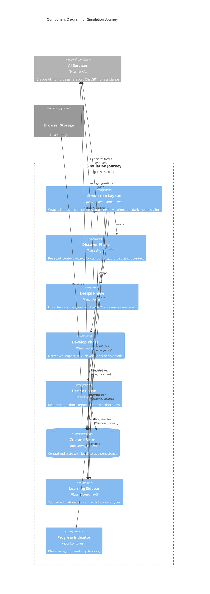
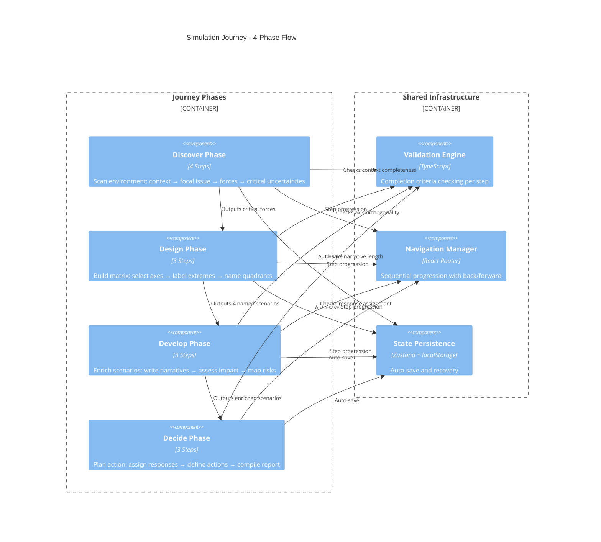

# C4 Component Level: Simulation Journey

## Overview
- **Name**: Simulation Journey
- **Description**: 4-phase scenario planning journey with 13 sub-steps guiding users through strategic futures analysis
- **Type**: Application Module
- **Technology**: Next.js App Router, React, TypeScript, Zustand

## Purpose

The Simulation Journey component orchestrates the complete scenario planning experience following Shell's methodology. It guides users through a structured progression from strategic context gathering to actionable decision-making.

The component manages the complex state lifecycle across four distinct phases, ensuring users build comprehensive mental models of multiple possible futures rather than attempting single-point predictions. Each phase builds upon the previous, creating a cumulative learning experience that transforms abstract strategic thinking into concrete action plans.

## Software Features

### Discover Phase
- **Pre-Read Introduction**: Full-screen phase introduction with game-guide voice and evocative storytelling
- **Context Wizard**: 6-step wizard collecting industry, organization type, stakeholder perspective, focal issue, and modifiers
- **Focal Issue Generation**: AI-assisted focal issue suggestions based on user context
- **Forces Analysis**: PEST forces rating interface for impact and uncertainty scoring

### Design Phase
- **Uncertainties Selection**: Filter critical forces and select two axes for scenario matrix
- **Orthogonality Checking**: Calculate and visualize quality score for axis pair selection
- **Axis Labeling**: Define low/high extremes for each uncertainty axis
- **Matrix Naming**: Create evocative names for four scenario quadrants in 2x2 matrix

### Develop Phase
- **Narrative Writing**: Compose vivid scenario descriptions with AI assistance
- **Impact Assessment**: Evaluate organizational impact across scenarios and dimensions
- **Risk Mapping**: Identify risks and opportunities within each scenario

### Decide Phase
- **Response Assignment**: Drag-and-drop interface for classifying scenarios (Bet Big, Hedge, Monitor, Watch)
- **Action Planning**: Define concrete actions with owners, timelines, and triggers per response type
- **Strategic Playbook**: Compile comprehensive report combining scenarios, impacts, and action plans

## Code Elements

This component contains the following code-level elements:
- [c4-code-app-simulation.md](./c4-code-app-simulation.md) - Complete simulation page collection with layout, phase pages, and navigation flow

## Interfaces

### Route Structure
The component exposes routes following the pattern `/simulation/{phase}/{sub-step}`:

**Discover Phase Routes**:
- `GET /simulation/discover/pre-read` - Phase introduction
- `GET /simulation/discover/context` - Strategic context collection
- `GET /simulation/discover/focal-issue` - Focal issue refinement (merged into context)
- `GET /simulation/discover/forces` - PEST forces rating

**Design Phase Routes**:
- `GET /simulation/design/uncertainties` - Critical uncertainty selection
- `GET /simulation/design/axes` - Axis labeling
- `GET /simulation/design/matrix` - Scenario matrix naming

**Develop Phase Routes**:
- `GET /simulation/develop/narratives` - Scenario narrative writing
- `GET /simulation/develop/impact` - Impact assessment
- `GET /simulation/develop/risk` - Risk and opportunity mapping

**Decide Phase Routes**:
- `GET /simulation/decide/responses` - Response type assignment
- `GET /simulation/decide/actions` - Action planning
- `GET /simulation/decide/report` - Final strategic playbook

### Navigation Patterns

**Sequential Progression**:
```typescript
// Navigation within phase
setCurrentStep(nextStepName: SubStep): void
completeMainPhase(phase: MainPhase): void

// Cross-phase navigation
router.push(`/simulation/${nextPhase}/${firstStep}`)
```

**Progress Tracking**:
```typescript
// Current position
mainPhase: 'discover' | 'design' | 'develop' | 'decide'
subStep: string // Current step within phase
completedPhases: MainPhase[] // Completed phase tracking
```

**State Management Interface**:
```typescript
// Context data
setIndustry(industry: string): void
setOrganizationType(type: string): void
setStakeholderPerspective(perspective: string): void
setFocalIssue(issue: string): void

// Forces and axes
setXAxis(force: Force): void
setYAxis(force: Force): void
selectForce(forceId: string): void

// Scenarios
setScenarios(scenarios: Scenario[]): void
updateScenario(scenarioId: string, updates: Partial<Scenario>): void

// Responses and actions
setResponseAssignment(scenarioId: string, responseType: ResponseType): void
```

## Dependencies

### Internal Components

**Layout and Navigation**:
- `SimulationLayout` - Root layout wrapping all phase pages with progress tracking and theming
- `ProgressIndicator` - Expandable phase navigation with sub-step visibility
- `HomeNav` - Top navigation bar for returning to landing page

**Learning Components**:
- `LearningSidebar` - Tabbed educational content (guide/example/tips) with 5 content type support
  - Mini-article modals for deep-dive learning
  - Comparison tiles for option evaluation
  - Micro-cases with ChatGPT exploration links
  - Quick tips for actionable advice

**UI Components**:
- `Button` - Reusable button component with variants
- `Modal` - Confirmation dialogs and full-screen overlays

### State Management

**Zustand Store** (`lib/store.ts`):
- Progress slice - Journey tracking (mainPhase, subStep, completedPhases)
- Context slice - Industry, organization, stakeholder, focal issue, modifiers, time horizon
- Forces slice - PEST forces array with impact/uncertainty ratings
- Axes slice - Selected X/Y axes with labels
- Scenarios slice - Four quadrant scenarios with narratives, impacts, risks
- Responses slice - Response assignments and action plans
- Persistence middleware - localStorage for session recovery

### AI Integration

**Force Generation**:
- `POST /api/generate-forces` - Claude API integration for PEST force generation
- Input: User context (industry, organization, stakeholder, focal issue)
- Output: 16 structured PEST forces with categories and descriptions

**ChatGPT Assistance**:
- URL generation for contextual prompts
- Focal issue suggestions
- Scenario naming inspiration
- Narrative writing assistance
- Pattern: `window.open('https://chat.openai.com/?q=' + encodeURIComponent(prompt), '_blank')`

### UI Library

**Framer Motion**:
- `motion.div` - Animated containers
- `AnimatePresence` - Enter/exit animations
- Layout animations for step transitions
- Spring transitions for tab indicators

**Lucide Icons**:
- 30+ icons for phases, steps, and UI elements
- Semantic icons: Search (Discover), Compass (Design), Layers (Develop), Target (Decide)
- Monochromatic gold styling for consistency

**Tailwind CSS**:
- Custom gold/slate palette
- Dark theme with gold accents
- Responsive grid layouts
- Utility-first styling

### Type System

**Core Types** (`lib/types.ts`):
- `MainPhase` - Phase enum ('discover' | 'design' | 'develop' | 'decide')
- `SubStep` - Step names within phases
- `Force` - PEST forces with impact/uncertainty ratings
- `Scenario` - Quadrant scenarios with narratives and metadata
- `ResponseType` - Strategic response categories ('bet-big' | 'hedge' | 'monitor' | 'watch')

**Taxonomies**:
- `INDUSTRIES` - Indianized industry categories
- `ORGANIZATION_TYPES` - Organization classifications
- `STAKEHOLDER_LABELS` - Stakeholder perspective mapping
- `CONTEXT_MODIFIERS` - Strategic modifiers (geo-politics, regulation, innovation)
- `PEST_LABELS` - PEST category labels

## Component Diagram



## Phase Flow Architecture



## Design Patterns

### Sequential Wizard Pattern
- Multi-step forms with local state management
- Progressive disclosure of complexity
- Mini progress bars showing step completion
- Validation preventing premature progression

### Unified Learning Pattern
- All pages use tabbed `LearningSidebar` component
- Three-tab structure: Guide, Example, Tips
- Content length consistency to prevent layout shift
- ChatGPT exploration links for deep-dives

### State Synchronization Pattern
- Zustand store as single source of truth
- Pages subscribe to relevant state slices
- Optimistic UI updates with immediate feedback
- localStorage persistence for session recovery

### Completion Criteria Pattern
- Computed properties checking step requirements
- Disabled "Continue" buttons until criteria met
- Visual feedback (gold checkmarks) on completion
- No blocking alerts, only preventive UI states

### Motion Feedback Pattern
- Framer Motion for all transitions
- Step entrance/exit with staggered delays
- Tab switching with spring animations
- Hover/tap feedback on interactive elements

## Navigation Rules

### Progression Requirements

**Discover Phase**:
- Context: All fields required in each wizard step
- Forces: Minimum impact/uncertainty ratings required
- Cannot proceed until all forces rated

**Design Phase**:
- Uncertainties: Both X and Y axes must be selected
- Orthogonality score displayed (60%+ recommended)
- Axes: All labels (low/high for both axes) required
- Matrix: All 4 scenario names must be non-empty

**Develop Phase**:
- Narratives: All scenarios must have 50+ character narratives
- Impact: All dimension ratings required
- Risk: Risk mapping for all scenarios required

**Decide Phase**:
- Responses: All 4 scenarios must be assigned to response types
- Actions: Action plans required for assigned response types
- Report: Auto-generated, no blocking requirements

### Back Navigation
- Always enabled except on pre-read pages
- Returns to previous step in sequence
- State preserved via Zustand store

### Home Navigation
- Always available via header button
- Shows confirmation modal before leaving simulation
- Warns about unsaved progress (if not persisted)

## Performance Optimizations

### Memoization
- `useMemo` for filtered/sorted data (critical forces, grouped modifiers)
- `useMemo` for computed scores (orthogonality calculation)
- Prevents unnecessary re-renders on state updates

### Lazy Rendering
- Learning sidebar content: Only active tab rendered
- Modal content: Conditional rendering on open state
- Confirmation dialogs: Render on demand

### Code Splitting
- Next.js automatic page-level code splitting
- Each phase page loaded on-demand
- Shared components bundled separately

## Deployment Considerations

### State Persistence Strategy
- Zustand middleware persists to localStorage
- State recovered on browser refresh
- Session recovery enables multi-session workflows

### Route Protection
- No authentication layer (public simulation)
- All routes publicly accessible
- State isolation per browser session

### API Rate Limiting
- Force generation: Single call per context setup
- No rate limiting implemented (future consideration)
- Graceful fallback on API errors

### Browser Compatibility
- Modern browsers with ES6+ support required
- Native HTML5 drag-and-drop API used
- localStorage API required for persistence

## Accessibility Features

### Semantic Structure
- Proper heading hierarchy (h1 → h2 → h3)
- Semantic HTML elements (button, input, label)
- Landmark regions for screen readers

### Keyboard Navigation
- Tab order follows visual flow
- Focus states on interactive elements
- Enter/Space for button activation
- Escape closes modals

### Visual Accessibility
- Color contrast: Gold on dark slate (AA standard)
- Focus rings: `ring-2 ring-gold-400 ring-offset-2`
- Icon labeling: Text accompanies all icons
- No color-only information conveyance

### Motion Preferences
- Framer Motion respects `prefers-reduced-motion`
- Critical functionality works without animations
- No auto-playing animations

## Future Enhancements

### Planned Features
- Export report as PDF
- Email sharing of strategic playbook
- Collaborative simulation sessions
- Template library for common industries
- Historical scenario archive

### Technical Debt
- Migrate from ChatGPT URLs to integrated AI generation
- Add comprehensive error boundaries
- Implement analytics tracking
- Add automated testing suite
- Optimize bundle size

### Scalability Considerations
- Backend API for force generation (avoid client API keys)
- Database persistence for multi-device access
- User authentication for saved simulations
- Real-time collaboration features
