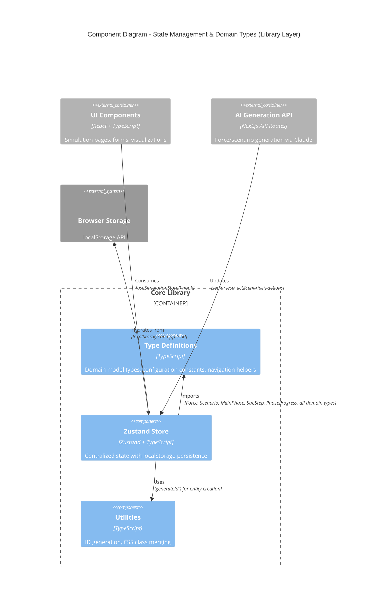

# C4 Component Level: State Management & Domain Types

## Overview
- **Name**: State Management & Domain Types
- **Description**: Zustand store with localStorage persistence and comprehensive TypeScript domain model for scenario planning simulation
- **Type**: Library Component
- **Technology**: Zustand v4+, TypeScript, localStorage API

## Purpose

This component provides the foundation for the entire Strategic Futures Lab application by managing centralized state for the 4-phase scenario planning journey and defining the complete type-safe domain model.

The component serves three critical functions:

1. **State Management**: Centralized Zustand store that manages all simulation state across the 4-phase journey (Discover → Design → Develop → Decide) with 13 sub-steps
2. **Domain Model**: Complete TypeScript type definitions for scenario planning concepts including Forces, Scenarios, Impact Assessments, and Actions
3. **Session Persistence**: localStorage persistence for session continuity, allowing users to resume their simulation journey across browser sessions

The component bridges UI components with AI generation APIs, providing a single source of truth for simulation progress, user context, scenario artifacts, and decision outputs.

## Software Features

### Progress Tracking
- **4-phase journey navigation**: Tracks mainPhase (discover/design/develop/decide) and subStep (13 granular steps)
- **Phase completion tracking**: Maintains completedPhases array for backward navigation validation
- **Navigation validation**: canNavigateToStep() validates navigation rules (can always go back, can advance only if current phase complete)
- **Helper functions**: getNextStep(), getPrevStep(), isFirstStepOfPhase(), isLastStepOfPhase() provide safe step transitions
- **Legacy phase support**: Maintains backward compatibility with 1-10 phase numbering system

### Context Setup
- **Industry selection**: 12 pre-defined Indian industry sectors (BFSI, IT Services, Manufacturing, Pharma, etc.) with descriptions and icons
- **Organization type**: 6 organization structures (Family Business, PE-backed, MNC Subsidiary, Listed Enterprise, Startup, PSU) with decision characteristics
- **Stakeholder perspective**: 4 organizational levels (Board/Promoter, CEO/MD, BU Head, Strategy Team) for content personalization
- **Focal issue framing**: Templates and examples for strategic question formation with 6 category patterns
- **Context modifiers**: 20+ modifiers across market, financial, operational, and regulatory categories
- **Time horizon**: Configurable analysis period (3-15 years, default 5)

### Forces Management (PEST Framework)
- **PEST categorization**: 6 categories (Political, Economic, Social, Technological, Environmental, Legal) with labels and descriptions
- **Force tracking**: Array of Force objects with id, name, description, category, impact (1-5), uncertainty (1-5), isCustom flag
- **AI-suggested ratings**: Stores aiSuggestedImpact and aiSuggestedUncertainty for transparency
- **Custom forces**: User can add custom forces with addCustomForce()
- **Force selection**: selectedForces array for narrowing down critical uncertainties
- **Rating updates**: updateForceRating() for adjusting impact/uncertainty scores
- **High-impact uncertainty filtering**: useHighImpactUncertaintyForces() selector returns forces with impact >= 3 AND uncertainty >= 3

### Scenario Management (2x2 Matrix)
- **Axes selection**: xAxis and yAxis Force objects define scenario dimensions
- **Axis labeling**: xAxisLabels and yAxisLabels provide polarity labels (low/high ends)
- **4 quadrant scenarios**: Scenarios array with TL, TR, BL, BR quadrant positioning
- **Scenario narratives**: Each scenario has name, narrative, timeHorizon, tone (-1 to 1), complexity (1-3)
- **Early signals**: Array of observable leading indicators per scenario
- **Key capabilities**: Required organizational capabilities per scenario
- **Scenario updates**: updateScenario() for partial updates to scenario properties

### Impact Assessment & Risk
- **Impact scores**: impactAssessments record maps scenario ID to ImpactScores (probability, repercussion, urgency, strategicDisruption on 1-5 scale)
- **Risk profile**: riskProfile object with appetite and capacity ratings (1-5 each)
- **Total impact calculation**: useTotalImpact(scenarioId) selector sums all four impact dimensions
- **Risk tolerance**: useTotalRiskTolerance() selector sums appetite + capacity (2-10 range)
- **Individual score updates**: updateImpactScore() for granular field-level changes

### Response & Action Planning
- **Response types**: 5 categories (priority-action, timely-action, safeguard, monitor, ignore) with labels, descriptions, colors
- **Response assignments**: responseAssignments record maps scenario ID to ResponseType
- **Action items**: ActionItem array with scenarioId, description, timeline (Q1-Q4), budgetRange (low/medium/high), owner (c-suite/director/manager/external), selected flag
- **Action selection**: toggleActionSelection() for prioritization workflow
- **Response labels**: RESPONSE_LABELS provides human-readable labels and color coding

### Research Integration
- **Research notes**: researchNotes array stores AI research mission outputs or user notes
- **Phase linking**: Each note tagged with phase (focal-issue/forces/scenarios)
- **Entity linking**: linkedForceIds and linkedScenarioIds arrays connect research to artifacts
- **Research missions**: 3 pre-defined missions (Industry Blind Spots, Force Deep Dive, Real-World Analogies) with suggested prompts and output guidance
- **Note management**: addResearchNote(), updateResearchNote(), deleteResearchNote(), linkNoteToForce(), linkNoteToScenario()

### Session Management
- **Session tracking**: sessionStartTime and lastSaveTime timestamps
- **Progress saving**: saveProgress() updates lastSaveTime
- **Session initialization**: startSession() sets sessionStartTime
- **State reset**: resetSimulation() returns to initial state
- **Selective persistence**: Loading states excluded from localStorage to prevent stale indicators

### Loading States
- **Forces generation**: isGeneratingForces flag for AI generation progress
- **Scenarios generation**: isGeneratingScenarios flag for scenario creation progress
- **Focal issues generation**: isGeneratingFocalIssues flag for focal issue suggestion progress

## Code Elements

This component contains the following code-level elements:
- [c4-code-lib.md](./c4-code-lib.md) - Core Library: State management (store.ts), Type definitions (types.ts), and Utilities (utils.ts)

## Interfaces

### State Store Hook
- **Hook**: `useSimulationStore(): SimulationState & Actions`
- **Description**: Zustand store hook exposing state and actions
- **Usage**: Import and call in React components to access/modify simulation state

### Navigation Actions
- `setCurrentStep(step: SubStep): void` - Set both subStep and mainPhase based on step
- `goToNextStep(): void` - Navigate to next substep with validation
- `goToPrevStep(): void` - Navigate to previous substep
- `completeMainPhase(phase: MainPhase): void` - Mark phase complete, update lastSaveTime
- `canNavigateToStep(step: SubStep): boolean` - Query if navigation is allowed (no state mutation)

### Context Setup Actions
- `setIndustry(industry: string): void` - Set selected industry sector
- `setOrganizationType(type: string): void` - Set organization structure
- `setStakeholderPerspective(perspective: StakeholderPerspective): void` - Set decision-maker level
- `setFocalIssue(issue: string): void` - Set main strategic question
- `setFocalIssueRefinement(refinement: string): void` - Set user refinement/context
- `setTimeHorizon(years: number): void` - Set analysis time horizon (years)

### Forces Actions
- `setForces(forces: Force[]): void` - Replace entire forces array (AI generation)
- `updateForceRating(forceId: string, field: 'impact' | 'uncertainty', value: number): void` - Update rating
- `addCustomForce(force: Omit<Force, 'id' | 'isCustom'>): void` - Add user-created force
- `selectForce(force: Force): void` - Add to selectedForces array
- `deselectForce(forceId: string): void` - Remove from selectedForces and axes if set
- `setXAxis(force: Force | null): void` - Set x-axis driving force
- `setYAxis(force: Force | null): void` - Set y-axis driving force
- `setAxisLabels(axis: 'x' | 'y', labels: { low: string; high: string }): void` - Set polarity labels

### Scenarios Actions
- `setScenarios(scenarios: Scenario[]): void` - Replace entire scenarios array (AI generation)
- `updateScenario(scenarioId: string, updates: Partial<Scenario>): void` - Partial update

### Impact & Risk Actions
- `setImpactAssessment(scenarioId: string, scores: ImpactScores): void` - Set all scores at once
- `updateImpactScore(scenarioId: string, field: keyof ImpactScores, value: number): void` - Single score update
- `setRiskProfile(profile: RiskProfile): void` - Set risk appetite and capacity

### Response & Actions
- `setResponseAssignment(scenarioId: string, response: ResponseType): void` - Assign response strategy
- `setActions(actions: ActionItem[]): void` - Replace actions array
- `toggleActionSelection(actionId: string): void` - Toggle selected flag

### Research Notes Actions
- `addResearchNote(note: Omit<ResearchNote, 'id' | 'timestamp'>): void` - Add with auto ID/timestamp
- `updateResearchNote(noteId: string, content: string): void` - Update content and timestamp
- `deleteResearchNote(noteId: string): void` - Remove note
- `linkNoteToForce(noteId: string, forceId: string): void` - Add force link
- `linkNoteToScenario(noteId: string, scenarioId: string): void` - Add scenario link

### Session Actions
- `startSession(): void` - Set sessionStartTime
- `saveProgress(): void` - Update lastSaveTime
- `resetSimulation(): void` - Reset to initial state

### Loading State Actions
- `setIsGeneratingForces(isGenerating: boolean): void` - Set forces loading state
- `setIsGeneratingScenarios(isGenerating: boolean): void` - Set scenarios loading state
- `setIsGeneratingFocalIssues(isGenerating: boolean): void` - Set focal issues loading state

### Computed Selectors
- `useHighImpactUncertaintyForces(): Force[]` - Returns forces with impact >= 3 AND uncertainty >= 3
- `useTotalImpact(scenarioId: string): number` - Sum of probability + repercussion + urgency + strategicDisruption
- `useTotalRiskTolerance(): number` - Sum of risk appetite + risk capacity (2-10 range)

### Type Definitions

#### Core Domain Types
- `Force` - Driving force with PEST category, impact/uncertainty ratings, custom flag
- `Scenario` - Future scenario with narrative, quadrant, tone, early signals, capabilities
- `ImpactScores` - Assessment with probability, repercussion, urgency, strategicDisruption
- `RiskProfile` - Organization's risk appetite and capacity
- `ActionItem` - Action with scenario link, timeline, budget, owner, selection flag
- `ResearchNote` - Research content with phase, linked entities, timestamp

#### Navigation Types
- `MainPhase` - Union type: 'discover' | 'design' | 'develop' | 'decide'
- `SubStep` - Union of 13 step identifiers (pre-read, context, focal-issue, forces, etc.)
- `PhaseProgress` - Object with mainPhase, subStep, completedPhases array
- `SimulationPhase` - Legacy union type: 1 | 2 | 3 | 4 | 5 | 6 | 7 | 8 | 9 | 10

#### Configuration Types
- `PESTCategory` - Union type: 'P' | 'E' | 'S' | 'T' | 'En' | 'L'
- `Industry` - Interface with id, name, icon, description, indianContext
- `OrganizationType` - Interface with id, name, description, decisionStyle
- `StakeholderPerspective` - Union type: 'board-promoter' | 'ceo-md' | 'bu-head' | 'strategy-team'
- `ResponseType` - Union type: 'priority-action' | 'timely-action' | 'safeguard' | 'monitor' | 'ignore'

#### Constants & Configuration
- `INDUSTRIES` - 12 pre-defined Indian industry sectors
- `ORGANIZATION_TYPES` - 6 organization structures
- `STAKEHOLDER_LABELS` - Labels and descriptions for stakeholder levels
- `PEST_LABELS` - Labels for PEST categories
- `PEST_DESCRIPTIONS` - Detailed descriptions with Indian context
- `RESPONSE_LABELS` - Labels, descriptions, and colors for response types
- `MAIN_PHASE_CONFIG` - Configuration for 4 main phases (label, description, subSteps, icon)
- `SUB_STEP_CONFIG` - Maps 13 substeps to labels and parent phases
- `FOCAL_ISSUE_TEMPLATES` - 6 templates for strategic question framing
- `CONTEXT_MODIFIERS` - 20+ context modifiers across 4 categories
- `RESEARCH_MISSIONS` - 3 research missions with prompts and guidance

#### Helper Functions
- `getNextStep(current: SubStep): SubStep | null` - Returns next step or null
- `getPrevStep(current: SubStep): SubStep | null` - Returns previous step or null
- `isLastStepOfPhase(step: SubStep): boolean` - Checks if step is last in phase
- `isFirstStepOfPhase(step: SubStep): boolean` - Checks if step is first in phase

#### Utility Functions
- `cn(...inputs: ClassValue[]): string` - Merges Tailwind CSS classes intelligently with conflict resolution
- `generateId(): string` - Generates pseudo-random 13-character alphanumeric ID for entities

## Dependencies

### Internal Dependencies
**None** - This component is self-contained and does not depend on other application components. It serves as the foundation layer that other components depend on.

### External Dependencies

| Package | Purpose | Version | Usage |
|---------|---------|---------|-------|
| **zustand** | State management library | v4+ | Core store creation via `create()` hook |
| **zustand/middleware** | Persistence middleware | Built-in | `persist` middleware for localStorage integration |
| **clsx** | Class name utility | Latest | Conditional CSS class composition in `cn()` |
| **tailwind-merge** | Tailwind class merging | Latest | Intelligent Tailwind class conflict resolution in `cn()` |

### Platform Dependencies
- **React** - Zustand hooks require React context for component integration
- **Browser localStorage API** - persist middleware requires localStorage for state persistence
- **Tailwind CSS** - cn() utility specifically designed for Tailwind class merging

## Component Diagram

This diagram shows the internal structure of the State Management & Domain Types component and its relationship to external systems.



### Key Relationships

**State Flow (Linear 4-Phase Journey)**
```
Discover Phase → Design Phase → Develop Phase → Decide Phase
(context setup) → (forces/axes) → (scenarios/impact) → (responses/actions)
```

**Type Dependency Chain**
```
types.ts (domain model)
    ↓ imported by
store.ts (state + actions)
    ↓ consumed by
UI Components (React hooks)
```

**Persistence Strategy**
```
User Action → Store Action → State Update → persist middleware → localStorage
                                                                      ↓
                                                          (on reload) → Hydrate Store
```

**AI Integration Pattern**
```
UI Component triggers generation
    ↓
API Route calls Claude API
    ↓
Parse JSON response
    ↓
Call store.setForces() or store.setScenarios()
    ↓
Store updates + persists
    ↓
UI rerenders with new data
```

## State Management Patterns

### State Shape Hierarchy

The store organizes state into logical sections following the journey phases:

```
SimulationState
├── Session Metadata (sessionStartTime, lastSaveTime)
├── Legacy Phase Tracking (currentPhase, completedPhases) - backward compatibility
├── New Journey Progress (progress.mainPhase, progress.subStep, completedPhases)
├── Phase 1: Context (industry, organizationType, stakeholderPerspective, focalIssue, timeHorizon)
├── Phase 2-3: Forces (forces[], selectedForces[], xAxis, yAxis, labels)
├── Phase 4: Scenarios (scenarios[])
├── Phase 5-6: Assessment (impactAssessments, riskProfile, responseAssignments, actions[])
├── Research Notes (researchNotes[])
└── Loading States (isGeneratingForces, isGeneratingScenarios, isGeneratingFocalIssues)
```

### Type Safety Strategy

**Three Layers of Type Definitions**

1. **Domain Models** (Force, Scenario, ImpactScores) - Business logic entities with validation
2. **Configuration Maps** (INDUSTRIES, ORGANIZATION_TYPES, RESPONSE_LABELS) - UI/content mapping with type safety
3. **State Interface** (SimulationState) - Store shape definition for action type inference

**Union Types for Constrained Values**
- `PESTCategory`, `MainPhase`, `SubStep`, `ResponseType` prevent invalid state values
- Enables IDE autocomplete and compile-time validation
- Eliminates runtime string matching errors

### Persistence Strategy

**Selective Persistence via partialize**
- **Persisted**: All user-entered data (forces, scenarios, assessments, actions, context, progress)
- **NOT Persisted**: Loading states (isGeneratingForces, isGeneratingScenarios, isGeneratingFocalIssues)
- **Rationale**: Prevents stale loading indicators after page refresh, ensures clean UX on reload

**Storage Key**: `'strategic-futures-lab'` in localStorage

### Navigation Validation

**Three-Tier Navigation Logic**

1. **canNavigateToStep()** - Query action validating navigation rules
   - Can always navigate back to completed phases
   - Can navigate within current phase
   - Can advance to next phase only if current phase is complete

2. **goToNextStep() / goToPrevStep()** - Safe navigation actions
   - Check validity before updating state
   - Update both mainPhase and subStep atomically
   - Prevent orphaned state

3. **Helper Functions** - Pure logic for step relationships
   - `getNextStep()`, `getPrevStep()` - Linear progression through 13 steps
   - `isFirstStepOfPhase()`, `isLastStepOfPhase()` - Phase boundary detection

## Architecture Decisions

### Why Zustand?
- **Lightweight**: No Provider boilerplate, simple hook-based API
- **TypeScript-first**: Excellent type inference and IDE support
- **Middleware ecosystem**: Built-in persist middleware for localStorage
- **Performance**: Minimal re-renders, no Context API overhead
- **Devtools**: Redux DevTools integration for debugging

### Why localStorage Persistence?
- **Session continuity**: Users can close browser and resume simulation
- **No backend required**: Reduces infrastructure complexity for MVP
- **Instant hydration**: No loading spinners on app load
- **Privacy-friendly**: Data stays on user's device

### Why Selective Persistence?
- **Clean UX**: Loading states excluded to prevent stale indicators after refresh
- **State hygiene**: Avoids persisting derived/computed values
- **Performance**: Smaller localStorage payload improves hydration speed

### Why Separate types.ts?
- **Reusability**: Types imported by store, UI components, and API routes
- **Documentation**: Types serve as canonical domain model reference
- **Compile-time safety**: Changes to types propagate across entire codebase
- **Configuration as code**: INDUSTRIES, RESPONSE_LABELS co-located with types

### Why Helper Functions in types.ts?
- **Pure logic**: Navigation helpers are pure functions with no side effects
- **Testability**: Can unit test step progression independently of store
- **Reusability**: Used by both store actions and UI components for validation

## Design Principles

### State Immutability
- All store actions create new state objects (Zustand enforces immutability)
- Array operations use spread syntax: `[...forces, newForce]`
- Object updates use spread: `{ ...scenario, ...updates }`

### Single Source of Truth
- Store is the only source of simulation state
- UI components derive all state from useSimulationStore()
- No duplicate state in component useState() hooks

### Action Naming Conventions
- **Setters**: `setIndustry()`, `setForces()` - Replace entire value
- **Updaters**: `updateForceRating()`, `updateScenario()` - Partial update by ID
- **Toggles**: `toggleActionSelection()` - Boolean state flip
- **Adders**: `addCustomForce()`, `addResearchNote()` - Append to array
- **Removers**: `deselectForce()`, `deleteResearchNote()` - Remove by ID
- **Queries**: `canNavigateToStep()` - Read-only validation, no state mutation

### Navigation Safety
- Never directly mutate progress.mainPhase or progress.subStep
- Always use navigation actions: setCurrentStep(), goToNextStep(), goToPrevStep()
- Always validate before navigation: canNavigateToStep()

### Type Constraints
- Use union types for finite value sets (MainPhase, SubStep, ResponseType)
- Use interfaces for extensible objects (Force, Scenario)
- Use Record types for ID-to-value mappings (impactAssessments, responseAssignments)

## Future Extensibility

### Planned Features
- **Undo/Redo**: Zustand middleware for action history and time travel
- **Cloud Sync**: Backend API integration for cross-device persistence
- **Collaboration**: Multi-user scenario planning sessions
- **Export Formats**: PDF, PowerPoint, JSON export from store state
- **AI Refinement**: Store AI conversation history for scenario narrative evolution

### Extension Points
- **Custom Force Categories**: Extend PESTCategory union with custom categories
- **Additional Response Types**: Extend ResponseType union for organization-specific responses
- **Dynamic Time Horizons**: Replace fixed 3-15 year range with configurable bounds
- **Multi-Scenario Matrices**: Support 3x3 or 4x4 matrices (currently locked to 2x2)
- **Research Mission Templates**: Add organization/industry-specific research missions

## Notes

- **Backward Compatibility**: Legacy phase system (1-10) maintained alongside new 4-phase journey for migration path
- **Indian Business Context**: Industry and organization types tailored for Indian ecosystem (BFSI, PSU, family business, etc.)
- **AI Integration Readiness**: Store coordinates with `/app/api/generate-forces` and future AI modules via loading state flags
- **Extensible Research System**: ResearchMission/ResearchNote designed to support future AI research integrations beyond ChatGPT
- **No Network Dependency**: Entire store operates offline; only AI generation requires network
- **Type-Safe Constants**: All configuration arrays (INDUSTRIES, ORGANIZATION_TYPES) are typed and immutable
- **Pure Functions**: Helper functions (getNextStep, cn, generateId) have no side effects and can be unit tested
- **Devtools Support**: Store state visible in Redux DevTools for debugging (if extension installed)
