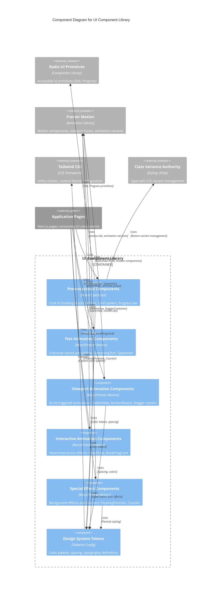

# C4 Component Level: UI Component Library

## Overview
- **Name**: UI Component Library
- **Description**: Reusable, composable React component library providing foundational UI primitives and advanced animation components for building premium scenario planning interfaces
- **Type**: Frontend Library Component
- **Technology**: React 18.3.1, TypeScript 5.7.2, Tailwind CSS 3.4.17, Framer Motion 11.15.0, Radix UI 1.1.x

## Purpose

The UI Component Library serves as the foundational design system for the Strategic Futures Lab application, providing two distinct categories of components:

**Presentational Components**: Core UI building blocks (Button, Card, Progress) that implement the application's dark-theme design system with gold accents, ensuring visual consistency and brand identity across all user interfaces.

**Animation Components**: Advanced motion and interaction components (StreamingText, FadeInView, GlowPulse, etc.) that create premium, executive-grade user experiences through sophisticated animations, viewport-triggered reveals, and interactive effects.

This component library solves several critical problems:
1. **Design Consistency**: Enforces consistent styling, spacing, and color usage across the entire application
2. **Developer Productivity**: Provides pre-built, tested, and documented components that accelerate feature development
3. **User Experience Excellence**: Delivers polished animations and interactions that differentiate the application from generic web apps
4. **Accessibility**: Leverages Radix UI primitives to ensure ARIA-compliant, keyboard-navigable components
5. **Maintainability**: Centralizes UI logic in reusable components, making design changes efficient and predictable

The library follows a compositional architecture, allowing developers to combine simple primitives into complex, interactive interfaces while maintaining the premium dark-theme aesthetic with gold accents throughout.

## Software Features

### Presentational Components
- **Button System**: Multi-variant button component with 6 visual styles (default/gold, secondary, outline, ghost, destructive) and 4 size options (default, sm, lg, icon), supporting polymorphic rendering via `asChild` prop for composition flexibility
- **Card Layout System**: Composable card component architecture with 6 sub-components (Card, CardHeader, CardTitle, CardDescription, CardContent, CardFooter) for building structured content containers with selected states
- **Progress Indicator**: Accessible progress bar with smooth animation, supporting numeric values and custom styling

### Text Animation Components
- **StreamingText**: Character-by-character typewriter effect with configurable speed, delay, and completion callbacks
- **Typewriter**: Cycling word animation that types and deletes words in sequence, ideal for dynamic headers and rotating taglines

### Viewport Animation Components
- **FadeInView**: Directional fade-in effect (up/down/left/right) triggered when element enters viewport, with configurable duration and delay
- **SectionReveal**: Simple opacity fade animation for major content sections entering viewport
- **StaggerContainer + StaggerItem**: Orchestrated sequential animations for child elements with configurable stagger delay

### Interactive Animation Components
- **GlowPulse**: Hover-responsive wrapper with pulsing glow backdrop, available in gold or emerald color schemes
- **BreathingCard**: Card component with continuous breathing glow animation, creating living, premium card effects

### Special Effect Components
- **FloatingParticles**: Background particle system with randomized floating animations for hero sections
- **Counter**: Viewport-triggered numeric counter animation with prefix/suffix support, ideal for statistics and metrics

## Code Elements

This component contains the following code-level elements:
- [c4-code-components-ui.md](./c4-code-components-ui.md) - Detailed documentation of all UI components, props interfaces, design system specifications, and component relationships

## Interfaces

### Button Interface
- **Protocol**: React Component Props API
- **Description**: Flexible button component with variant-based styling
- **Operations**:
  - `Button({ variant?, size?, asChild?, className?, ...buttonProps })` - Renders styled button with polymorphic support
  - `buttonVariants` - CVA variant configuration export for external styling composition

**Key Props:**
- `variant?: 'default' | 'secondary' | 'outline' | 'ghost' | 'gold' | 'destructive'` - Visual style variant
- `size?: 'default' | 'sm' | 'lg' | 'icon'` - Size variant
- `asChild?: boolean` - Enables polymorphic rendering via Radix Slot

### Card Interface
- **Protocol**: React Component Props API
- **Description**: Composable card layout system with semantic sub-components
- **Operations**:
  - `Card({ selected?, className?, ...divProps })` - Root card container with selection state
  - `CardHeader({ className?, ...divProps })` - Header section wrapper
  - `CardTitle({ className?, ...headingProps })` - H3 title element
  - `CardDescription({ className?, ...pProps })` - Muted description text
  - `CardContent({ className?, ...divProps })` - Main content area
  - `CardFooter({ className?, ...divProps })` - Footer action area

**Key Props:**
- `selected?: boolean` - Visual indicator for selected card state (enhanced border, ring glow)

### Progress Interface
- **Protocol**: React Component Props API (Radix UI wrapper)
- **Description**: Accessible progress bar with WAI-ARIA compliance
- **Operations**:
  - `Progress({ value?, className?, ...progressProps })` - Renders horizontal progress bar

**Key Props:**
- `value?: number` - Current progress value (0-100 by default)

### StreamingText Interface
- **Protocol**: React Component Props API
- **Description**: Typewriter-style text animation
- **Operations**:
  - `StreamingText({ text, speed?, delay?, onComplete?, className? })` - Character-by-character reveal animation

**Key Props:**
- `text: string` - Text to animate
- `speed?: number` - Milliseconds per character (default: 30)
- `delay?: number` - Initial delay before animation starts (default: 0)
- `onComplete?: () => void` - Callback fired when animation completes

### FadeInView Interface
- **Protocol**: React Component Props API
- **Description**: Viewport-triggered directional fade animation
- **Operations**:
  - `FadeInView({ children, direction?, delay?, duration?, className? })` - Fades and slides children into view

**Key Props:**
- `direction?: 'up' | 'down' | 'left' | 'right' | 'none'` - Slide direction (default: 'up')
- `delay?: number` - Animation delay in seconds (default: 0)
- `duration?: number` - Animation duration in seconds (default: 0.6)

### StaggerContainer Interface
- **Protocol**: React Component Props API
- **Description**: Orchestrates staggered animations of child StaggerItem components
- **Operations**:
  - `StaggerContainer({ children, staggerDelay?, initialDelay?, className? })` - Manages sequential child animations
  - `StaggerItem({ children, className? })` - Wraps individual animated child

**Key Props:**
- `staggerDelay?: number` - Delay between each child animation in seconds (default: 0.1)
- `initialDelay?: number` - Delay before first child starts in seconds (default: 0)

### GlowPulse Interface
- **Protocol**: React Component Props API
- **Description**: Interactive hover animation with pulsing glow effect
- **Operations**:
  - `GlowPulse({ children, color?, className? })` - Wraps children with glow backdrop

**Key Props:**
- `color?: 'gold' | 'emerald'` - Glow color scheme (default: 'gold')

### Counter Interface
- **Protocol**: React Component Props API
- **Description**: Animated numeric counter triggered on viewport entry
- **Operations**:
  - `Counter({ end, duration?, prefix?, suffix?, className? })` - Counts from 0 to target value

**Key Props:**
- `end: number` - Target number to count to
- `duration?: number` - Animation duration in seconds (default: 2)
- `prefix?: string` - Text before number (e.g., "$")
- `suffix?: string` - Text after number (e.g., "+")

### Typewriter Interface
- **Protocol**: React Component Props API
- **Description**: Cycling word animation with typing/deleting effect
- **Operations**:
  - `Typewriter({ words, typingSpeed?, deletingSpeed?, pauseDuration?, className? })` - Cycles through word array

**Key Props:**
- `words: string[]` - Array of words to cycle through
- `typingSpeed?: number` - Milliseconds per character when typing (default: 100)
- `deletingSpeed?: number` - Milliseconds per character when deleting (default: 50)
- `pauseDuration?: number` - Pause at complete word in milliseconds (default: 2000)

### FloatingParticles Interface
- **Protocol**: React Component Props API
- **Description**: Background particle effect system
- **Operations**:
  - `FloatingParticles({ count?, className? })` - Renders floating particles

**Key Props:**
- `count?: number` - Number of particles to render (default: 20)

### BreathingCard Interface
- **Protocol**: React Component Props API
- **Description**: Card with breathing glow background animation
- **Operations**:
  - `BreathingCard({ children, className? })` - Wraps children in animated card

### SectionReveal Interface
- **Protocol**: React Component Props API
- **Description**: Simple viewport-triggered fade animation
- **Operations**:
  - `SectionReveal({ children, className? })` - Fades children on viewport entry

## Dependencies

### Components Used
This is a foundational library component and does not depend on other application components.

### External Systems

**UI Framework Dependencies:**
- **react@^18.3.1** - Core React library for component rendering and hooks
- **@radix-ui/react-slot@^1.1.1** - Polymorphic component pattern (used in Button for `asChild` composition)
- **@radix-ui/react-progress@^1.1.1** - Accessible progress primitive with WAI-ARIA support

**Animation Library:**
- **framer-motion@^11.15.0** - Animation library providing motion components, viewport detection hooks, and animation variants

**Styling Dependencies:**
- **class-variance-authority@^0.7.1** - Type-safe CSS variant management system (used in Button variants)
- **Tailwind CSS@3.4.17** - Utility-first CSS framework with custom gold/navy/slate color tokens
- **clsx + tailwind-merge** - CSS class merging utilities (via `@/lib/utils` cn() function)

**Development Dependencies:**
- **TypeScript@5.7.2** - Type safety and interface definitions
- **Next.js App Router** - Client-side rendering directive (`'use client'`) for all components

### Internal Dependencies

**From `/lib` directory:**
- `@/lib/utils` - Exports `cn()` utility for merging Tailwind CSS classes with proper deduplication

**React Hooks Used:**
- `useState`, `useEffect`, `useRef` - State management and side effects in animation components
- `React.forwardRef` - Ref forwarding for all presentational components

## Component Diagram



## Design System Integration

### Color Palette
The UI library enforces strict color semantics aligned with the dark-theme design system:

**Primary Colors:**
- `gold-400`, `gold-500` - Interactive elements, accents, primary actions, positive examples
- `gold-500/10`, `gold-500/20`, `gold-500/30` - Transparent gold overlays for glows and backgrounds

**Background Colors:**
- `slate-900`, `slate-800` - Primary dark backgrounds (never white/light)
- `slate-700`, `slate-700/50` - Secondary dark backgrounds for cards and panels

**Text Colors:**
- `slate-100` - Primary headings (high contrast on dark)
- `slate-300` - Body text (readable contrast)
- `slate-400`, `slate-500` - Muted text (secondary information)

**Interactive States:**
- `navy-500`, `navy-900` - Focus rings, card selection borders
- `emerald-400`, `emerald-500` - Completion indicators only (not positive examples)
- `amber-400`, `amber-500` - Warnings, negative examples
- `red-500` - Destructive actions, urgent states

### Typography
- **Headings**: Serif font (CardTitle uses serif), large sizes, tight line-height
- **Body**: Sans-serif, balanced line-height for readability
- **Text sizing**: Hierarchical scale from text-xs to text-2xl

### Spacing & Layout
- **Component padding**: Consistent p-6 (24px) for Card sections
- **Spacing utilities**: space-y-1.5 for related elements
- **Border radius**: rounded-xl for cards, rounded-full for progress indicators

### Animation Principles
- **Performance**: GPU-accelerated transforms (opacity, scale, translateY) only
- **Duration**: 200-500ms for interactions, 2-5s for ambient animations
- **Easing**: Spring physics for hover effects, ease-out for viewport animations
- **Accessibility**: All animations should respect `prefers-reduced-motion` (future enhancement)

## Deployment Considerations

**Build Integration:**
- All components marked with `'use client'` directive for Next.js App Router compatibility
- Tree-shakeable exports allow importing only needed components
- TypeScript strict mode enabled for type safety

**Bundle Size:**
- Framer Motion adds ~60KB gzipped to bundle
- Radix UI primitives are small (<10KB per primitive)
- Tailwind CSS purges unused utilities in production

**Performance:**
- Animation components use RequestAnimationFrame for smooth 60fps
- Viewport animations use Intersection Observer API (via Framer Motion's useInView)
- No external CSS files; all styling inline via Tailwind utilities

**Browser Support:**
- Modern evergreen browsers (Chrome, Firefox, Safari, Edge)
- Requires CSS Grid, Flexbox, CSS Custom Properties
- Intersection Observer API required for viewport animations

## Usage Patterns

### Composition Example: Card with Button
```tsx
import { Card, CardHeader, CardTitle, CardContent, CardFooter } from '@/components/ui/card'
import { Button } from '@/components/ui/button'

<Card selected={isSelected}>
  <CardHeader>
    <CardTitle>Scenario Title</CardTitle>
  </CardHeader>
  <CardContent>
    <p className="text-slate-300">Scenario description...</p>
  </CardContent>
  <CardFooter>
    <Button variant="gold" size="lg">Select Scenario</Button>
  </CardFooter>
</Card>
```

### Animation Example: Staggered Fade-In
```tsx
import { StaggerContainer, StaggerItem } from '@/components/ui/animations'

<StaggerContainer staggerDelay={0.15}>
  {items.map(item => (
    <StaggerItem key={item.id}>
      <div className="p-4 bg-slate-800">
        {item.content}
      </div>
    </StaggerItem>
  ))}
</StaggerContainer>
```

### Interactive Example: Glow Pulse on Hover
```tsx
import { GlowPulse } from '@/components/ui/animations'
import { Card } from '@/components/ui/card'

<GlowPulse color="gold">
  <Card className="cursor-pointer">
    <CardContent>Interactive content</CardContent>
  </Card>
</GlowPulse>
```

## Notes

### Future Enhancements
1. **Accessibility**: Implement `prefers-reduced-motion` media query support to disable animations for users with motion sensitivity
2. **Performance**: Extract animation variants to centralized constants file for reusability and smaller bundle size
3. **Testing**: Add Storybook integration for component visual regression testing
4. **Card Variants**: Create loading skeleton variants for Card component
5. **Responsive Animations**: Add duration adjustments based on viewport size (faster on mobile)
6. **BreathingCard**: Make opacity pulse configurable via props

### Design Principles
- **Dark Theme Compliance**: All components designed for dark slate backgrounds; Card uses white as intentional contrast accent
- **Gold Accent System**: Interactive elements, focus states, and primary actions consistently use gold per design system
- **Composability**: Card system follows compound component pattern; Button supports polymorphic rendering via `asChild`
- **Animation Performance**: GPU-accelerated transforms only; heavy effects (blur) applied to pseudo-elements
- **Accessibility**: Radix UI primitives provide WAI-ARIA compliance; components set displayName for React DevTools

### Technical Notes
- All components use `React.forwardRef` for ref forwarding compatibility
- Client-side rendering required (`'use client'` directive) for Next.js App Router
- No external CSS files; all styling through embedded Tailwind utilities
- TypeScript strict mode enforced with comprehensive interface definitions
