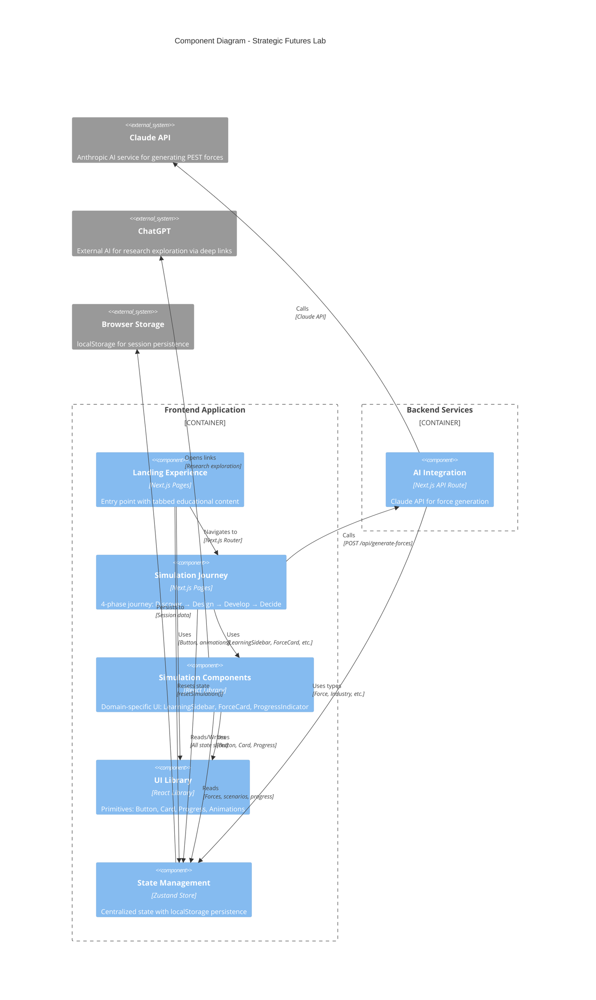

# C4 Component Index - Strategic Futures Lab

This document provides a master index of all components in the Strategic Futures Lab system, showing their relationships and dependencies.

## System Overview

Strategic Futures Lab is a scenario planning simulation application that guides users through a structured 4-phase journey (Discover → Design → Develop → Decide) to analyze strategic uncertainties and develop action plans. The system is built with Next.js 14, React, TypeScript, and integrates with Claude AI for intelligent force generation.

---

## System Components

| Component | Type | Description | Documentation |
|-----------|------|-------------|---------------|
| **UI Library** | Library | Reusable UI primitives and animation components (Button, Card, Progress, animations) | [c4-component-ui-library.md](./c4-component-ui-library.md) |
| **Simulation Components** | Library | Domain-specific UI components for scenario planning (LearningSidebar, ForceCard, ProgressIndicator) | [c4-component-simulation-components.md](./c4-component-simulation-components.md) |
| **State Management** | Library | Zustand store with localStorage persistence and TypeScript domain model | [c4-component-state-management.md](./c4-component-state-management.md) |
| **AI Integration** | Service | Claude API integration for AI-powered PEST force generation | [c4-component-ai-integration.md](./c4-component-ai-integration.md) |
| **Simulation Journey** | Application Module | 4-phase scenario planning journey with 13 sub-steps | [c4-component-simulation-journey.md](./c4-component-simulation-journey.md) |
| **Landing Experience** | Application Module | Entry point and educational introduction to scenario planning | [c4-component-landing-experience.md](./c4-component-landing-experience.md) |

---

## Component Relationships Diagram

---

## Dependency Matrix

| Component | Depends On | Depended By |
|-----------|------------|-------------|
| **UI Library** | External: React, Radix UI, Framer Motion, Tailwind, CVA | Simulation Components, Landing Experience, Simulation Journey |
| **Simulation Components** | UI Library, State Management | Simulation Journey |
| **State Management** | External: Zustand, localStorage | All application modules |
| **AI Integration** | State Management (types), External: Anthropic SDK | Simulation Journey |
| **Simulation Journey** | Simulation Components, State Management, AI Integration, UI Library | Landing Experience (navigation target) |
| **Landing Experience** | UI Library, State Management | None (entry point) |

---

## Component Details Summary

### 1. UI Library
**Technology**: React, TypeScript, Tailwind CSS, Framer Motion, Radix UI, CVA

**Key Features**:
- Presentational components: Button (6 variants), Card (compound pattern), Progress
- Animation components: StreamingText, FadeInView, StaggerContainer, GlowPulse, Typewriter, Counter
- Design system: Dark theme with gold accents

### 2. Simulation Components
**Technology**: React, TypeScript, Framer Motion, Zustand integration

**Key Features**:
- Educational: LearningSidebar (3-tab pattern), InsightPanel, WisdomPanel
- Force evaluation: FlippableForceCard (3D flip), ForceCard, CompactSlider
- Navigation: ProgressIndicator, HomeNav
- Research: ResearchMission (ChatGPT integration)

### 3. State Management
**Technology**: Zustand, TypeScript, localStorage

**Key Features**:
- 4-phase journey state: progress tracking with validation
- Domain model: Force, Scenario, ImpactScores, ActionItem, RiskProfile
- 50+ store actions for all phases
- Selective localStorage persistence
- Navigation helpers: getNextStep(), getPrevStep()

### 4. AI Integration
**Technology**: Anthropic SDK, Next.js API Routes

**Key Features**:
- POST /api/generate-forces endpoint
- Context-aware prompt engineering
- Generates 16 PEST forces from user context
- JSON parsing with regex fallback

### 5. Simulation Journey
**Technology**: Next.js App Router, React

**Key Features**:
- 4 phases: Discover, Design, Develop, Decide
- 13 sub-steps with sequential progression
- Route pattern: /simulation/{phase}/{sub-step}
- Completion criteria per step

### 6. Landing Experience
**Technology**: Next.js, React, Framer Motion

**Key Features**:
- Tabbed pre-read content (What/Creators/Journey)
- Dark theme with gold accents
- Entry animations
- Navigation to simulation

---

## Code-Level Documentation Index

| Code Directory | Documentation |
|----------------|---------------|
| `lib/` (store, types, utils) | [c4-code-lib.md](./c4-code-lib.md) |
| `lib/ai/` | [c4-code-lib-ai.md](./c4-code-lib-ai.md) |
| `components/ui/` | [c4-code-components-ui.md](./c4-code-components-ui.md) |
| `components/simulation/` | [c4-code-components-simulation.md](./c4-code-components-simulation.md) |
| `app/` (root) | [c4-code-app-root.md](./c4-code-app-root.md) |
| `app/api/` | [c4-code-app-api.md](./c4-code-app-api.md) |
| `app/simulation/` | [c4-code-app-simulation.md](./c4-code-app-simulation.md) |
| `docs/` | [c4-code-docs.md](./c4-code-docs.md) |

---

## Related Documentation

- **Container Level**: [c4-container.md](./c4-container.md) - Deployment architecture
- **Context Level**: [c4-context.md](./c4-context.md) - System context with personas and user journeys
