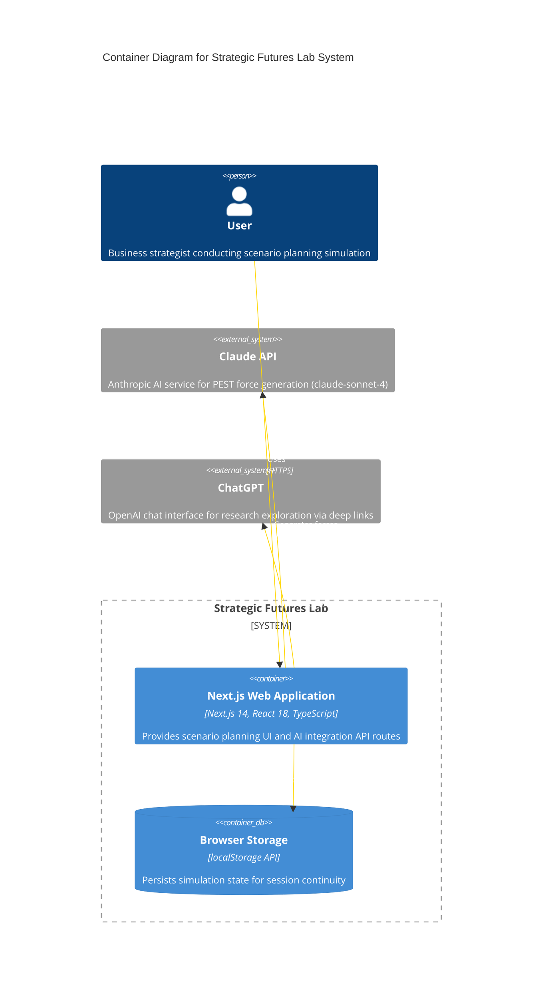

# C4 Container Level: Strategic Futures Lab System Deployment

## System Overview

Strategic Futures Lab is deployed as a **monolithic Next.js 14 application** with client-side state persistence and external AI service integration. The system follows a **single-container deployment model** where the Next.js application serves both the React frontend and API routes from the same runtime process.

---

## Containers

### Next.js Web Application

- **Name**: Next.js Web Application
- **Description**: Full-stack Next.js 14 application providing React-based scenario planning UI and AI integration API routes
- **Type**: Web Application (Frontend + Backend API)
- **Technology**: Next.js 14.2.20, React 18.3.1, TypeScript 5.7.2, Node.js runtime
- **Deployment**: Single Node.js process serving both static pages and API routes

#### Purpose

The Next.js Web Application is the **primary and only deployable container** in the Strategic Futures Lab system. It consolidates both frontend user experience and backend AI integration into a unified deployment unit, simplifying infrastructure while maintaining clear architectural boundaries through Next.js App Router conventions.

This container handles:
- **Server-side rendering** of React pages for improved SEO and initial load performance
- **Client-side rendering** of interactive simulation components with Framer Motion animations
- **API route handling** for AI force generation via `/api/generate-forces` endpoint
- **Static asset serving** for images, fonts, and compiled JavaScript/CSS bundles
- **Environment-based configuration** for development vs. production deployment

The container architecture leverages Next.js conventions to maintain separation of concerns:
- `app/` directory contains page routes and layouts (frontend)
- `app/api/` directory contains API route handlers (backend)
- `components/` directory contains reusable UI components
- `lib/` directory contains shared state management and utilities

#### Components

This container deploys the following logical components:

- **Landing Experience**: Entry point and educational introduction
  - Documentation: [c4-component-landing-experience.md](./c4-component-landing-experience.md)

- **Simulation Journey**: 4-phase scenario planning journey with 13 sub-steps
  - Documentation: [c4-component-simulation-journey.md](./c4-component-simulation-journey.md)

- **UI Library**: Reusable UI primitives and animation components
  - Documentation: [c4-component-ui-library.md](./c4-component-ui-library.md)

- **Simulation Components**: Domain-specific UI components for scenario planning
  - Documentation: [c4-component-simulation-components.md](./c4-component-simulation-components.md)

- **State Management**: Zustand store with localStorage persistence
  - Documentation: [c4-component-state-management.md](./c4-component-state-management.md)

- **AI Integration**: Claude API integration for force generation
  - Documentation: [c4-component-ai-integration.md](./c4-component-ai-integration.md)

#### Interfaces

##### Web UI Interface
- **Protocol**: HTTPS (HTTP/2 in production)
- **Description**: React-based single-page application with Next.js App Router navigation
- **Routes**:
  - `GET /` - Landing page with tabbed educational content
  - `GET /simulation/discover/{step}` - Discovery phase pages (pre-read, context, focal-issue, forces)
  - `GET /simulation/design/{step}` - Design phase pages (uncertainties, axes, matrix)
  - `GET /simulation/develop/{step}` - Develop phase pages (narratives, impact, risk)
  - `GET /simulation/decide/{step}` - Decide phase pages (responses, actions, report)
- **Technologies**: React 18, Framer Motion 11, Tailwind CSS 3.4, Lucide Icons
- **State Management**: Client-side Zustand store with localStorage persistence

##### Force Generation API
- **Protocol**: REST/HTTP (JSON)
- **Description**: AI-powered PEST force generation endpoint
- **Specification**: [apis/generate-forces-api.yaml](./apis/generate-forces-api.yaml)
- **Endpoints**:
  - `POST /api/generate-forces` - Generate 16 PEST-categorized driving forces
    - **Request Body**:
      ```json
      {
        "industry": "bfsi",
        "organizationType": "listed-enterprise",
        "challenge": "How should we position ourselves for the next wave of digital banking regulation?",
        "modifiers": ["high-regulation", "cash-rich"],
        "strategicQuestion": "Should we lead with compliance-first or innovation-first approach?"
      }
      ```
    - **Response (200 OK)**:
      ```json
      {
        "forces": [
          {
            "id": "force-1738042800000-0",
            "name": "RBI Digital Lending Norms",
            "description": "New regulatory framework for digital lending platforms requiring stricter KYC protocols",
            "category": "P",
            "suggestedImpact": 4,
            "suggestedUncertainty": 3,
            "impact": 0,
            "uncertainty": 0,
            "isCustom": false
          }
        ]
      }
      ```
    - **Response (500 Error)**:
      ```json
      {
        "error": "Failed to generate forces. Please try again."
      }
      ```
- **Authentication**: None (API key stored server-side in environment variables)
- **Rate Limiting**: Relies on Anthropic API's built-in rate limits

#### Dependencies

##### External Systems Used

**Anthropic Claude API**:
- **Purpose**: AI-powered PEST force generation
- **Model**: claude-sonnet-4-20250514
- **Protocol**: HTTPS REST API via @anthropic-ai/sdk
- **Authentication**: API key in ANTHROPIC_API_KEY environment variable
- **Usage**: Called by `/api/generate-forces` endpoint
- **Max Tokens**: 4000 per request
- **Rate Limits**: Subject to Anthropic tier limits

**ChatGPT (External)**:
- **Purpose**: Research exploration via deep links
- **Protocol**: URL-based deep linking (`https://chat.openai.com/?q={prompt}`)
- **Usage**: Simulation components open ChatGPT in new browser tab with pre-filled prompts
- **No API integration**: Pure URL navigation, no backend calls

#### Infrastructure

- **Deployment Configuration**:
  - **Development**: `npm run dev` - Next.js dev server on `http://localhost:3000`
  - **Production**: `npm run build && npm run start` - Optimized build with static generation
  - **Config File**: [next.config.js](../next.config.js)
    - Server actions body size limit: 2MB
    - No custom webpack configuration
    - No image optimization domains configured

- **Scaling Strategy**:
  - **Current**: Single-instance monolith (typical for Vercel/serverless deployment)
  - **Horizontal Scaling**: Supported via Next.js serverless functions (Vercel auto-scales API routes)
  - **Vertical Scaling**: Node.js process can handle ~1000 concurrent connections per instance

- **Resource Requirements**:
  - **CPU**: 1 vCPU minimum (2 vCPU recommended for production)
  - **Memory**: 512MB minimum (1GB recommended for production)
  - **Storage**: ~100MB for application code + dependencies
  - **Network**: Standard HTTP/HTTPS (port 3000 in dev, 80/443 in production)

- **Environment Variables**:
  - `ANTHROPIC_API_KEY` (required) - Claude API authentication
  - `NODE_ENV` (optional) - `development` | `production`

---

### Browser Storage

- **Name**: Browser Storage
- **Description**: Client-side localStorage for simulation state persistence
- **Type**: Browser Storage (Key-Value Store)
- **Technology**: Web Storage API (localStorage)
- **Deployment**: Runs in user's browser (Chrome, Firefox, Safari, Edge)

#### Purpose

Browser Storage provides **session persistence** for the scenario planning simulation, allowing users to:
- Close their browser and resume their simulation later
- Refresh the page without losing progress
- Navigate away and return to continue their work

This storage layer is **not a backend database**—it's purely client-side, meaning:
- Each user's data is isolated to their browser
- No cross-device synchronization
- No backend infrastructure required for basic functionality
- Privacy-friendly (data never leaves the user's device)

The Zustand persist middleware automatically syncs store state to localStorage with the key `'strategic-futures-lab'`.

#### Stored Data

**Persisted State** (stored):
- User context: industry, organization type, stakeholder perspective, focal issue
- Generated forces with user ratings (impact/uncertainty)
- Selected axes and scenario matrix
- Scenario narratives, impact assessments, risk profiles
- Response assignments and action plans
- Journey progress (mainPhase, subStep, completedPhases)

**Excluded from Persistence** (not stored):
- Loading states (`isGeneratingForces`, `isGeneratingScenarios`)
- Transient UI state (modal open/closed, tab selection)
- Session metadata (sessionStartTime, lastSaveTime)

#### Dependencies

**Next.js Web Application**:
- **Read Operations**: On page load, Zustand hydrates store from localStorage
- **Write Operations**: On every state mutation, persist middleware updates localStorage
- **Protocol**: Direct browser API calls (synchronous read/write)

---

## External Systems

### Claude API (Anthropic)

- **Name**: Claude API
- **Description**: Anthropic's AI language model API for context-aware force generation
- **Type**: External AI Service (Third-Party SaaS)
- **Technology**: REST API, Claude Sonnet 4 model (claude-sonnet-4-20250514)

#### Purpose

Claude API powers the **intelligent force generation** capability, transforming user-provided business context into 16 structured PEST-categorized driving forces. This eliminates the manual brainstorming burden and accelerates the scenario planning process.

#### Integration Pattern

**Request Flow**:
1. User completes context setup in Discover phase
2. Frontend calls `POST /api/generate-forces` with industry, org type, challenge
3. API route constructs structured prompt with context
4. API route calls Claude API via Anthropic SDK
5. Claude returns JSON array of 16 forces
6. API route parses, enriches with IDs, and returns to frontend
7. Frontend updates Zustand store and persists to localStorage

**Error Handling**:
- Missing API key: Returns 500 with error message
- Claude API failure: Returns 500 with generic error
- JSON parse failure: Regex fallback extraction, then 500 if still fails

#### Dependencies

**Next.js Web Application** (`/api/generate-forces` endpoint):
- **Protocol**: HTTPS REST API
- **Authentication**: `ANTHROPIC_API_KEY` environment variable
- **SDK**: `@anthropic-ai/sdk` v0.32.1+
- **Usage**: Single API call per force generation request (no streaming)

---

### ChatGPT (OpenAI)

- **Name**: ChatGPT
- **Description**: External AI service for research exploration via deep links
- **Type**: External AI Service (Third-Party SaaS)
- **Technology**: Web-based chat interface with URL-encoded prompt support

#### Purpose

ChatGPT integration provides **on-demand research assistance** for users who want to explore concepts deeper during the simulation. This is **not a backend API integration**—it's purely URL-based navigation that opens ChatGPT in a new browser tab with pre-filled prompts.

#### Integration Pattern

**Deep Link Pattern**:
```
https://chat.openai.com/?q={encodeURIComponent(prompt)}
```

**Usage Examples**:
- **Force Deep Dive**: "Explain how RBI's digital lending norms might evolve over the next 5 years in the context of fintech disruption"
- **Scenario Naming**: "Suggest evocative names for a scenario where AI regulation is strict AND talent is scarce in the Indian tech sector"
- **Wisdom Exploration**: "Explore Peter Schwartz's approach to scenario planning and how it differs from traditional strategic planning"

**Components Using ChatGPT Links**:
- `FlippableForceCard` - Deep-dive force analysis
- `InsightPanel` - Concept exploration links
- `WisdomPanel` - Strategic thinking exploration
- `ResearchMission` - Structured research prompts

#### Dependencies

**Next.js Web Application** (Simulation Components):
- **Protocol**: URL-based navigation (`window.open`)
- **No API Key Required**: User must have ChatGPT access (free or paid)
- **No Backend Integration**: Pure client-side navigation

---

## Container Diagram



**Key Container Responsibilities** (from [c4model.com](https://c4model.com/diagrams/container)):

- **Next.js Web Application**: High-level technology choices include React 18 for UI, Zustand for state management, Framer Motion for animations, and Next.js API routes for backend logic
- **Browser Storage**: Simple key-value storage using Web Storage API, no complex queries or indexing
- **Communication Protocols**: HTTPS for web traffic, REST/JSON for Claude API, URL navigation for ChatGPT

---

## Deployment Architecture

### Current Deployment Model

**Monolithic Next.js Application**:
- Single deployment unit containing frontend pages, API routes, and shared libraries
- No microservices or service mesh
- No container orchestration (Kubernetes/Docker Swarm)
- Suitable for Vercel, Netlify, AWS Amplify, or self-hosted Node.js

**Deployment Options**:

1. **Vercel (Recommended)**:
   - Zero-config deployment via `vercel` CLI or GitHub integration
   - Automatic serverless function creation for API routes
   - Global CDN for static assets
   - Edge network for reduced latency
   - Automatic HTTPS with custom domain support
   - Environment variable management in dashboard

2. **Docker (Self-Hosted)**:
   ```dockerfile
   FROM node:18-alpine
   WORKDIR /app
   COPY package*.json ./
   RUN npm ci --only=production
   COPY . .
   RUN npm run build
   EXPOSE 3000
   CMD ["npm", "start"]
   ```
   - Single container running `npm start`
   - Requires reverse proxy (nginx) for HTTPS
   - Can be deployed to AWS ECS, Google Cloud Run, or any Docker host

3. **Node.js Process (Traditional Hosting)**:
   - `npm run build && npm start` on VPS or bare metal
   - Requires process manager (PM2, systemd) for restart on crash
   - Requires reverse proxy (nginx, Apache) for HTTPS
   - Requires manual environment variable configuration

### Infrastructure Requirements

**Network Configuration**:
- **Inbound**: Port 3000 (dev) or 80/443 (production with reverse proxy)
- **Outbound**: HTTPS to `api.anthropic.com` for Claude API calls
- **DNS**: Custom domain with A/AAAA records or CNAME to hosting provider
- **SSL/TLS**: Required for production (Let's Encrypt, Cloudflare, or provider-managed)

**Compute Resources**:
- **Development**: 1 vCPU, 512MB RAM (local dev machine)
- **Production (Low Traffic)**: 1 vCPU, 1GB RAM, ~100 concurrent users
- **Production (Medium Traffic)**: 2 vCPU, 2GB RAM, ~500 concurrent users
- **Production (High Traffic)**: Horizontal scaling via serverless functions (Vercel) or load balancer + multiple instances

**Storage Requirements**:
- **Application Code**: ~50MB (node_modules ~300MB, but not deployed with serverless)
- **Build Artifacts**: ~20MB (optimized Next.js build)
- **No Persistent Storage**: All user data in client-side localStorage (no database)

**Environment Variables**:
```bash
# Required
ANTHROPIC_API_KEY=sk-ant-xxxxx

# Optional
NODE_ENV=production
```

### Scaling Considerations

**Current Bottlenecks**:
1. **Claude API Rate Limits**: Anthropic tier limits constrain force generation throughput
2. **Single-Process Node.js**: CPU-bound for AI prompt construction (easily mitigated with horizontal scaling)
3. **No Caching**: Every force generation request calls Claude API (no deduplication)

**Scaling Strategies**:

**Horizontal Scaling** (Recommended):
- Deploy to Vercel or serverless platform
- API routes automatically scale to demand
- No code changes required
- CDN caching for static assets reduces load

**Vertical Scaling** (Not Recommended):
- Limited by Node.js single-threaded event loop
- Better to add more instances than bigger instances

**Database Addition** (Future Enhancement):
- Add PostgreSQL or MongoDB for multi-device sync
- Store simulation sessions server-side
- Enable collaboration features
- Requires authentication layer

---

## Container Relationships

### Data Flow Patterns

**Simulation Initialization Flow**:
```
User navigates to /
  ↓
Next.js renders Landing Experience (SSR)
  ↓
User clicks "Get ready to see the future"
  ↓
resetSimulation() clears Zustand store
  ↓
localStorage cleared
  ↓
Navigate to /simulation/discover/pre-read
  ↓
Start of 4-phase journey
```

**Force Generation Flow**:
```
User completes context in Discover phase
  ↓
Frontend: setIsGeneratingForces(true)
  ↓
Frontend: POST /api/generate-forces with context
  ↓
API Route: Validate ANTHROPIC_API_KEY
  ↓
API Route: Build structured prompt with industry/org/challenge
  ↓
API Route: Call Claude API with prompt
  ↓
Claude API: Generate 16 PEST forces (4 per category)
  ↓
API Route: Parse JSON response (regex fallback if wrapped)
  ↓
API Route: Enrich forces with IDs, set impact/uncertainty to 0
  ↓
API Route: Return {forces: Force[]}
  ↓
Frontend: setForces(forces)
  ↓
Zustand persist: Write to localStorage
  ↓
Frontend: setIsGeneratingForces(false)
  ↓
UI updates with generated forces
```

**State Persistence Flow**:
```
User modifies state (e.g., rates a force)
  ↓
Component calls store action (e.g., updateForceRating)
  ↓
Zustand updates state immutably
  ↓
Persist middleware detects change
  ↓
localStorage.setItem('strategic-futures-lab', JSON.stringify(state))
  ↓
UI re-renders with updated state
```

**Session Recovery Flow**:
```
User refreshes page or returns later
  ↓
Next.js renders page (SSR or client-side)
  ↓
Zustand hydrates store from localStorage
  ↓
localStorage.getItem('strategic-futures-lab')
  ↓
Parse JSON and merge with initial state
  ↓
UI renders with recovered progress
  ↓
User continues from where they left off
```

**Research Exploration Flow**:
```
User clicks "Explore with ChatGPT" link in component
  ↓
Component constructs prompt with context
  ↓
Component substitutes placeholders ([INDUSTRY], [FORCE], etc.)
  ↓
window.open('https://chat.openai.com/?q=' + encodeURIComponent(prompt), '_blank')
  ↓
New browser tab opens with ChatGPT
  ↓
User explores concept, returns to simulation
  ↓
No data transfer back to application (manual note-taking)
```

### Inter-Container Communication

**Next.js Web Application ↔ Browser Storage**:
- **Direction**: Bidirectional (read on load, write on state change)
- **Protocol**: Synchronous JavaScript API (`localStorage.getItem`, `localStorage.setItem`)
- **Frequency**: Read once on app load, write on every state mutation (debounced by Zustand)
- **Data Format**: JSON string (serialized Zustand store state)
- **Error Handling**: Try-catch around localStorage operations (quota exceeded, private browsing mode)

**Next.js Web Application → Claude API**:
- **Direction**: Unidirectional (app calls API, no webhooks)
- **Protocol**: HTTPS REST API with JSON request/response
- **Frequency**: ~1-2 calls per user session (force generation step)
- **Data Format**: JSON request body, JSON response body
- **Error Handling**: 500 status codes with user-friendly error messages, detailed logging

**Next.js Web Application → ChatGPT**:
- **Direction**: Unidirectional (app opens URL, no response)
- **Protocol**: URL-based navigation (`window.open`)
- **Frequency**: Variable (user-initiated, 0-10+ times per session)
- **Data Format**: URL-encoded query parameter
- **Error Handling**: None (user's responsibility to have ChatGPT access)

---

## API Documentation

### Force Generation API

**Complete API specification**: [apis/generate-forces-api.yaml](./apis/generate-forces-api.yaml)

**Quick Reference**:

| Aspect | Details |
|--------|---------|
| **Endpoint** | `POST /api/generate-forces` |
| **Authentication** | None (API key stored server-side) |
| **Rate Limiting** | Inherited from Anthropic API tier limits |
| **Request Format** | JSON with industry, organizationType, challenge, optional modifiers/strategicQuestion |
| **Response Format** | JSON with 16-element forces array |
| **Error Responses** | 500 with {error: string} message |
| **Latency** | 2-5 seconds typical (depends on Claude API load) |
| **Max Request Size** | 2MB (configured in next.config.js) |
| **Idempotency** | Non-idempotent (same input may produce different forces) |

**Sample cURL Request**:
```bash
curl -X POST http://localhost:3000/api/generate-forces \
  -H "Content-Type: application/json" \
  -d '{
    "industry": "bfsi",
    "organizationType": "listed-enterprise",
    "challenge": "How should we position ourselves for the next wave of digital banking regulation?",
    "modifiers": ["high-regulation", "cash-rich"]
  }'
```

**Sample Response**:
```json
{
  "forces": [
    {
      "id": "force-1738042800000-0",
      "name": "RBI Digital Lending Norms",
      "description": "New regulatory framework for digital lending platforms requiring stricter KYC and credit assessment protocols",
      "category": "P",
      "suggestedImpact": 4,
      "suggestedUncertainty": 3,
      "impact": 0,
      "uncertainty": 0,
      "isCustom": false
    }
  ]
}
```

---

## Security Considerations

### API Key Protection

**Anthropic API Key**:
- **Storage**: `.env.local` file (never committed to version control)
- **Access**: Server-side only (Next.js API routes)
- **Validation**: Checked on every `/api/generate-forces` request
- **Exposure Risk**: Low (never sent to client, never logged)
- **Rotation**: Manual (update `.env.local` and restart)

**Best Practices**:
- Add `.env.local` to `.gitignore` (already configured)
- Use environment variable management in hosting platform (Vercel Secrets, AWS Parameter Store)
- Rotate API key if exposed (revoke old key in Anthropic dashboard)

### Client-Side State Security

**localStorage Data**:
- **Sensitivity**: Medium (contains business strategy but no PII)
- **Encryption**: None (plain JSON in browser storage)
- **Access Control**: Same-origin policy (only app's domain can access)
- **Risk**: If user's device is compromised, data is readable
- **Mitigation**: Educate users not to use on shared/public devices

### Network Security

**HTTPS Enforcement**:
- **Development**: HTTP acceptable (localhost)
- **Production**: HTTPS required (configured in hosting platform)
- **Certificate**: Let's Encrypt or hosting provider's managed certificates
- **HSTS**: Recommended (configured in reverse proxy or hosting platform)

**CORS Configuration**:
- **Current**: Not configured (default Next.js behavior: same-origin only)
- **Future**: If API routes are called from external domains, add CORS headers

### Input Validation

**Current State**: Minimal validation (relies on Claude API's robustness)

**Recommendations**:
1. **Add Zod schemas** for request validation in `/api/generate-forces`
2. **Validate enum values** (industry, organizationType) before prompt construction
3. **Sanitize user inputs** (challenge, strategicQuestion) to prevent prompt injection
4. **Rate limiting** at application level (prevent API quota exhaustion)

---

## Performance Characteristics

### Response Times

| Operation | Typical Latency | Notes |
|-----------|----------------|-------|
| **Page Load (Landing)** | 200-500ms | SSR + hydration |
| **Page Load (Simulation)** | 300-700ms | SSR + localStorage hydration |
| **State Update (Local)** | <10ms | Zustand mutation + localStorage write |
| **Force Generation API** | 2-5 seconds | Claude API call + parsing |
| **ChatGPT Link Open** | <100ms | URL navigation only |

### Optimization Techniques

**Code Splitting**:
- Next.js automatic page-level code splitting
- Dynamic imports for heavy components (not currently used)
- Tree-shaking for unused Lucide icons

**Caching**:
- Static assets cached via CDN (Vercel)
- No caching for API routes (future enhancement)
- localStorage acts as client-side cache for state

**Animation Performance**:
- Framer Motion uses GPU-accelerated transforms (opacity, scale, translateY)
- No layout shifts during animations
- RequestAnimationFrame for smooth 60fps

**Bundle Size**:
- Total JS bundle: ~300KB gzipped (estimated)
- Largest dependency: Framer Motion (~60KB)
- Next.js code splitting reduces initial load to ~100KB

---

## Monitoring & Observability

### Current State

**No Built-In Monitoring**:
- No application performance monitoring (APM)
- No error tracking (Sentry, Rollbar)
- No analytics (PostHog, Google Analytics)
- Console logs only for debugging

### Recommended Additions

**Error Tracking**:
- **Sentry** for frontend and API route errors
- **Alert on**: 500 errors, Claude API failures, localStorage quota exceeded

**Performance Monitoring**:
- **Vercel Analytics** for Web Vitals (LCP, FID, CLS)
- **PostHog** for user journey tracking (phase completion rates, drop-off points)

**Business Metrics**:
- Force generation success rate
- Average session duration
- Phase completion rates
- ChatGPT link click-through rate

---

## Testing Strategy

### Unit Tests (Not Implemented)

**Recommended Coverage**:
- API route: `/api/generate-forces` handler logic
- Store actions: Zustand state mutations
- Utility functions: `cn()`, `generateId()`, `getNextStep()`

### Integration Tests (Not Implemented)

**Recommended Coverage**:
- Force generation end-to-end (mock Claude API)
- State persistence to localStorage
- Navigation flow between phases

### E2E Tests (Not Implemented)

**Recommended Coverage**:
- Complete simulation journey (Discover → Decide)
- Force generation and rating workflow
- Session recovery after page refresh

---

## Future Enhancements

### Architectural Improvements

1. **Separate AI Service**:
   - Extract AI logic to dedicated microservice
   - Support multiple AI providers (Claude, GPT-4, Mistral)
   - Implement caching and rate limiting at service level

2. **Add Database Layer**:
   - PostgreSQL or MongoDB for server-side state
   - Enable multi-device synchronization
   - Support collaboration features

3. **Add Authentication**:
   - Next-Auth for user login
   - Associate simulations with user accounts
   - Enable sharing and team collaboration

4. **Implement Caching**:
   - Redis for API response caching
   - Deduplicate identical force generation requests
   - Reduce Claude API costs

### Feature Enhancements

1. **Real-Time Collaboration**:
   - WebSocket server for live updates
   - Multi-user scenario planning sessions
   - Shared workspace with permissions

2. **Export Capabilities**:
   - PDF generation of final report
   - PowerPoint export of scenario matrix
   - JSON export for backup/sharing

3. **Analytics Dashboard**:
   - Track user journey completion rates
   - Identify common drop-off points
   - A/B test different learning content

---

## Deployment Checklist

### Pre-Deployment

- [ ] Set `ANTHROPIC_API_KEY` in production environment
- [ ] Configure custom domain and HTTPS certificate
- [ ] Test force generation with production API key
- [ ] Verify localStorage persistence across page reloads
- [ ] Test on target browsers (Chrome, Firefox, Safari, Edge)
- [ ] Run `npm run build` to ensure production build succeeds
- [ ] Review and update `next.config.js` for production settings

### Post-Deployment

- [ ] Verify all routes load correctly (landing, simulation phases)
- [ ] Test force generation API endpoint
- [ ] Confirm ChatGPT deep links open correctly
- [ ] Monitor error logs for first 24 hours
- [ ] Set up uptime monitoring (Pingdom, UptimeRobot)
- [ ] Configure DNS records for custom domain
- [ ] Enable HSTS and security headers
- [ ] Add Sentry or error tracking tool

### Ongoing Maintenance

- [ ] Rotate Anthropic API key quarterly
- [ ] Update Next.js and dependencies monthly
- [ ] Review error logs weekly
- [ ] Monitor Claude API usage and costs
- [ ] Backup localStorage data strategy (user education)

---

## Notes

**Design Decisions**:

1. **Why Monolithic Next.js?**
   - Simplifies deployment (single container)
   - Leverages Next.js conventions for clean separation
   - Suitable for MVP scale (<10,000 users)
   - Easy to extract microservices later if needed

2. **Why localStorage?**
   - No backend database required for MVP
   - Instant session persistence
   - Privacy-friendly (data stays on device)
   - Simple to implement with Zustand persist middleware

3. **Why No Authentication?**
   - Reduces friction for first-time users
   - Suitable for single-user scenario planning
   - Can be added later with Next-Auth

4. **Why Claude API?**
   - Superior prompt adherence (structured JSON output)
   - Strong reasoning for business context
   - Competitive pricing vs. GPT-4

**Known Limitations**:

1. **Single-Device Only**: No cross-device sync without database
2. **No Collaboration**: One user per simulation session
3. **No Caching**: Every force generation calls Claude API (cost inefficiency)
4. **No Rate Limiting**: Vulnerable to API quota exhaustion
5. **No Error Tracking**: Manual error discovery via user reports

**Related Documentation**:

- **Component Level**: [c4-component.md](./c4-component.md) - Component architecture and relationships
- **Context Level**: [c4-context.md](./c4-context.md) - System context with user personas
- **API Specification**: [apis/generate-forces-api.yaml](./apis/generate-forces-api.yaml) - OpenAPI 3.1 spec
