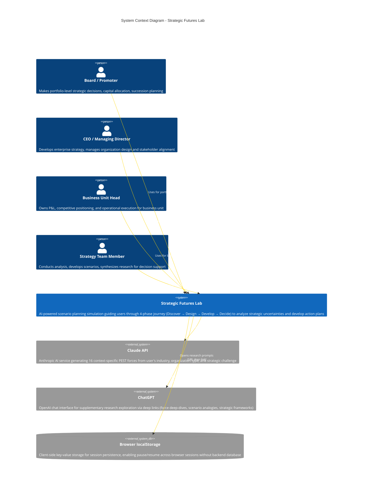

# C4 Context Level: Strategic Futures Lab System Context

## System Overview

### Short Description

Strategic Futures Lab is an AI-powered scenario planning simulation that guides business strategists through Shell's proven methodology to analyze strategic uncertainties and develop robust action plans.

### Long Description

Strategic Futures Lab transforms Shell's battle-tested scenario planning methodology into an interactive digital experience. The system addresses a critical challenge faced by Indian business leaders: making strategic decisions in an environment of unprecedented uncertainty—regulatory shifts, technological disruption, geopolitical changes, and market volatility.

Traditional strategic planning assumes a predictable future. This system embraces uncertainty as a given, guiding users through a structured 4-phase journey (Discover → Design → Develop → Decide) to explore multiple plausible futures, assess organizational impact, and develop responsive action plans. By combining educational content, AI-powered force generation (via Claude API), and interactive simulation components, the system accelerates a process that typically requires weeks of workshops into hours of focused strategic thinking.

The system is purpose-built for the Indian business context, with Indianized industry taxonomies (BFSI, IT Services, PSUs), organization types (family business, PE/VC-backed, listed enterprise), and regulatory considerations (RBI, SEBI, GST). It serves strategists at all organizational levels—from board members making portfolio decisions to strategy teams developing decision support analysis.

**Business Problem Solved**: Enables leaders to move from single-point forecasting (which fails in volatile environments) to scenario-based thinking, resulting in strategies that are robust across multiple possible futures rather than optimized for one uncertain forecast.

**Key Capabilities**:
- **AI-Powered Force Generation**: Generates 16 context-specific PEST forces using Claude AI based on user's industry, organization type, and strategic challenge
- **Interactive Scenario Matrix**: 2x2 matrix construction with drag-and-drop uncertainty axes, quadrant naming, and narrative development
- **Impact & Risk Assessment**: Structured evaluation of each scenario's probability, repercussion, urgency, and strategic disruption
- **Action Planning Framework**: Response assignment (priority, timely, safeguard, monitor, ignore) with quarterly action item development
- **Educational Integration**: Tabbed learning content, real-world case studies, and ChatGPT research exploration links at every step
- **Session Persistence**: Client-side localStorage ensures users can pause and resume their simulation across browser sessions

---

## Personas

### Board / Promoter Level Executive

- **Type**: Human User
- **Description**: Board members or promoter-owners making portfolio-level decisions about capital allocation, succession planning, governance, and diversification. They operate at the highest strategic level, concerned with enterprise longevity and stakeholder value creation.
- **Goals**:
  - Evaluate portfolio-level strategic choices (e.g., "Should we acquire in adjacent sectors or double down on core business?")
  - Understand how macro forces (regulatory changes, geopolitical shifts, technology disruption) impact enterprise value
  - Develop robust strategies that protect shareholder value across multiple possible futures
  - Prepare for generational transitions and succession scenarios
- **Key Features Used**:
  - Focal Issue framing for portfolio decisions
  - AI-generated PEST force analysis
  - Scenario matrix to explore divergent futures
  - Impact assessment with focus on strategic disruption
  - Response assignment for capital allocation priorities

### CEO / Managing Director

- **Type**: Human User
- **Description**: Chief executives responsible for enterprise strategy, organization design, and stakeholder management. They translate board vision into operational reality while managing quarterly performance pressures and long-term transformation.
- **Goals**:
  - Frame enterprise-level strategic questions (e.g., "Should we shift from project-based revenue to platform/subscription model?")
  - Understand how external forces affect competitive positioning, talent strategy, and business model viability
  - Develop action plans that balance short-term performance with long-term resilience
  - Align leadership team around a shared view of possible futures
- **Key Features Used**:
  - Industry and organization type selection (shapes AI-generated forces)
  - Force evaluation (impact vs. uncertainty ratings)
  - Scenario narrative development
  - Impact assessment across all four scenarios
  - Action planning with ownership assignment (C-suite, director, manager)

### Business Unit Head

- **Type**: Human User
- **Description**: P&L owners responsible for competitive positioning, revenue growth, and operational excellence within a specific business unit or product line. They operate with autonomy but within enterprise guardrails.
- **Goals**:
  - Address unit-level strategic choices (e.g., "Should we prioritize tier-2/3 India or Southeast Asia for expansion?")
  - Understand how external uncertainties (competitive dynamics, regulatory changes, talent availability) affect unit performance
  - Develop action plans with clear timelines, budgets, and ownership
  - Present scenario-based business cases to CEO/board for resource approval
- **Key Features Used**:
  - Context modifiers (pan-India presence, B2B vs. B2C, asset-heavy vs. asset-light)
  - Force scanning and uncertainty selection
  - Scenario impact assessment (probability, repercussion, urgency)
  - Response assignment and quarterly action planning
  - Final report export for stakeholder communication

### Strategy / Planning Team Member

- **Type**: Human User
- **Description**: Strategy, corporate planning, or business development professionals responsible for analysis, options development, and decision support. They facilitate strategic conversations and synthesize insights for leadership.
- **Goals**:
  - Conduct rigorous analysis of strategic options and uncertainties
  - Develop scenario-based frameworks to support executive decision-making
  - Synthesize external research (via ChatGPT integration) into actionable insights
  - Create compelling scenario narratives and impact assessments
  - Produce board-ready reports and presentations
- **Key Features Used**:
  - All educational content (guides, examples, tips) in LearningSidebar
  - ChatGPT research exploration for force deep-dives and scenario analogies
  - Detailed force evaluation with AI-suggested ratings
  - Comprehensive scenario narrative development
  - Risk profile assessment (appetite vs. capacity)
  - Full report generation with all simulation outputs

---

## System Features

### 4-Phase Scenario Planning Journey

- **Description**: Structured progression through Discover → Design → Develop → Decide phases with 13 sequential sub-steps, guided by educational content and validation at each stage
- **Users**: All personas
- **User Journey**: [4-Phase Journey - All Personas](#4-phase-journey---all-personas)

### AI-Powered PEST Force Generation

- **Description**: Context-aware generation of 16 driving forces (Political, Economic, Social, Technological, Environmental, Legal/Regulatory) tailored to user's industry, organization type, and strategic challenge
- **Users**: All personas (particularly valuable for Board/Promoter and CEO/MD who need comprehensive environmental scanning)
- **User Journey**: [Force Generation Journey](#force-generation-journey)

### Interactive Scenario Matrix Construction

- **Description**: Drag-and-drop selection of critical uncertainty axes, 2x2 matrix visualization, quadrant naming, and scenario narrative development with tone/complexity adjustments
- **Users**: All personas
- **User Journey**: [Scenario Design Journey](#scenario-design-journey)

### Impact Assessment & Risk Profiling

- **Description**: Structured evaluation of each scenario across four dimensions (probability, repercussion, urgency, strategic disruption) combined with organizational risk profile (appetite vs. capacity)
- **Users**: CEO/MD, Business Unit Head, Strategy Team (Board/Promoter typically reviews rather than completes)
- **User Journey**: [Impact Assessment Journey](#impact-assessment-journey)

### Response Assignment & Action Planning

- **Description**: Assignment of response types (priority action, timely action, safeguard, monitor, ignore) to scenarios, followed by quarterly action item development with budget ranges and ownership
- **Users**: All personas (Strategy Team drafts, BU Head/CEO/MD approves, Board/Promoter reviews)
- **User Journey**: [Action Planning Journey](#action-planning-journey)

### Educational Content & Research Integration

- **Description**: Tabbed learning sidebar (Guide, Example, Tips) on every step, with ChatGPT deep-link integration for force research, scenario analogies, and concept exploration
- **Users**: Strategy Team (primary), Business Unit Head (secondary), CEO/MD (occasional reference)
- **User Journey**: [Research Exploration Journey](#research-exploration-journey)

### Session Persistence & Resume

- **Description**: Automatic saving of all simulation state (context, forces, scenarios, assessments, actions) to browser localStorage, enabling pause/resume across sessions
- **Users**: All personas
- **User Journey**: [Session Recovery Journey](#session-recovery-journey)

---

## User Journeys

### 4-Phase Journey - All Personas

This is the primary journey for all personas, representing the complete scenario planning simulation flow.

#### Discover Phase (Steps 1-3)
1. **Pre-Read Introduction**: User reads tabbed content (What is scenario planning / Creators / Journey preview) to understand methodology
2. **Context Setup**: User selects industry (e.g., BFSI), organization type (e.g., Listed Enterprise), stakeholder perspective (e.g., CEO/MD), and context modifiers (e.g., Cash-rich, Heavily regulated)
3. **Focal Issue Framing**: User defines strategic question using templates or custom input (e.g., "Should we acquire a D2C brand or build our own direct channel?"), sets time horizon (3-15 years)

**Output**: User context profile and focal issue that shapes AI force generation

#### Design Phase (Steps 4-7)
4. **Force Scanning**: System generates 16 AI-powered PEST forces based on user context; user reviews, edits, adds custom forces, and rates each on impact (1-5) and uncertainty (1-5)
5. **Uncertainty Selection**: User reviews all forces sorted by uncertainty rating, selects 2 critical uncertainties to become scenario axes
6. **Axis Configuration**: User defines opposing labels for each axis (e.g., "Hyper-regulation" vs. "Free market" for regulatory uncertainty)
7. **Matrix Construction**: User names each of 4 quadrants (TL, TR, BL, BR), previews scenario matrix

**Output**: 2x2 scenario matrix with named quadrants representing 4 possible futures

#### Develop Phase (Steps 8-10)
8. **Scenario Narratives**: User writes narrative for each quadrant, adjusts tone (challenging vs. optimistic), complexity (1-3), identifies early signals and key capabilities
9. **Impact Assessment**: User evaluates each scenario on probability (1-5), repercussion (1-5), urgency (1-5), strategic disruption (1-5)
10. **Risk Profiling**: User assesses organization's risk appetite (1-5) and risk capacity (1-5)

**Output**: 4 rich scenario narratives with quantified impact scores and organizational risk profile

#### Decide Phase (Steps 11-13)
11. **Response Assignment**: User assigns response type to each scenario (priority action, timely action, safeguard, monitor, ignore) based on impact scores
12. **Action Planning**: User develops 3-5 action items per scenario with timeline (Q1-Q4), budget range (low/medium/high), owner (C-suite, director, manager, external)
13. **Final Report**: User reviews complete simulation output, exports or shares for stakeholder communication

**Output**: Response-assigned scenarios with quarterly action plan and comprehensive report

---

### Force Generation Journey

This journey shows how the AI-powered force generation feature accelerates environmental scanning.

#### Persona: CEO / Managing Director
1. **Complete Context Setup**: CEO selects industry (IT Services), organization type (Listed Enterprise), perspective (CEO/MD), modifiers (Export-oriented, Talent-intensive)
2. **Frame Focal Issue**: CEO enters "Should we shift to a GCC model given the talent arbitrage erosion?" with 7-year time horizon
3. **Trigger AI Generation**: CEO clicks "Generate Forces" button on Forces step
4. **AI Processing**: System sends context to Claude API via `/api/generate-forces` endpoint
5. **Review AI Forces**: System returns 16 PEST forces tailored to IT Services + talent context:
   - Political: "India-US trade policy on services export" (impact 4, uncertainty 4)
   - Economic: "Wage inflation in tier-1 cities" (impact 5, uncertainty 2)
   - Social: "Remote work normalization" (impact 5, uncertainty 3)
   - Technological: "AI-powered code generation adoption" (impact 5, uncertainty 4)
   - Environmental: "ESG talent attraction mandates" (impact 3, uncertainty 3)
   - Legal: "Gig worker classification regulations" (impact 4, uncertainty 4)
6. **Customize Forces**: CEO edits AI-generated force descriptions, adds 2 custom forces based on proprietary intelligence, re-rates some forces
7. **Proceed to Uncertainty Selection**: CEO uses force ratings to select critical uncertainties for scenario axes

**Output**: 16-18 forces (14-16 AI-generated, 0-2 custom) with user-validated ratings, ready for scenario design

---

### Scenario Design Journey

This journey shows how users construct the 2x2 scenario matrix, the heart of the methodology.

#### Persona: Strategy Team Member
1. **Review Rated Forces**: Strategy team member views all forces sorted by uncertainty rating (high to low)
2. **Select First Axis**: Selects "AI-powered code generation adoption" (high impact, high uncertainty) as X-axis
3. **Label X-Axis**: Defines opposing labels:
   - Low end: "AI is productivity tool" (augments human developers)
   - High end: "AI is code generator" (replaces junior developers)
4. **Select Second Axis**: Selects "India-US trade policy on services export" (high impact, high uncertainty) as Y-axis
5. **Label Y-Axis**: Defines opposing labels:
   - Low end: "Protectionist barriers" (H1B restrictions, offshoring penalties)
   - High end: "Open trade regime" (continued services export freedom)
6. **Name Quadrants**: Names 4 scenarios based on axis combinations:
   - Top-Left: "Fortress America + AI Augmentation" (protectionist + AI as tool)
   - Top-Right: "Open Skies + AI Augmentation" (open trade + AI as tool)
   - Bottom-Left: "Fortress America + AI Replacement" (protectionist + AI as generator)
   - Bottom-Right: "Open Skies + AI Replacement" (open trade + AI as generator)
7. **Preview Matrix**: Reviews 2x2 matrix visualization with all quadrant names, confirms scenario logic

**Output**: 2x2 scenario matrix with meaningful, differentiated quadrant names ready for narrative development

---

### Impact Assessment Journey

This journey shows how users evaluate scenarios and determine appropriate responses.

#### Persona: Business Unit Head
1. **Review Scenario Narratives**: BU Head reads all 4 scenario narratives written by strategy team
2. **Assess First Scenario** (e.g., "Fortress America + AI Replacement"):
   - **Probability**: Rates 2/5 (possible but not likely in 7-year horizon)
   - **Repercussion**: Rates 5/5 (existential threat to export-led business model)
   - **Urgency**: Rates 3/5 (early signals exist but not immediate crisis)
   - **Strategic Disruption**: Rates 5/5 (requires complete business model pivot)
3. **Assess Remaining Scenarios**: Repeats for other 3 quadrants with varying scores
4. **Define Risk Profile**:
   - **Risk Appetite**: Rates 3/5 (moderate willingness to take risks for transformation)
   - **Risk Capacity**: Rates 4/5 (strong balance sheet can absorb strategic bets)
5. **Review Impact Matrix**: Views heatmap showing which scenarios require most attention (high probability × high repercussion)

**Output**: Quantified impact scores for all scenarios and organizational risk profile, informing response assignment

---

### Action Planning Journey

This journey shows how users translate scenarios into executable quarterly actions.

#### Persona: CEO / Managing Director
1. **Review Response Assignments**: CEO reviews strategy team's recommended response assignments:
   - "Open Skies + AI Augmentation": Priority Action (high probability, high repercussion, high urgency)
   - "Fortress America + AI Augmentation": Timely Action (moderate probability, high repercussion)
   - "Open Skies + AI Replacement": Safeguard (low probability, high repercussion)
   - "Fortress America + AI Replacement": Monitor (low probability, very high repercussion)
2. **Develop Priority Actions** (for "Open Skies + AI Augmentation" scenario):
   - Action 1: "Pilot AI co-pilot tools in 3 project teams" (Q1, low budget, owner: Director)
   - Action 2: "Launch AI upskilling program for mid-level developers" (Q2, medium budget, owner: C-suite)
   - Action 3: "Establish AI governance council" (Q1, low budget, owner: C-suite)
3. **Develop Safeguards** (for "Open Skies + AI Replacement" scenario):
   - Action 1: "Develop GCC expansion business case" (Q3, medium budget, owner: Director)
   - Action 2: "Map alternative revenue streams (product, IP-led)" (Q2, low budget, owner: Manager)
4. **Assign Monitors** (for "Fortress America + AI Replacement" scenario):
   - Early signal monitoring: H1B visa approval rates, AI model performance benchmarks, client offshoring policies
5. **Review Quarterly Plan**: Views all actions on timeline (Q1-Q4) with ownership and budget allocation
6. **Export for Board Review**: Generates report with scenario matrix, impact scores, response assignments, and action plan

**Output**: Quarterly action plan with 12-15 actions mapped to scenarios, owners, and timelines, ready for execution

---

### Research Exploration Journey

This journey shows how Strategy Team members use ChatGPT integration to deepen their scenario analysis.

#### Persona: Strategy Team Member
1. **Encounter Force**: While reviewing AI-generated force "AI-powered code generation adoption," strategist wants to explore implications
2. **Click "Explore with ChatGPT"**: Clicks research link on FlippableForceCard component
3. **System Opens ChatGPT**: New browser tab opens with pre-filled prompt:
   "Explain how AI-powered code generation adoption might evolve over the next 7 years in the context of India's IT Services industry. What are the extreme possibilities on either end? Who are the key stakeholders shaping this force and what are their incentives?"
4. **ChatGPT Response**: Strategist reads ChatGPT's analysis covering:
   - Technology trajectory (current state → future possibilities)
   - Extreme scenarios (AI as productivity tool vs. AI as code generator)
   - Stakeholder analysis (developers, enterprises, tech giants, regulators)
   - Indian context (talent pool, cost arbitrage, quality perception)
5. **Synthesize Insights**: Strategist returns to simulation, updates force description with key insights, adjusts uncertainty rating from 3 to 4 based on research
6. **Repeat for Scenarios**: Later, when naming scenarios, clicks "Explore how Shell named scenarios" to learn from historical examples
7. **Document Findings**: Strategist adds research notes to simulation (not currently implemented, but typical workflow)

**Output**: Enriched force descriptions and scenario narratives informed by external research, improving simulation quality

---

### Session Recovery Journey

This journey shows how users can pause and resume their simulation across multiple sessions.

#### Persona: Board / Promoter Level Executive
1. **Start Simulation**: Board member begins simulation, completes Discover phase (context, focal issue)
2. **Pause Mid-Journey**: After generating forces and rating 8 out of 16, board member closes browser to attend board meeting
3. **Return Next Day**: Board member opens browser, navigates to Strategic Futures Lab landing page
4. **Session Detection**: System detects existing localStorage data with `mainPhase: 'design'`, `subStep: 'forces'`, progress indicator shows "Design Phase - Forces (Step 4/13)"
5. **Auto-Resume**: System hydrates Zustand store from localStorage, restoring:
   - Industry: BFSI
   - Organization Type: Listed Enterprise
   - Stakeholder Perspective: Board/Promoter
   - Focal Issue: "Should we acquire a D2C brand or build our own direct channel?"
   - Forces: 16 forces with 8 rated, 8 pending
6. **Continue Journey**: Board member resumes rating remaining 8 forces, proceeds to uncertainty selection
7. **Complete Simulation**: Over 3 more sessions spanning 2 weeks, board member completes all phases, with all progress automatically saved

**Output**: Seamless multi-session experience with zero data loss, enabling realistic executive workflows

---

## External Systems and Dependencies

### Claude API (Anthropic)

- **Type**: External AI Service (Third-Party SaaS)
- **Description**: Anthropic's Claude AI language model providing context-aware PEST force generation. Uses `claude-sonnet-4-20250514` model for high-quality structured JSON output.
- **Integration Type**: REST API (HTTPS)
- **Purpose**: Accelerates environmental scanning by generating 16 industry-specific, context-aware driving forces based on user's industry, organization type, challenge, and modifiers. Eliminates manual brainstorming bottleneck that typically requires hours of workshops.
- **Data Flow**:
  - **Request**: User context (industry, organizationType, challenge, modifiers, strategicQuestion) sent from Next.js API route `/api/generate-forces`
  - **Response**: JSON array of 16 `Force` objects with PEST categorization, names, descriptions, suggested impact/uncertainty ratings
- **Authentication**: API key (`ANTHROPIC_API_KEY`) stored server-side in environment variables
- **Error Handling**: 500 errors returned to frontend on API failure, JSON parsing fallback with regex extraction
- **Dependencies**: `@anthropic-ai/sdk` v0.32.1+

### ChatGPT (OpenAI)

- **Type**: External AI Service (Third-Party SaaS)
- **Description**: OpenAI's ChatGPT web interface used for on-demand research exploration via deep links. No backend API integration—purely URL-based navigation.
- **Integration Type**: URL Deep Link (HTTPS)
- **Purpose**: Provides supplementary research assistance for users who want to explore concepts deeper (force deep-dives, scenario analogies, historical examples, strategic thinking frameworks). Enhances educational experience without requiring backend infrastructure.
- **Data Flow**:
  - **Request**: User clicks "Explore with ChatGPT" link in simulation component (FlippableForceCard, InsightPanel, WisdomPanel, ResearchMission)
  - **URL Construction**: System constructs URL `https://chat.openai.com/?q={encodeURIComponent(prompt)}` with pre-filled prompt including user context placeholders ([INDUSTRY], [FORCE], [SCENARIO])
  - **Response**: New browser tab opens with ChatGPT; user explores concept manually, returns to simulation
- **Authentication**: None (user must have ChatGPT access—free or paid)
- **Dependencies**: None (pure client-side navigation via `window.open`)

### Browser localStorage

- **Type**: Browser Storage (Client-Side Key-Value Store)
- **Description**: Web Storage API (localStorage) used for session persistence. Stores serialized Zustand store state under key `'strategic-futures-lab'`.
- **Integration Type**: Synchronous JavaScript API
- **Purpose**: Enables session continuity across browser refreshes, tab closures, and multi-day workflows. Eliminates need for backend database and user authentication for MVP. Privacy-friendly as data never leaves user's device.
- **Data Flow**:
  - **Write**: On every Zustand state mutation (e.g., `setForces()`, `updateScenario()`), persist middleware automatically writes to `localStorage.setItem('strategic-futures-lab', JSON.stringify(state))`
  - **Read**: On app load, Zustand hydrates store from `localStorage.getItem('strategic-futures-lab')`, parsing JSON and merging with initial state
- **Stored Data**:
  - **Persisted**: User context (industry, organization type, stakeholder perspective, focal issue), forces with ratings, axes and labels, scenarios with narratives, impact assessments, risk profile, response assignments, actions, journey progress
  - **Excluded**: Loading states (`isGeneratingForces`, `isGeneratingScenarios`), transient UI state, session metadata
- **Error Handling**: Try-catch around localStorage operations to handle quota exceeded errors and private browsing mode
- **Dependencies**: Zustand `persist` middleware

---

## System Context Diagram

**Diagram Notes** (following [c4model.com](https://c4model.com/diagrams/system-context) principles):

- **Focus on people and software systems**, not technologies: Shows 4 user personas (human actors) and 3 external systems (Claude API, ChatGPT, browser storage)
- **System boundary**: Strategic Futures Lab is the central system; all dependencies are external
- **Stakeholder-friendly**: Diagram is understandable by non-technical executives; no low-level protocols or implementation details
- **Relationships show intent**: "Generates PEST forces", "Opens research prompts", "Uses for enterprise strategy development" convey business purpose, not just technical interaction
- **Technologies shown sparingly**: Only mentioned where essential to understanding (REST API, URL deep link, Web Storage API)

---

## Related Documentation

### Lower-Level Architecture Documentation

- **Container Level**: [c4-container.md](./c4-container.md) - Deployment architecture showing Next.js Web Application, Browser Storage, and external system integrations
- **Component Level**: [c4-component.md](./c4-component.md) - Component architecture covering UI Library, Simulation Components, State Management, AI Integration, Simulation Journey, and Landing Experience

### API Documentation

- **Force Generation API**: [apis/generate-forces-api.yaml](./apis/generate-forces-api.yaml) - OpenAPI 3.1 specification for `/api/generate-forces` endpoint

### Code-Level Documentation

- **Library Code**: [c4-code-lib.md](./c4-code-lib.md) - Store, types, utilities
- **AI Integration**: [c4-code-lib-ai.md](./c4-code-lib-ai.md) - Claude API integration
- **UI Components**: [c4-code-components-ui.md](./c4-code-components-ui.md) - Button, Card, Progress, animations
- **Simulation Components**: [c4-code-components-simulation.md](./c4-code-components-simulation.md) - LearningSidebar, ForceCard, ProgressIndicator
- **Application Pages**: [c4-code-app-simulation.md](./c4-code-app-simulation.md) - All simulation phase pages

---

## System Context Summary

### What Makes This System Unique

**Methodology Provenance**: Built on Shell's proven scenario planning approach (credited with anticipating 1973 and 1979 oil shocks), bringing 50+ years of strategic foresight methodology to digital format.

**Indian Business Context**: Unlike generic strategy tools, this system is purpose-built for Indian business environment with:
- Indianized industry taxonomies (BFSI, PSUs, IT Services, agri-food processing)
- Organization type nuances (promoter-led family businesses, PE/VC-backed, MNC subsidiaries)
- Regulatory landscape awareness (RBI, SEBI, GST, PLI schemes, Make in India)
- Stakeholder perspective mapping (Board/Promoter, CEO/MD, BU Head, Strategy Team)

**AI-Accelerated Workflow**: Transforms a weeks-long workshop process into hours of focused strategic thinking through context-aware AI force generation, while preserving human judgment for critical decisions (uncertainty selection, scenario naming, impact assessment, action planning).

**Educational by Design**: Every step includes tabbed learning content (Guide, Example, Tips) and ChatGPT research integration, making the system a learning journey rather than just a planning tool.

**No Backend Required**: Client-side persistence via localStorage eliminates authentication friction, backend database complexity, and privacy concerns—ideal for executives working on confidential strategic questions.

### User Outcomes

After completing the simulation, users emerge with:

1. **Mental Model Shift**: From single-point forecasting to scenario-based thinking, prepared for uncertainty rather than paralyzed by it
2. **2x2 Scenario Matrix**: Visual representation of 4 plausible futures based on 2 critical uncertainties
3. **Rich Scenario Narratives**: Descriptive stories of each future with early signals, key capabilities, tone, and complexity ratings
4. **Quantified Impact Assessment**: Probability, repercussion, urgency, and strategic disruption scores for each scenario
5. **Response-Assigned Scenarios**: Clear designation of which scenarios require priority action, timely action, safeguards, monitoring, or can be ignored
6. **Quarterly Action Plan**: 12-15 concrete actions mapped to Q1-Q4 with budget ranges, ownership, and scenario linkage
7. **Board-Ready Report**: Comprehensive simulation output ready for stakeholder communication and decision approval

### Strategic Value Proposition

**For Board/Promoters**: Provides structured framework for evaluating portfolio-level strategic bets, enabling capital allocation decisions that are robust across multiple futures rather than optimized for one uncertain forecast.

**For CEO/MDs**: Translates abstract external forces into concrete organizational implications, enabling proactive transformation rather than reactive crisis management.

**For BU Heads**: Offers rigorous justification for resource requests backed by scenario-based analysis, increasing likelihood of board approval for strategic initiatives.

**For Strategy Teams**: Accelerates high-quality scenario development from weeks to hours while maintaining methodological rigor, freeing time for deeper analysis and stakeholder alignment.

**Enterprise-Wide**: Creates shared language and mental models across leadership team, enabling more productive strategic conversations and faster decision-making in volatile environments.
